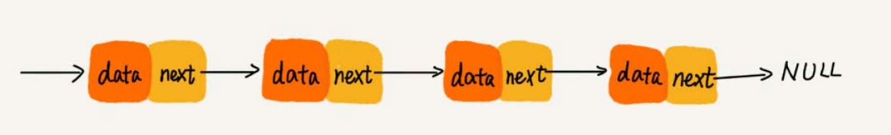
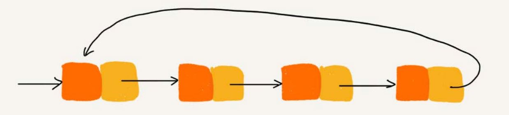

# 链表
链表也是一种基础的数据结构。常见的链表结构有：单链表，双向链表，循环链表。

## 单链表
链表通过指针将一组零散的内存块串联在一起。其中内存块称为链表的**结点**。为了将所有的结点串起来，每个链表的结点除了存储数据之外，
还需要记录链上的下一个结点的地址。这个记录下个结点地址的指针叫作**后继指针 `next`**。



其中有两个结点是比较特殊的，它们分别是头结点和尾结点。其中，**头结点用来记录链表的基地址**。有了它，就可以遍历得到整条链表。而**尾结点
的指针不是指向下一个结点，而是指向一个空地址 NULL**，表示这是链表上最后一个结点。

在链表中插入或者删除一个数据，我们并不需要为了保持内存的连续性而搬移结点，因为链表的存储空间本身就不是连续的。所以，在链表中插入和删除一
个数据是非常快速的。链表的插入和删除操作，只需要考虑相邻结点的指针改变，时间复杂度是 `O(1)`。


虽然插入和删除变得高效了，但是这也导致链表的随机访问没有数组效率高，因为无法像数组那样直接通过寻址公式计算出下标对应的内存地址，必须
根据后继指针来遍历每一个节点。所以链表的随机减访问时间复杂度为 `O(n)`。

## 循环链表
循环链表只是一种特殊的单链表，唯一的不同就是循环链表的尾节点的指针不指向空地址 NULL，而是头节点。



循环链表的优点是从链尾到链头比较方便。当要处理的数据具有环型结构特点时，就特别适合采用循环链表。比如约瑟夫问题。

## 双向链表
单向链表只有一个方向，而双向链表，有两个方向。每个结点不止有一个**后继指针 `next`** 指向后面的结点，还有一个
**前驱指针 `prev`** 指向前面的结点。


双向链表比单链表需要额外的空间来存储前驱指针，因此同样的数据要比单链表占用更多的内存空间。

### 双向链表的优势
双向链表在某些情况下的插入、删除等操作都要比单链表简单、高效。
1. 删除结点中“值等于某个给定值”的结点
对于这种情况，不管是单链表还是双向链表，为了查找到值等于给定值的结点，都需要从头结点开始一个一个依次遍历对比，直到找到值等于给定值的结点，
然后再通过我前面讲的指针操作将其删除。尽管单纯的删除操作时间复杂度是 `O(1)`，但遍历查找的时间是主要的耗时点，对应的时间复杂度为 `O(n)`。
根据时间复杂度分析中的加法法则，删除值等于给定值的结点对应的链表操作的总时间复杂度为 `O(n)`。

2. 删除给定指针指向的结点
这种情况，加入我们已经找到了要删除的结点 q，得到了 q 节点的指针，但是要删除删除这个结点 q 还需要知道其前驱结点，而单链表并不支持直接获取
前驱结点，所以，为了找到前驱结点，我们还是要从头结点开始遍历链表，直到 `p->next=q`，说明 p 是 q 的前驱结点。但是对于双向链表来说，因为
双向链表中的结点已经保存了前驱结点的指针，不需要像单链表那样遍历。所以，针对这种情况，单链表删除操作需要 `O(n)` 的时间复杂度，而双向链表
只需要 `O(1)` 的时间复杂度。

对于一个有序链表，双向链表的按值查询的效率也要比单链表高一些。因为，我们可以记录上次查找的位置 p，每次查询时，根据要查找的值与 p 的大小关系，
决定是往前还是往后查找，所以平均只需要查找一半的数据。

## 与数组的区别
- 数组需要一块连续的内存空间来存储，对内存的要求比较高。如果我们申请一个 100MB 大小的数组，当内存中没有连续的、足够大的存储空间时，
即便内存的剩余总可用空间大于 100MB，仍然会申请失败。
- 链并不需要一块连续的内存空间，它通过**指针**将一组零散的内存块串联起来使用。

### 性能
- 数组简单易用，在实现上使用的是连续的内存空间，可以借助 **CPU 的缓存机制**，预读数组中的数据，所以访问效率更高。而链表在内存中并不是连续
存储，所以对 CPU 缓存不友好，没办法有效预读。
- 数组的缺点是大小固定，一经声明就要占用整块连续内存空间。如果声明的数组过大，系统可能没有足够的连续内存空间分配给它，导致
“内存不足（out ofmemory）”。如果声明的数组过小，则可能出现不够用的情况。这时只能再申请一个更大的内存空间，把原数组拷贝进去，
非常费时。链表本身没有大小的限制，天然地支持动态扩容，**动态扩容是链表与数组最大的区别**。

## 利用哨兵简化实现难度

单链表的插入和删除操作。如果在结点 p 后面插入一个新的结点，只需要两行代码就可以搞定。
```c
new_node->next = p->next;
p->next = new_node;
```
但是，当要向一个空链表中插入第一个结点，刚刚的逻辑就不能用了。需要进行特殊处理，其中 head 表示链表的头结点。
```c
if (head == null) {
    head = new_node;
}
```

如果要删除结点 p 的后继结点：
```c
p->next = p->next->next;
```
但是，如果要删除链表中的最后一个结点，前面的删除代码就不 work 了。需要特殊处理：
```c
if (head->next == null) {
    head = null;
}
```
针对链表的插入、删除操作，需要对插入第一个结点和删除最后一个结点的情况进行特殊处理。这样代码实现起来就会很繁琐，不简洁，而且也
容易因为考虑不全而出错。

哨兵，解决的是国家之间的边界问题。同理，这里说的哨兵也是解决“边界问题”的，不直接参与业务逻辑。还记得如何表示一个空链表吗？
`head=null` 表示链表中没有结点了。其中 head 表示头结点指针，指向链表中的第一个结点。如果引入哨兵结点，在任何时候，不管链表是不是空，
`head` 指针都会一直指向这个**哨兵结点**。这种有哨兵结点的链表叫**带头链表**。相反，没有哨兵结点的链表就叫作**不带头链表**。
哨兵结点是不存储数据的。因为哨兵结点一直存在，所以插入第一个结点和插入其他结点，删除最后一个结点和删除其他结点，都可以统一为相同的代码
实现逻辑了

## LRU
常见的缓存淘汰策略有三种：先进先出策略 FIFO（First In，First Out）、最少使用策略 LFU（Least Frequently Used）、最近最少使用
策略 LRU（Least Recently Used）。

### 如何基于链表实现 LRU 缓存淘汰算法
思路：维护一个有序单链表，越靠近链表尾部的结点是越早之前访问的。当有一个新的数据被访问时，从链表头开始顺序遍历链表。
1. 如果此数据之前已经被缓存在链表中了，我们遍历得到这个数据对应的结点，并将其从原来的位置删除，然后再插入到链表的头部。
2. 如果此数据没有在缓存链表中，又可以分为两种情况：
  - 如果此时缓存未满，则将此结点直接插入到链表的头部；
  - 如果此时缓存已满，则链表尾结点删除，将新的数据结点插入链表的头部。
  
实现 LRU 算法，用数组也可以的，但是要考虑性能，选择最优的数据结构。


