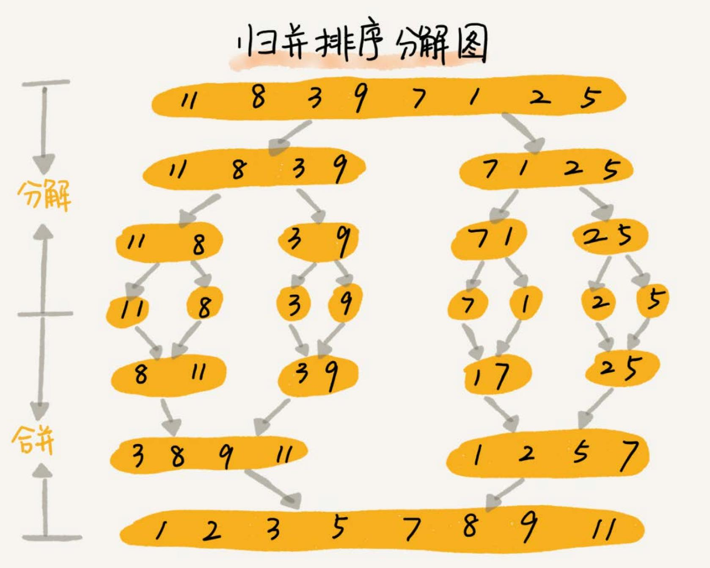
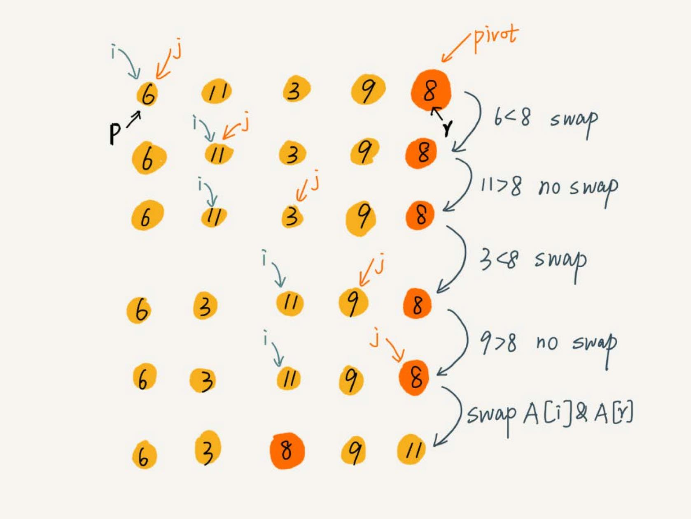
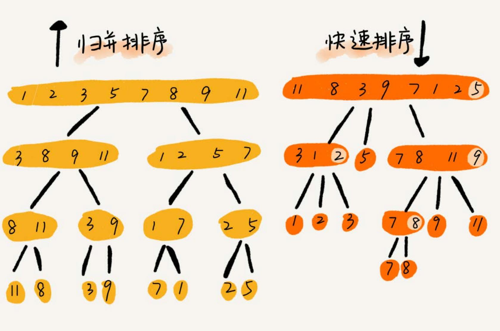

# 排序
常用的三类排序算法：

| 算法 | 时间复杂度 |
| --- | --- |
| 冒泡、插入、选择 | `O(n^2)` |
| 快排、归并 | `O(nlogn)` |
| 桶、计数、基数 | `O(n)` |

插入排序和冒泡排序的时间复杂度相同，为什么更倾向于使用插入排序算法而不是冒泡排序算法？

## 分析排序算法
### 执行效率
排序算法执行效率的分析，可以通过几个方面来衡量：
1. 最好情况、最坏情况、平均情况时间复杂度
2. 时间复杂度的系数、常数、低阶我们知道，时间复杂度反应的是数据规模 n 很大的时候的一个增长趋势，所以它表示的时候会忽略系数、常数、低阶。但
是实际的软件开发中，排序的可能是 10 个、100 个、1000 个这样规模很小的数据，所以，在对同一阶时间复杂度的排序算法性能对比的时候，就要把
系数、常数、低阶也考虑进来。
3. 基于比较的排序算法的执行过程，会涉及两种操作，一种是元素比较大小，另一种是元素交换或移动。所以，如果在分析排序算法的执行效率的时候，
应该把比较次数和交换（或移动）次数也考虑进去。

### 内存消耗
算法的内存消耗可以通过空间复杂度来衡量，针对排序算法的空间复杂度，有一个概念，**原地排序**（Sorted in place），就是**特指“空间复杂度”
是 `O(1)` 的排序算法**。冒泡排序，插入排序，选择排序都是原地排序算法。

### 稳定性
稳定性就是说，如果待排序的序列中存在值相等的元素，经过排序之后，相等元素之间原有的先后顺序不变。

比如一组数据 2，9，3，4，8，3，按照大小排序之后就是 2，3，3，4，8，9。

这组数据里有两个 3。经过某种排序算法排序之后，如果两个 3 的前后顺序没有改变，那我们就把这种排序算法叫作**稳定的排序算法**；
如果前后顺序发生变化，那对应的排序算法就叫作**不稳定的排序算法**。

#### 为什么要考察排序算法的稳定性
真正软件开发中，我们要排序的往往不是单纯的整数，而是一组对象，我们需要按照对象的某个 key 来排序。
比如说，我们现在要给电商交易系统中的“订单”排序。订单有两个属性，一个是下单时间，另一个是订单金额。如果我们现在有 10 万条订单数据，我们希望
按照金额从小到大对订单数据排序。对于金额相同的订单，我们希望按照下单时间从早到晚有序。

最先想到的方法是：我们先按照金额对订单数据进行排序，然后，再遍历排序之后的订单数据，对于每个金额相同的小区间再按照下单时间排序。这种排序思
路理解起来不难，但是实现起来会很复杂。

借助稳定排序算法，这个问题可以非常简洁地解决。解决思路是这样的：我们先按照下单时间给订单排序，注意是按照下单时间，不是金额。排序完成之后，
我们用稳定排序算法，按照订单金额重新排序。两遍排序之后，我们得到的订单数据就是按照金额从小到大排序，金额相同的订单按照下单时间从早到晚排序的。

为什么呢？稳定排序算法可以保持金额相同的两个对象，在排序之后的前后顺序不变。第一次排序之后，所有的订单按照下单时间从早到晚有序了。在第二次排
序中，我们用的是稳定的排序算法，所以经过第二次排序之后，相同金额的订单仍然保持下单时间从早到晚有序。


## 冒泡排序
冒泡排序只会操作相邻的两个数据。每次冒泡操作都会对相邻的两个元素进行比较，看是否满足大小关系要求。如果不满足就让它俩互换。**一次冒泡
会让至少一个元素移动到它应该在的位置**，重复 n 次，就完成了 n 个数据的排序工作。
```go
func BubbleSort(a []int) {
	length := len(a)
	if len(a) <= 1 {
		return
	}
	for i := 0; i < length; i ++ {
		flag := false
		for j := 0; j < length - i - 1; j ++ {
			if a[j] > a[j + 1] {
				a[j], a[j + 1] = a[j + 1], a[j]
				flag = true
			}
		}
		if !flag {
			break
		}
	}
}
```

### 分析冒泡排序
1. 冒泡的过程只涉及相邻数据的交换操作，只需要常量级的临时空间，所以它的空间复杂度为 `O(1)`，是一个原地排序算法。
2. 在冒泡排序中，只有交换才可以改变两个元素的前后顺序。当有相邻的两个元素大小相等的时候，不做交换，相同大小的数据在排序
前后不会改变顺序，所以冒泡排序是稳定的排序算法。
3. 最好情况下，要排序的数据已经是有序的了，我们只需要进行一次冒泡操作，就可以结束了，所以最好情况时间复杂度是 `O(n)`。而最
坏的情况是，要排序的数据刚好是倒序排列的，需要进行 n 次冒泡操作，所以最坏情况时间复杂度为 `O(n^2)`。

## 插入排序
插入排序，将数组中的数据分为两个区间，**已排序区间**和**未排序区间**。初始已排序区间只有一个元素，就是数组的第一个元素。插入算法的核心思想是取未排序
区间中的元素，在已排序区间中找到合适的插入位置将其插入，并保证已排序区间数据一直有序。重复这个过程，直到未排序区间中元素为空，算法结束。


插入排序也包含两种操作，一种是**元素的比较**，一种是**元素的移动**。当我们需要将一个数据 a 插入到已排序区间时，需要拿 a 与已排序区间的元素依次
比较大小，找到合适的插入位置。找到插入点之后，我们还需要将插入点之后的元素顺序往后移动一位。

```go
func InsertSort(a []int)  {
	n := len(a)
	if n <= 1 {
		return
	}
	for i := 1; i < n; i++ {
		value := a[i]
		j := i - 1
		// 查找要插入的位置并移动数据
		for ; j >= 0; j-- {
			if a[j] > value {
				a[j+1] = a[j]
			} else {
				break
			}
		}
		a[j+1] = value
	}
}
```

### 分析插入排序
1. 插入排序算法的运行并不需要额外的存储空间，所以空间复杂度是 `O(1)`，也就是一个原地排序算法。
2. 插入排序中，对于值相同的元素，可以选择将后面出现的元素，插入到前面出现元素的后面，这样就可以保持原有的前后顺序不变，所
以插入排序是稳定的排序算法。
3. 如果要排序的数据已经是有序的，并不需要搬移任何数据。如果从尾到头在有序数据组里面查找插入位置，每次只需要比较一个
数据就能确定插入的位置。所以这种情况下，最好是时间复杂度为 `O(n)`。注意，这里是从尾到头遍历已经有序的数据。如果数组
是倒序的，每次插入都相当于在数组的第一个位置插入新的数据，所以需要移动大量的数据，所以最坏情况时间复杂度为 `O(n^2)`。

## 选择排序
选择排序有点类似插入排序，也分**已排序区间**和**未排序区间**。但是选择排序每次会从未排序区间中找到最小的元素，将其放到已排序区间的末尾。


```go
func SelectionSort(a []int)  {
	length := len(a)
	if len(a) <= 1 {
		return
	}
	for i := 0; i < length; i ++ {
        minIndex := i
        for j := i + 1; j < length; j ++ { // 找到最小值
            if a[j] < a[minIndex] {
                minIndex = j
            }
        }
        a[i], a[minIndex] = a[minIndex], a[i] // 交换
	}
}
```

### 分析选择排序
1. 选择排序算法的运行并不需要额外的存储空间，空间复杂度是 `O(1)`，是一个原地排序算法。
2. 选择排序中，每次都要找剩余未排序元素中的最小值，并和前面的元素交换位置，这样破坏了稳定性。因此，相对于冒泡排序和插入排序，选择排序就稍微逊色了。
3. 选择排序的最好情况时间复杂度、最坏情况和平均情况时间复杂度都为 `O(n^2)`。因为每一轮选择排序都要遍历未排序区间，找到最小值。

## 为什么插入排序要比冒泡排序更受欢迎
冒泡排序的数据交换要比插入排序的数据移动要复杂，冒泡排序需要 3 个赋值操作，而插入排序只需要 1 个。
```go
if a[j] > a[j + 1] {
    a[j], a[j + 1] = a[j + 1], a[j]
    flag = true
}


if a[j] > value {
    a[j + 1] = a[j]
} else {
    break
}
```

## 归并排序
归并排序使用的就是**分治思想**。分治，就是将一个大问题分解成小的子问题来解决。小的子问题解决了，大问题也就解决了。

分治思想跟我们前面讲的递归思想很像。是的，分治算法一般都是用递归来实现的。分治是一种解决问题的处理思想，递归是一种编程技巧。



```go
func MergeSort(a []int)  {
	length := len(a)
	if len(a) <= 1 {
		return
	}
	mergeSort(a, 0, length - 1)
}

func mergeSort(arr []int, start, end int)  {
	if start >= end {
		return
	}
	mid := (start + end) / 2
	mergeSort(arr, start, mid)
	mergeSort(arr, mid + 1, end)
	merge(arr, start, mid, end)
}

// arr 是原切片，只传入分组后的下标
func merge(arr []int, start, mid, end int) {
	// 申请一个可以存放两个分组所有元素的临时切片
	tmpArr := make([]int, end - start + 1)
	i := start // 第一个分组的开始位置
	j := mid + 1 // 第二个分组的开始位置
	k := 0
	for ; i <= mid && j <= end; k++ { // 每个分组都已经排好顺序
		if arr[i] < arr[j] {  // 直接比较每个分组相同位置的元素大小
			tmpArr[k] = arr[i] // 小的元素放到临时切片中
			i++
		} else {
			tmpArr[k] = arr[j]
			j++
		}
	}
	copy(arr[start : end + 1], tmpArr) // 将临时切片的元素拷贝到原切片的对应位置
}
```

### 分析归并排序
1. 因为归并排序的合并函数，在合并两个有序数组为一个有序数组时，需要借助额外的存储空间。归并排序不是原地排序算法。每次合并操作都需要申
请额外的内存空间，但在合并完成之后，临时开辟的内存空间就被释放掉了。在任意时刻，CPU 只会有一个函数在执行，也就只会有一个临时的内存空
间在使用。临时内存空间最大也不会超过 n 个数据的大小，所以空间复杂度是 `O(n)`。
2. 合并的过程中，如果 `A[p…q]` 和 `A[q+1…r]` 之间有值相同的元素，我们可以先把 `A[p…q]` 中的元素放入 `tmp` 数组。这样就保证了
值相同的元素，在合并前后的先后顺序不变。所以，归并排序是一个稳定的排序算法
3. 归并排序的最好情况时间复杂度、最坏情况和平均情况时间复杂度都为 `O(nlogn)`。

## 快速排序
快速排序简称“快排”，使用的也是**分治思想**。

快排的思想：如果要排序数组中下标从 p 到 r 之间的一组数据，选择 p 到 r 之间的任意一个数据作为 pivot（分区点）。我们遍历 p 到 r 之间的
数据，将小于 pivot 的放到左边，将大于 pivot 的放到右边，将 pivot 放到中间。经过这一步骤之后，数组 p 到 r 之间的数据就被分成了三个部分，
前面 p 到 `q-1` 之间都是小于 pivot 的，中间是 pivot，后面的 `q+1` 到 r 之间是大于 pivot 的。

```go
func QuickSort(a []int) {
	length := len(a)
	if len(a) <= 1 {
		return
	}
	separateSort(a, 0, length - 1)
}

func separateSort(arr []int, start, end int) {
	if start >= end {
		return
	}
	i := partition(arr, start, end)
	separateSort(arr, start, i-1)
	separateSort(arr, i+1, end)
}
```

如果我们不考虑空间消耗的话，`partition()` 分区函数可以写得非常简单。我们申请两个临时数组 X 和 Y，遍历 `A[p…r]`，将小于 pivot 的元素
都拷贝到临时数组 X，将大于 pivot 的元素都拷贝到临时数组 Y，最后再将数组 X 和数组 Y 中数据顺序拷贝到 `A[p…r]`。但是，这样就不是原地排
序算法了。



```go
func partition(arr []int, start, end int) int {
	// 选取最后一位当对比数字
	pivot := arr[end]

	var i = start
	for j := start; j < end; j++ {
		if arr[j] < pivot {
			if !(i == j) {
				// 交换位置
				arr[i], arr[j] = arr[j], arr[i]
			}
			i++
		}
	}

	arr[i], arr[end] = arr[end], arr[i]

	return i
}
```
处理有点类似选择排序。通过游标 i 把 `A[p…r-1]` 分成两部分。`A[p…i-1]` 的元素都是小于 pivot 的，暂且叫它“已处理区间”，`A[i…r-1]` 
是“未处理区间”。每次都从未处理的区间 `A[i…r-1]` 中取一个元素 `A[j]`，与 pivot 对比，如果小于 pivot，则将其加入到已处理区间的尾
部，也就是 `A[i]` 的位置。

## 快排和归并的区别


- 归并排序的处理过程是由下到上的，先处理子问题，然后再合并。而快排正好相反，它的处理过程是由上到下的，先分区，然后再处理子问题。
- 归并排序非原地排序算法，快速排序可以实现原地排序。
- 归并排序是稳定的排序，快速排序不是。
