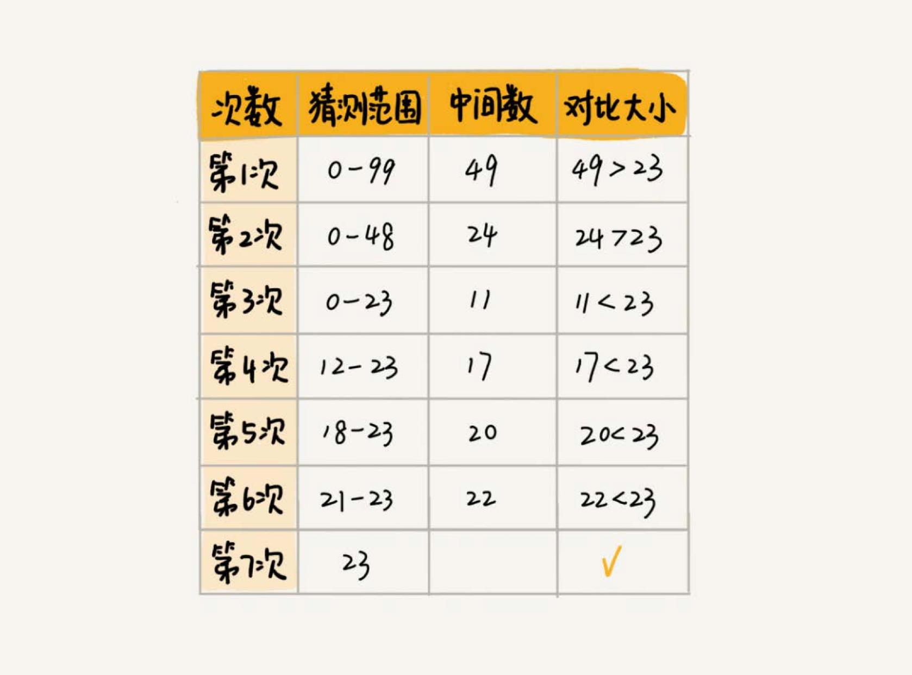
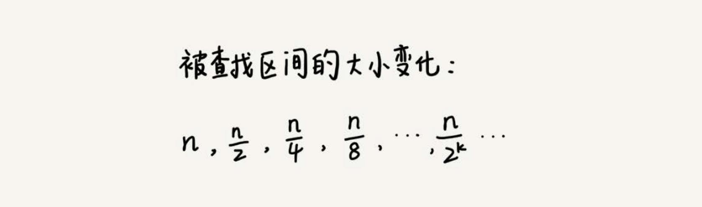

# 二分查找
二分查找是一种非常简单易懂的快速查找算法，比如说，一个猜数字游戏。猜一个 0 到 99 之间的数字，猜的过程中，每猜一次，就会告诉你猜的大了还是
小了，直到猜中为止。如何快速猜中数字？



这个例子用的就是二分思想，按照这个思想 7 次就猜出来了。

## 二分查找的时间复杂度
假设数据大小是 n，每次查找后数据都会缩小为原来的一半，也就是会除以 2。最坏情况下，直到查找区间被缩小为空，才停止。



其中 `n/2^k=1` 时，k 的值就是总共缩小的次数。而每一次缩小操作只涉及两个数据的大小比较，所以，经过了 k 次区间缩小操作，时间复杂度
就是 `O(k)`。通过 `n/2^k=1`，我们可以求得 `k=log2(n)`，所以时间复杂度就是 `O(logn)`。

`O(logn)` 这种对数时间复杂度。这是一种极其高效的时间复杂度，有的时候甚至比时间复杂度是常量级 `O(1)`的算法还要高效。

因为 `logn` 是一个非常“恐怖”的数量级，即便 n 非常非常大，对应的 `logn` 也很小。比如 n 等于 2 的 32 次方，这个数很大了吧？大约是 42 亿。
也就是说，如果我们在 42 亿个数据中用二分查找一个数据，最多需要比较 32 次。

用大 O 标记法表示时间复杂度的时候，会省略掉常数、系数和低阶。对于常量级时间复杂度的算法来说，`O(1)` 有可能表示的是一个非常大的常量值，比
如 `O(1000)`、`O(10000)`。所以，常量级时间复杂度的算法有时候可能还没有 `O(logn)` 的算法执行效率高。

## 实现
```go
func BinarySearch(a []int, value int) int {
	length := len(a)
	if length < 1 {
		return -1
	}
	start := 0
	end := length -1
	for start <= end {
		mid := (start + end) / 2
		if a[mid] == value {
			return mid
		} else if a[mid] < value {
			start = mid + 1
		} else {
			end = mid - 1
		}
	}

	return -1
}

// 使用递归实现二分查找
func BinarySearchRecursive(a []int, value int) int {
	length := len(a)
	if length < 1 {
		return -1
	}

	return bs(a, value, 0, length -1)
}

func bs(a []int, value, start, end int) int {
	if start > end {
		return -1
	}
	mid := (start + end) / 2
	if a[mid] == value {
		return mid
	} else if a[mid] < value {
		return bs(a, value, mid + 1, end)
	} else {
		return bs(a, value, start, mid - 1)
	}
}
```

上面的代码中，`mid := (start + end) / 2` 这种写法是有问题的。因为如果 start 和 end 比较大的话，两者之和就有可能会溢出。改进的
方法是将 mid 的计算方式写成 `start+(end-start)/2`。更进一步，如果要将性能优化到极致的话，可以将这里的除以 2 操作转化成位
运算`start+((end-start)>>1)`。因为相比除法运算来说，计算机处理位运算要快得多。

## 应用场景
二分查找的应用场景是有很大局限性：
- 二分查找依赖的是**顺序表结构**，也就是数组。不能依赖链表的主要原因是二分查找算法需要按照下标随机访问元素。数组按照下标随机访问数据
的时间复杂度是 `O(1)`，而链表随机访问的时间复杂度是 `O(n)`。所以，如果数据使用链表存储，二分查找的时间复杂就会变得很高。
- 二分查找针对的是**有序数据**。如果数据没有序，需要先排序。排序的时间复杂度最低是 `O(nlogn)`。所以，如果我们针对的是一组静态的数据，
没有频繁地插入、删除，我们可以进行一次排序，多次二分查找。如果我们的数据集合有频繁的插入和删除操作，要想用二分查找，要么每次插入、删除
操作之后保证数据仍然有序，要么在每次二分查找之前都先进行排序。针对这种动态数据集合，无论哪种方法，维护有序的成本都是很高的。
- 数据量太小不适合二分查找。顺序遍历就足够了。
- **数据量太大也不适合二分查找。二分查找的底层需要依赖数组这种数据结构，而数组为了支持随机访问的特性，要求内存空间连续，对内存的要
求比较苛刻。比如，1GB 大小的数据，如果用数组来存储，那就需要 1GB 的连续内存空间**。

## 查找第一个值等于给定值的元素
前面实现的二分查找，适用于有序数据集合中不存在重复的数据的情况，如果有重复数据，如何找到第一个等于给定值的元素？

```go
func BinarySearch(a []int, value int) int {
	length := len(a)
	if length < 1 {
		return -1
	}
	start := 0
	end := length -1
	for start <= end {
		mid := (start + end) / 2
		if a[mid] > value {
			end = mid - 1
		} else if a[mid] < value {
			start = mid + 1
		} else {
			if mid == 0 || a[mid - 1] != value {
				return mid
			} else {
				end = mid - 1
			}
		}
	}
	return -1
}
```

注意 `a[mid] == value` 时，要判断否有重复值，数据集合是有序的，要找到第一个等于给定值得元素：
- 如果 `mid == 0` 说明，已经是 `a[mid]` 集合的第一个元素，不需要再继续查找。
- 如果 `a[mid - 1] != value`，也就是 `a[mid]` 的前一个元素不等于 value，那么就说明 `a[mid]` 就是第一个等于给定值得元素。

## 查找最后一个值等于给定值的元素
```go
func BinarySearch(a []int, value int) int {
	length := len(a)
	if length < 1 {
		return -1
	}
	start := 0
	end := length -1
	for start <= end {
		mid := (start + end) / 2
		if a[mid] > value {
			end = mid - 1
		} else if a[mid] < value {
			start = mid + 1
		} else {
			if mid == length - 1  || a[mid + 1] != value {
				return mid
			} else {
				start = mid + 1
			}
		}
	}
	return -1
}
```

和查找最后一个值等于给定值的元素思路差不多，注意 `a[mid] == value` 时：
- 如果 `mid == length - 1` 说明，已经是 `a[mid]` 集合的最后一个元素，不需要再继续查找。
- 如果 `a[mid + 1] != value`，也就是 `a[mid]` 的下一个元素不等于 value，那么就说明 `a[mid]` 就是最后一个等于给定值得元素。

## 查找第一个大于等于给定值的元素
```go
func BinarySearch(a []int, value int) int {
	length := len(a)
	if length < 1 {
		return -1
	}
	start := 0
	end := length -1
	for start <= end {
		mid := (start + end) / 2
		if a[mid] >= value {
			if mid == 0 || a[mid - 1] < value {
				return mid
			} else {
				end = mid - 1
			}
		} else {
			start = mid + 1
		}
	}
	return -1
}
```

如果 `a[mid]` 大于等于给定值 value ，先看这个 `a[mid]` 是不是要找的第一个值大于等于给定值的元素。
- 如果 `mid == 0` 说明，已经是 `a[mid]` 集合的第一个元素，不需要再继续查找。
- 如果 `a[mid - 1] < value`，也就是前面一个元素小于要查找的值 value，那么就说明 `a[mid]` 就是我们要找得元素。

## 查找最后一个小于等于给定值的元素
```go
func BinarySearch(a []int, value int) int {
	length := len(a)
	if length < 1 {
		return -1
	}
	start := 0
	end := length -1
	for start <= end {
		mid := (start + end) / 2
		if a[mid] <= value {
			if mid == length - 1 || a[mid + 1] > value {
				return mid
			} else {
				start = mid + 1
			}
		} else {
			end = mid - 1
		}
	}
	return -1
}
```

如果 `a[mid]` 小于等于给定值 value ，先看这个 `a[mid]` 是不是要找的第一个值小于等于给定值的元素。
- 如果 `mid == length - 1` 说明，已经是 `a[mid]` 集合的最后一个元素，不需要再继续查找。
- 如果 `a[mid + 1] > value`，后面一个元素大于要查找的值 value，那么就说明 `a[mid]` 就是我们要找得元素。