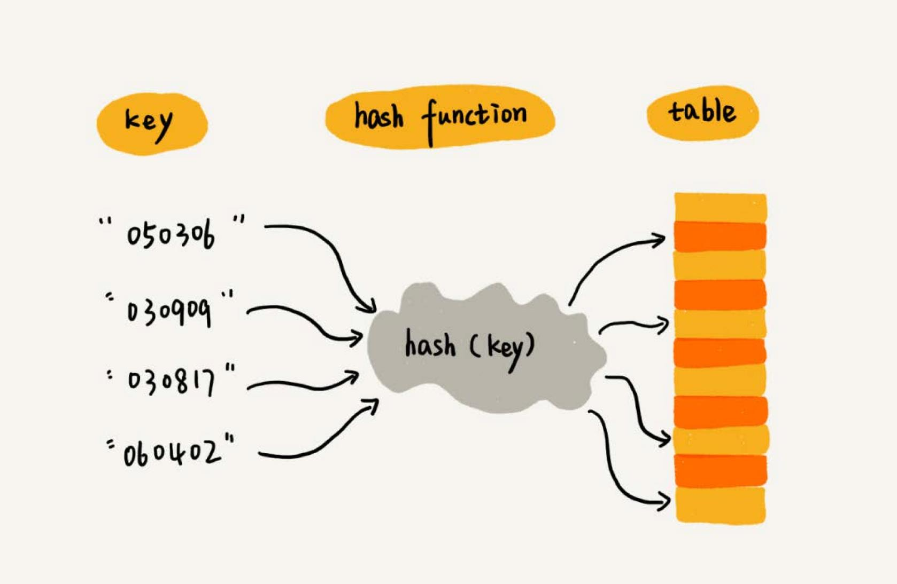
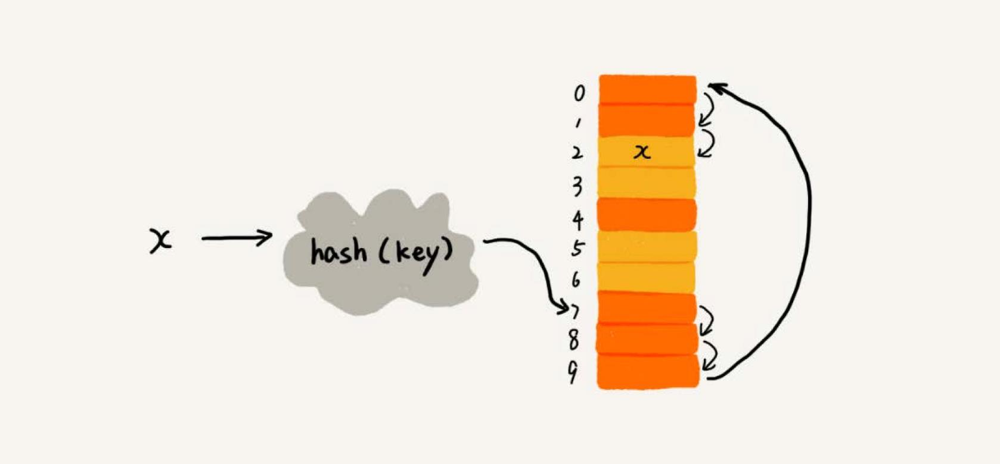
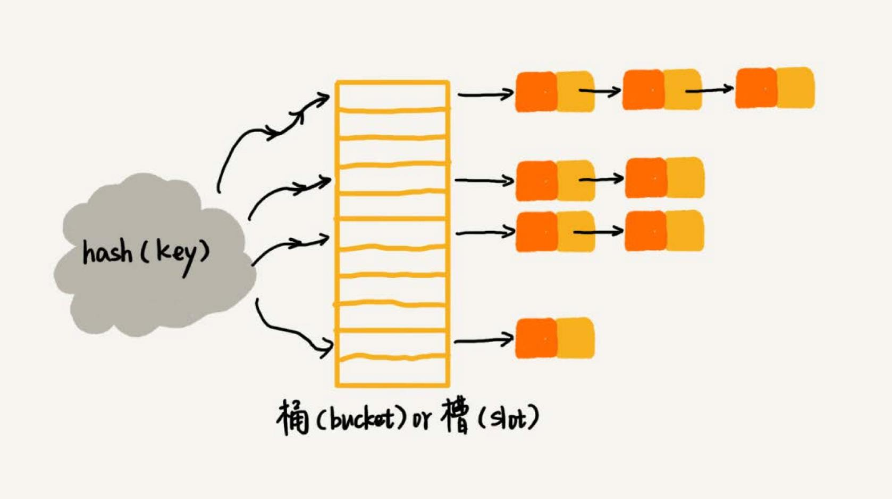
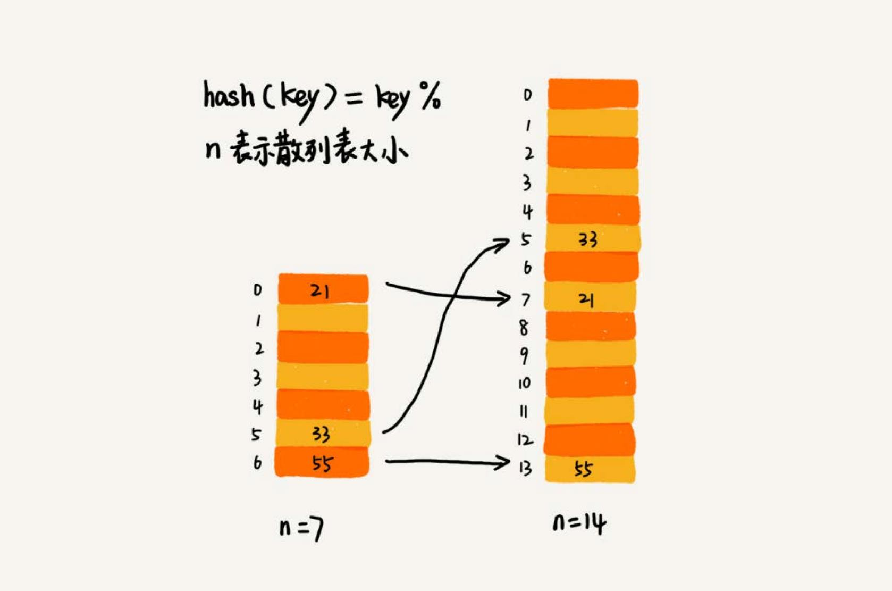
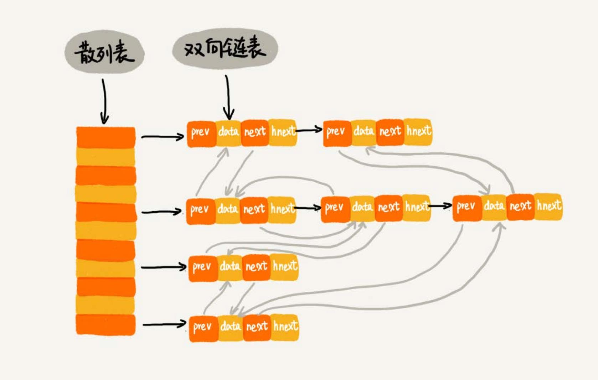

# 散列表
散列表（Hash Table），也叫**哈希表**或者 **Hash 表**。

散列表用的是数组支持按照下标随机访问数据的特性，所以散列表其实就是数组的一种扩展，由数组演化而来。



通过**散列函数**把元素的**键值**映射为**数组下标**，然后将数据存储在数组中对应下标的位置。当按照键值查询元素时，用同样的散列函数，将键
值转化数组下标，从对应的数组下标的位置取数据。

## 散列函數
散列函数在散列表中起着非常关键的作用。把它定义成 `hash(key)`，`key` 表示元素的键值，`hash(key)` 计算得到一个散列值。

散列函数设计的基本要求：
1. 散列函数计算得到的散列值是一个非负整，因为数组下标是从 0 开始的。
2. 如果 `key1 = key2`，那么 `hash(key1) == hash(key2)`
3. 如果 `key1 != key2`，那么 `hash(key1) != hash(key2)`

第三点要注意，在真实的情况下，要想找到一个不同的 key 对应的散列值都不一样的散列函数，几乎是不可能的。即便像的 MD5、SHA、CRC 等哈希算法，
也无法完全避免这种散列冲突。而且，因为数组的存储空间有限，也会加大散列冲突的概率。

## 散列冲突
再好的散列函数也无法避免散列冲突。那该如何解决散列冲突问题？

常用的散列冲突解决方法有两类：
- 开放寻址法（open addressing）
- 链表法（chaining）

### 开放寻址法
开放寻址法的思想是，如果出现了散列冲突，就重新探测一个空闲位置，将其插入。一种比较简单的探测方法，**线性探测**（Linear Probing）：

当往散列表中插入数据时，如果某个数据经过散列函数散列之后，存储位置已经被占用了，就从当前位置开始，依次往后查找，看是否有空闲位置，
直到找到为止。

如下图，黄色的色块表示空闲位置，橙色的色块表示已经存储了数据：


图中散列表的大小为 10，在元素 x 插入散列表之前，散列表中已有 6 个元素。x 经过 Hash 算法之后，被散列到位置下标为 7 的位置，但是
这个位置已经有数据了，所以就产生了冲突。于是就顺序地往后一个一个找，看有没有空闲的位置，遍历到尾部都没有找到空闲的位置，于是再从表头
开始找，直到找到空闲位置 2，于是将其插入到这个位置。

在散列表中查找元素的过程有点儿类似插入过程。通过散列函数求出要查找元素的键值对应的散列值，然后比较数组中下标为散列值的元素和要查找的
元素。如果相等，则说明就是要找的元素；否则就顺序往后依次查找。如果遍历到数组中的空闲位置，还没有找到，就说明要查找的元素并没有在散列表中。

#### 删除操作
散列表跟数组一样，还支持删除操作。对于使用线性探测法解决冲突的散列表，注意**删除操作不能单纯地把要删除的元素设置为空**。因为查找
操作遍历到数组中的空闲位置，还没有找到，就认为数据不存在。但是，如果这个空闲位置是后来删除的，就会导致原来的查找算法失效。存在的数据，
会被认定为不存在。如何解决？

可以将删除的元素，特殊标记为 **deleted**。当线性探测查找的时候，遇到标记为 deleted 的空间，并不是停下来，而是继续往下探测。

#### 线性探测法的问题
当**散列表中插入的数据越来越多时，散列冲突发生的可能性就会越来越大，空闲位置会越来越少，线性探测的时间就会越来越久**。极端情况下，
可能需要探测整个散列表，所以最坏情况下的时间复杂度为 `O(n)`。同理，在删除和查找时，也有可能会线性探测整张散列表，才能找到要
查找或者删除的数据。

#### 二次探测
二次探测，跟线性探测很像，线性探测每次探测的步长是 1，那它探测的下标序列就是 `hash(key)+0`，`hash(key)+1`，`hash(key)+2` ……
而二次探测探测的步长就变成了原来的“二次方”，也就是说，它探测的下标序列就是 `hash(key)+0`，`hash(key)+1^2`，`hash(key)+2^2`……

#### 双重散列
意思就是不仅要使用一个散列函数。使用一组散列函数 `hash1(key)`，`hash2(key)`，`hash3(key)`…… 先用第一个散列函数，如果计
算得到的存储位置已经被占用，再用第二个散列函数，依次类推，直到找到空闲的存储位置。

#### 装载因子
不管采用哪种探测方法，当散列表中空闲位置不多的时候，散列冲突的概率就会大大提高。**为了尽可能保证散列表的操作效率，一般情况下，会尽可能保证
散列表中有一定比例的空闲槽位**。用**装载因子**（load factor）来表示空位的多少。

装载因子的计算公式：`散列表的装载因子=填入表中的元素个数/散列表的长度`

**装载因子越大，说明空闲位置越少，冲突越多，散列表的性能会下降**。

### 链表法
链表法是一种更加常用的散列冲突解决办法。如下图，在散列表中，每个“桶（bucket）”或者“槽（slot）”会对应一条链表，所有散列值相同的元素
都放到相同槽位对应的链表中。


插入的时候，只需要通过散列函数计算出对应的散列槽位，将其插入到对应链表中即可，所以插入的时间复杂度是 `O(1)`。当查找、删除一个元素时，
同样通过散列函数计算出对应的槽，然后遍历链表查找或者删除。

#### 时间复杂度
查找或删除操作的时间复杂度跟链表的长度 k 成正比，也就是 `O(k)`。**对于散列比较均匀的散列函数来说，理论上讲，`k=n/m`**，其中 n 表示散
列中数据的个数，m 表示散列表中“槽”的个数。

## 设计散列表
散列表的查询效率并不能笼统地说成是 `O(1)`。它跟散列函数、装载因子、散列冲突等都有关系。如果散列函数设计得不好，或者装载因子过高，
都可能导致散列冲突发生的概率升高，查询效率下降。

如果有恶意的攻击者，还有可能通过精心构造的数据，使得所有的数据经过散列函数之后，都散列到同一个槽里。如果使用的是基于链表的冲突解决
方法，那这个时候，散列表就会退化为链表，查询的时间复杂度就从 `O(1)` 退化为 `O(n)`。

如果散列表中有 10 万个数据，退化后的散列表查询的效率就下降了 10 万倍。更直接点说，如果之前运行 100 次查询只需要 0.1 秒，那现在就需
要 1 万秒。这样就有可能因为查询操作消耗大量 CPU 或者线程资源，导致系统无法响应其他请求，从而达到拒绝服务攻击（DoS）的目的。这也就
是**散列表碰撞攻击**的基本原理。

### 设计散列函数
散列函数设计的好坏，决定了散列表冲突的概率大小，也直接决定了散列表的性能。

1. 设计不能太复杂。过于复杂的散列函数，势必会消耗很多计算时间，也就间接的影响到散列表的性能。
2. 散列函数生成的值要尽可能随机并且均匀分布，这样才能避免或者最小化散列冲突，而且即便出现冲突，散列到每个槽里的数据也会比较平均，
不会出现某个槽内数据特别多的情况。
3. 其他因素，长度、特点、分布、散列表的大小等。

### 装载因子过大
装载因子越大，散列冲突的概率就越大。不仅插入数据的过程要多次寻址或者拉很长的链，查找的过程也会因此变得很慢。

- 对于没有频繁插入和删除的静态数据集合来说，很容易根据数据的特点、分布等，设计出完美的、极少冲突的散列函数，因为之前数据都是已知的。
- 对于动态散列表来说，数据集合是频繁变动的，事先无法预估将要加入的数据个数，所以也无法事先申请一个足够大的散列表。随着数据慢慢加入，装
载因子就会慢慢变大。当装载因子大到一定程度之后，可以进行**动态扩容**。

#### 动态扩容
散列表的动态扩容，可以重新申请一个更大的散列表，将数据搬移到这个新散列表中。假设每次扩容都申请一个原来散列表大小两倍的空间。如果原来
散列表的装载因子是 0.8，那经过扩容之后，新散列表的装载因子就下降为原来的一半，变成了 0.4。

针对**散列表的扩容，数据搬移操作**要复杂很多。因为散列表的大小变了，数据的存储位置也变了，所以**需要通过散列函数重新计算每个数据的存储
位置**。



图中，散列表中 21 这个元素原来存储在下标为 0 的位置，搬移到新的散列表中，存储在下标为 7 的位置。

当散列表的装载因子超过某个阈值时，就需要进行扩容。装载因子阈值的设置要权衡时间、空间复杂度。如果内存空间不紧张，对执行效率要求很高，
可以降低负载因子的阈值；相反，如果内存空间紧张，对执行效率要求又不高，可以增加负载因子的值。

#### 避免低效地扩容
动态扩容的散列表插入一个数据都很快，但是在特殊情况下，当装载因子已经到达阈值，需要先进行扩容，再插入数据。这个时候，插入数据就会变得很慢，
甚至会无法接受。

如果我们的业务代码直接服务于用户，尽管大部分情况下，插入一个数据的操作都很快，但是，极个别非常慢的插入操作，也会让用户崩溃。这个时
候，“一次性”扩容的机制就不合适了。

为了解决一次性扩容耗时过多的情况，可以将扩容操作穿插在插入操作的过程中，分批完成。当装载因子触达阈值之后，我们只申请新空间，但并
不将老的数据搬移到新散列表中。

有新数据要插入时，将新数据插入新散列表中，并且从老的散列表中拿出一些数据放入到新散列表。每次插入一个数据到散列表，都重复上面的过程。
经过多次插入操作之后，老的散列表中的数据就一点一点全部搬移到新散列表中了。这样没有了集中的一次性数据搬移，插入操作就都变得很快了。

对于查询操作，为了兼容了新、老散列表中的数据，我们先从新散列表中查找，如果没有找到，再去老的散列表中查找。

这种实现方式，任何情况下，插入一个数据的时间复杂度都是 `O(1)`。

### 选择冲突解决方法
散列冲突的解决办法，开放寻址法和链表法。
Java 中 LinkedHashMap 就采用了链表法解决冲突，ThreadLocalMap 是通过线性探测的开放寻址法来解决冲突。
#### 开放寻址法
开放寻址法不像链表法，需要拉很多链表。散列表中的数据都存储在数组中，可以有效地利用 CPU 缓存加快查询速度。而且，这种方法实现的散列表，
序列化起来比较简单。链表法包含指针，序列化起来就没那么容易。

用开放寻址法解决冲突的散列表，删除数据的时候比较麻烦，需要特殊标记已经删除掉的数据。而且，在开放寻址法中，所有的数据都存储在一个数组中，比
起链表法来说，冲突的代价更高。所以，使用开放寻址法解决冲突的散列表，装载因子的上限不能太大。这也导致这种方法比链表法更浪费内存空间。

**当数据量比较小、装载因子小的时候，适合采用开放寻址法**。

#### 链表法
链表法对内存的利用率比开放寻址法要高。因为链表结点可以在需要的时候再创建，并不需要像开放寻址法那样事先申请好。实际上，这一点也是链表优于
数组的地方。

链表法比起开放寻址法，对大装载因子的容忍度更高。开放寻址法只能适用装载因子小于 1 的情况。接近 1 时，就可能会有大量的散列冲突，导致大量
的探测、再散列等，性能会下降很多。但是对于链表法来说，只要散列函数的值随机均匀，即便装载因子变成 10，也就是链表的长度变长了而已，虽然查找
效率有所下降，但是比起顺序查找还是快很多。

链表因为要存储指针，所以对于比较小的对象的存储，是比较消耗内存的，还有可能会让内存的消耗翻倍。而且，因为链表中的结点是零散分布在内存中的，
不是连续的，所以对 CPU 缓存是不友好的，这方面对于执行效率也有一定的影响。

如果存储的是大对象，也就是说要存储的对象的大小远远大于一个指针的大小（4 个字节或者 8 个字节），那链表中指针的内存消耗在大对象面前就可以
忽略了。

*基于链表的散列冲突处理方法比较适合存储大对象、大数据量的散列表，而且，比起开放寻址法，它更加灵活，支持更多的优化策略，比如用红黑树代替
链表**。

### 散列表举例分析
Java 的 HashMap 是一个工业级的散列表。

#### 初始大小
HashMap 默认的初始大小是 16，当然这个默认值是可以设置的，如果事先知道大概的数据量有多大，可以通过修改默认初始大小，减少动态扩容的次数，
这样会大大提高 HashMap 的性能。

#### 装载因子和动态扩容
最大装载因子默认是 0.75，当 HashMap 中元素个数超过 0.75*capacity（capacity表示散列表的容量）的时候，就会启动扩容，每次扩容都会扩容
为原来的两倍大小。

#### 散列冲突解决方法
HashMap 底层采用链表法来解决冲突。即使负载因子和散列函数设计得再合理，也免不了会出现拉链过长的情况，一旦出现拉链过长，则会严重
影响 HashMap 的性能。

于是，在 JDK1.8 版本中，为了对 HashMap 做进一步优化，引入了红黑树。而当链表长度太长（默认超过 8）时，链表就转换为红黑树。
当红黑树结点个数少于 8 个的时候，又会将红黑树转化为链表。

#### 散列函数
散列函数的设计并不复杂，追求的是简单高效、分布均匀。
```java
int hash(Object key) {
  int h = key.hashCode()；
  return (h ^ (h >>> 16)) & (capitity -1); //capicity表示散列表的大小
}
```

## 散列表和链表
Redis 有序集合不仅使用了跳表，还用到了散列表。Java 的 LinkedHashMap 也用到了散列表和链表。为什么散列表和链表会经常放到一块使用？

散列表这种数据结构虽然支持非常高效的数据插入、删除、查找操作，但是散列表中的数据都是通过散列函数打乱之后无规律存储的。也就说，它无法
支持按照某种顺序快速地遍历数据。如果希望按照顺序遍历散列表中的数据，那需要将散列表中的数据拷贝到数组中，然后排序，再遍历。

为了解决这个问题，将散列表和链表（或者跳表）结合在一起使用。

### LRU 缓存淘汰算法
之前使用单链表可以实现 LRU 缓存淘汰算法，但是时间复杂度是 `O(n)`。借助散列表可以实现时间复杂度是 `O(1)` 的 LRU 算法。

一个缓存（cache）系统主要包含下面这几个操作：
- 往缓存中添加一个数据；
- 从缓存中删除一个数据；
- 在缓存中查找一个数据。
这三个操作都要涉及“查找”操作，如果单纯地采用链表的话，时间复杂度只能是 `O(n)`。如果将散列表和链表两种数据结构组合使用，可以将这三个操作
的时间复杂度都降低到 `O(1)`。具体的结构就是下面这个样子：



使用双向链表存储数据，链表中的每个结点处理存储数据（data）、前驱指针（prev）、后继指针（next）之外，还新增了一个特殊的字段 `hnext`。

因为散列表是通过链表法解决散列冲突的，所以每个结点会在两条链中。一个链是刚刚提到的双向链表，另一个链是散列表中的拉链。前驱和后继指
针是为了将结点串在双向链表中，`hnext` 指针是为了将结点串在散列表的拉链中。

前面讲到的缓存的三个操作，是如何做到时间复杂度是 `O(1)` 的：
- 散列表中查找数据的时间复杂度接近 `O(1)`，所以通过散列表，可以很快地在缓存中找到一个数据。当找到数据之后，还需要将它移动到双向链表的尾部。
- 借助散列表，可以在 `O(1)` 时间复杂度里找到要删除的结点。因为是双向链表，所以可以通过前驱指针 `O(1)` 时间复杂度获取前驱结点，所以在
双向链表中，删除结点只需要 `O(1)` 的时间复杂度。
- 添加数据到缓存稍微有点麻烦，需要先看这个数据是否已经在缓存中。如果已经在其中，需要将其移动到双向链表的尾部；如果不在其中，还要看缓存有
没有满。如果满了，则将双向链表头部的结点删除，然后再将数据放到链表的尾部；如果没有满，就直接将数据放到链表的尾部。