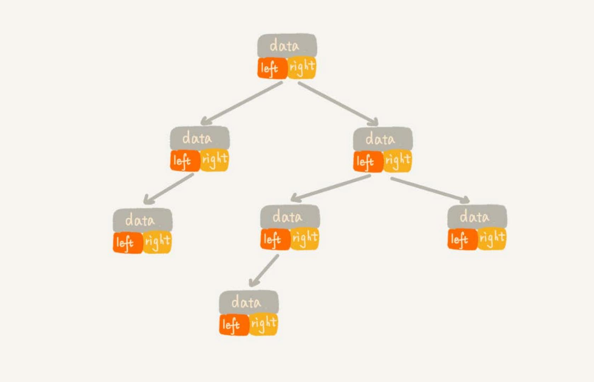
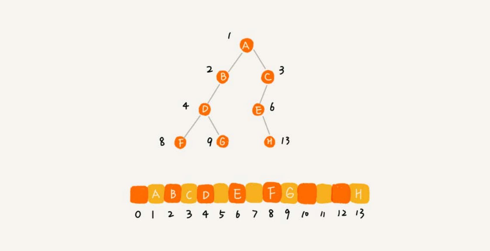

# 树
栈、队列等都是线性表结构，**树**，一种非线性表结构，这种数据结构比线性表的数据结构要复杂得多。


树的每个元素叫作**节点**，用来连线相邻节点之间的关系，叫作**父子关系**。


A 节点就是 B 节点的**父节点**，B 节点是 A 节点的**子节点**。B、C、D 这三个节点的父节点是同一个节点，所以它们之间互
称为**兄弟节点**。没有父节点的节点叫作**根节点**，也就是节点 E。**没有子节点的节点**叫作**叶子节点**或者**叶节点**，
G、H、I、J、K、L 都是叶子节点。

“树” 的三个比较相似的概念：高度（Height）、深度（Depth）、层（Level）。


## 二叉树
二叉树是最常用的树结构。

二叉树，就是每个节点**最多有两个“叉”，也就是两个子节点**，分别是左子节点和右子节点。不过，二叉树并不要求每个节点都有两个子节点，
有的节点只有左子节点，有的节点只有右子节点。


- 编号 2，叶子节点全都在最底层，除了叶子节点之外，每个节点都有左右两个子节点，这种二叉树就叫作**满二叉树**。
- 编号 3 ，叶子节点都在最底下两层，最后一层的叶子节点都靠左排列，并且除了最后一层，其他层的节点个数都要达到最大，
这种二叉树叫作**完全二叉树**。

### 二叉树的存储
为什么把最后一层的叶子节点靠左排列的叫完全二叉树？

二叉树的存储方法：
- 基于指针或者引用的二叉链式存储法。
- 基于数组的顺序存储法。

#### 链式存储法


上图是链式存储法，每个节点有三个字段，其中一个存储数据，另外两个是指向左右子节点的指针。只要拎住根节点，就可以通过左右子节点
的指针，把整棵树都串起来。这种存储方式比较常用。大部分二叉树代码都是通过这种结构来实现的。

#### 顺序存储法


上图是顺序存储法，节点 X 存储在数组中下标为 i 的位置，下标为 `2 * i` 的位置存储的就是左子节点，下标为 `2 * i + 1` 的位置存储
的就是右子节点。反过来，下标为 `i/2` 的位置存储就是它的父节点。只要知道根节点存储的位置，就可以把整棵树都串起来。

但是基于数组的顺序存储法，如果是**非完全二叉树，其实会浪费比较多的数组存储空间**。比如下面途中的例子：



如果某棵二叉树是一棵完全二叉树，那用数组存储无疑是最节省内存的一种方式。因为数组的存储方式并不需要存储额外的左右子节点的指针。
这就是为什么完全二叉树要求最后一层的子节点都靠左的原因。

**堆其实就是一种完全二叉树，最常用的存储方式就是数组**。

### 二叉树的遍历
遍历方法有三种：
- 前序遍历是指，对于树中的任意节点来说，先打印这个节点，然后再打印它的左子树，最后打印它的右子树。
- 中序遍历是指，对于树中的任意节点来说，先打印它的左子树，然后再打印它本身，最后打印它的右子树。
- 后序遍历是指，对于树中的任意节点来说，先打印它的左子树，然后再打印它的右子树，最后打印这个节点本身。


每个节点最多会被访问两次，所以遍历操作的时间复杂度，跟节点的个数 n 成正比，也就是说二叉树遍历的时间复杂度是 `O(n)`。

## 二叉查找树
二叉查找树是二叉树中最常用的一种类型，也叫**二叉搜索树**。支持快速查找、插入、删除一个数据。

**二叉查找树要求，在树中的任意一个节点，其左子树中的每个节点的值，都要小于这个节点的值，而右子树节点的值都大于这个节点的值**。

### 查找
先取根节点，如果它等于要查找的数据，就返回。如果要查找的数据比根节点的值小，那就在左子树中递归查找；如果要查找的数据比根节点的值大，
那就在右子树中递归查找。

### 插入
新插入的数据一般都是在叶子节点上，所以只需要从根节点开始，依次比较要插入的数据和节点的大小关系。如果要插入的数据比节点的数据大，并且节点的
右子树为空，就将新数据直接插到右子节点的位置；如果不为空，就再递归遍历右子树，查找插入位置。同理，如果要插入的数据比节点数值小，并且节点
的左子树为空，就将新数据插入到左子节点的位置；如果不为空，就再递归遍历左子树，查找插入位置。

### 删除
删除操作比较复杂，针对要删除节点的子节点个数的不同，要分三种情况：

1. 如果要删除的节点没有子节点，只需要直接将父节点中，指向要删除节点的指针置为 `null`。
2. 如果要删除的节点只有一个子节点（只有左子节点或者右子节点），只需要更新父节点指向要删除节点的指针，让它指向要删除节点的子
节点就可以了。
3. 如果要删除的节点有两个子节点，这就比较复杂了。需要找到这个节点的右子树中的最小节点，把它替换到要删除的节点上。然后再删除掉这个
最小节点，因为最小节点肯定没有左子节点（如果有左子结点，那就不是最小节点了），所以，我们可以应用上面两条规则来删除这个最小节点。


### 支持重复数据的二叉查找树
上面的二叉查找树的操作，针对的是不存在键值相同的情况。那如果存储的两个对象键值相同，该怎么处理？
有两种解决方法：
1. 二叉查找树中每一个节点不仅会存储一个数据，因此通过链表和支持动态扩容的数组等数据结构，把值相同的数据都存储在同一个节点上。
2. 第二种方法，每个节点仍然只存储一个数据。在查找插入位置的过程中，如果碰到一个节点的值，与要插入数据的值相同，我们就将这个要插入的
数据放到这个节点的右子树，也就是说，把这个新插入的数据当作大于这个节点的值来处理。


当要查找数据的时候，遇到值相同的节点，并不停止查找操作，而是继续在右子树中查找，直到遇到叶子节点，才停止。这样就可以把键值等于要查找值的所
有节点都找出来。

对于删除操作，也需要先查找到每个要删除的节点，然后再按前面讲的删除操作的方法，依次删除。

### 二叉查找树的时间复杂度
不同形态二叉查找树，查找、插入、删除操作的时间复杂度是不同的。


第一种情况是最糟糕的情况，根节点的左右子树极度不平衡，退化成了链表，查找的时间复杂度就变成了 `O(n)`。

最理想的情况下，二叉查找树是一棵完全二叉树（或满二叉树），时间复杂度其实都跟树的高度成正比，也就是 `O(height)`
（可以查看[代码示例](https://github.com/shipengqi/algorithm-learn/blob/master/demos/trees/bstree/binary_search_tree.go)）。

那么如何求一棵包含 n 个节点的完全二叉树的高度？

树的高度就等于最大层数减一，包含 n 个节点的完全二叉树中，第一层包含 1 个节点，第二层包含 2 个节点，第三层包含 4 个节点，依次类推，下面一
层节点个数是上一层的 2 倍，第 K 层包含的节点个数就是 `2^(K-1)`。

但是，对于完全二叉树来说，最后一层的节点个数并不确定。它包含的节点个数在 1 个到 `2^(L-1)` 个之间（假设 L 是最大层数）。
如果把每一层的节点个数加起来就是总的节点个数 n。也就是说，如果节点的个数是 n，那么 n 满足这样一个关系：
```
n >= 1+2+4+8+...+2^(L-2)+1
n <= 1+2+4+8+...+2^(L-2)+2^(L-1)
```

这时两个等比数列，L 的范围是`[log2(n+1), log2(n) +1]`。完全二叉树的层数小于等于 `log2(n) + 1`，也就是说，完全二叉树的高度小于
等于 `log2n`。

### 二叉查找树和散列表
散列表的插入、删除、查找操作的时间复杂度可以做到常量级的 `O(1)`，非常高效。二叉查找树在比较平衡的情况下，插入、删除、查找操作时间复杂度
才是 `O(logn)`，相对散列表，好像并没有什么优势，那为什么还要用二叉查找树？
1. 散列表中的数据是无序存储的，如果要输出有序的数据，需要先进行排序。而对于二叉查找树来说，我们只需要中序遍历，就可以在 `O(n)` 的时间
复杂度内，输出有序的数据序列。
2. 散列表扩容耗时很多，而且当遇到散列冲突时，性能不稳定，尽管二叉查找树的性能不稳定，但是在工程中，最常用的平衡二叉查找树的性能非常稳定，时间
复杂度稳定在 `O(logn)`。
3. 尽管散列表的查找等操作的时间复杂度是常量级的，但因为哈希冲突的存在，这个常量不一定比 logn 小，所以实际的查找速度可能不一定比 `O(logn)` 
快。加上哈希函数的耗时，也不一定就比平衡二叉查找树的效率高。 
4. 散列表的构造比二叉查找树要复杂，需要考虑的东西很多。比如散列函数的设计、冲突解决办法、扩容、缩容等。平衡二叉查找树只需要考虑平衡性
这一个问题。
5. 为了避免过多的散列冲突，散列表装载因子不能太大，特别是基于开放寻址法解决冲突的散列表，不然会浪费一定的存储空间。


## 红黑树
极端情况下，二叉树会退化为链表，时间复杂度会退化到 `O(n)`。要解决这个复杂度退化的问题，需要设计一种**平衡二叉查找树**。

### 平衡二叉查找树
平衡二叉树：二叉树中任意一个节点的左右子树的高度相差不能大于 1。从这个定义来看，完全二叉树、满二叉树其实都是平衡二叉树，但是非完全二叉树也有
可能是平衡二叉树。


### 红黑树
平衡二叉查找树有很多，比如，Splay Tree（伸展树）、Treap（树堆）等，红黑树（Red-Black Tree），简称 R-B Tree。它是一种不严格的平
衡二叉查找树。

红黑树中的节点，一类被标记为黑色，一类被标记为红色。一棵红黑树要满足的要求：

- 根节点是黑色的；
- 每个叶子节点都是黑色的空节点（NIL），也就是说，叶子节点不存储数据；
- 任何相邻的节点都不能同时为红色，也就是说，红色节点是被黑色节点隔开的；
- 每个节点，从该节点到达其可达叶子节点的所有路径，都包含相同数目的黑色节点；


平衡二叉查找树的初衷，是为了解决二叉查找树因为动态更新导致的性能退化问题。所以，“平衡”的意思可以等价为性能不退化。“近似平衡”就等价为性能
不会退化的太严重。红黑树是近似平衡的。


