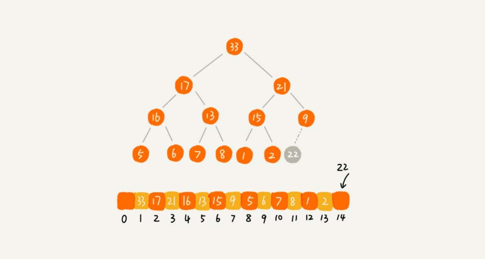

# 堆
堆是一种特殊的树。

- 堆必须是一个完全二叉树；
- 堆中每一个节点的值都必须大于等于（或小于等于）其子树中每个节点的值。换一种说法，堆中每个节点的值都大于等于（或者小于等于）其左右
子节点的值。

对于每个节点的值都大于等于子树中每个节点值的堆，叫作**大顶堆**。对于每个节点的值都小于等于子树中每个节点值的堆，叫作**小顶堆**。

将根节点最大的堆叫做最大堆或大根堆，根节点最小的堆叫做最小堆或小根堆。

堆最经典的应用就是堆排序了。

## 实现一个堆
完全二叉树比较适合用数组来存储，非常节省存储空间。

用数组存储堆的例子：


数组中下标为 i 的位置，下标为 `2 * i` 的位置存储的就是左子节点，下标为 `2 * i + 1` 的位置存储
的就是右子节点。反过来，下标为 `i/2` 的位置存储就是它的父节点。

### 插入
往堆中插入一个元素后，需要继续满足堆的两个特性。如果把新插入的元素放到堆的最后，如下图，已经不符合堆的特性。于是，
就需要进行调整，让其重新满足堆的特性，这个过程叫作**堆化**（heapify）。



**堆化有两种，从下往上和从上往下**。先看从下往上的堆化方法。

堆化非常简单，就是顺着节点所在的路径，向上或者向下，对比，然后交换。

让新插入的节点与父节点对比大小。如果不满足子节点小于等于父节点的大小关系，就互换两个节点。一直重复这个过程，直到父子节点之间满足刚说的那
种大小关系。


```go
type Heap struct {
	a       []int  // 数组，从下标 1 开始存储
	n       int    // 堆可以存储的元素的最大个数
	count   int    // 堆已经存储的元素的个数
}

// top-max heap -> heapify from down to up
func (h *Heap) insert(data int) {
    if h.count >= h.n { // 堆满了
		return
	}
    h.count ++
    h.a[h.count] = data

	// compare with parent node
	i := h.count
	parent := i / 2
	// fmt.Println(i, parent)
	for parent > 0 && h.a[parent] < h.a[i] {
		swap(h.a, parent, i)
		i = parent
		parent = i / 2
	}
}

func swap(a []int, i, j int) {
	a[i], a[j] = a[j], a[i]
}
```
### 删除堆顶元素
堆顶元素存储的就是堆中数据的最大值或者最小值。

假设构造的是大顶堆，堆顶元素就是最大的元素。当删除堆顶元素之后，就需要把第二大的元素放到堆顶，那第二大元素肯定会出现在左右子节点中。
然后再迭代地删除第二大节点，以此类推，直到叶子节点被删除。


上面的方法有点问题，就是最后堆化出来的堆并不满足完全二叉树的特性。

把最后一个节点放到堆顶，然后利用同样的父子节点对比方法。对于不满足父子节点大小关系的，互换两个节点，并且重复进行这个过程，直到父子节点
之间满足大小关系为止。这就是**从上往下**的堆化方法。


一个包含 n 个节点的完全二叉树，树的高度不会超过 `log2n`。堆化的过程是顺着节点所在路径比较交换的，所以堆化的时间复杂度跟树的高度成正比，
也就是 `O(logn)`。插入数据和删除堆顶元素的主要逻辑就是堆化，所以，往堆中插入一个元素和删除堆顶元素的时间复杂度都是 `O(logn)`。

```go
func (h *Heap) removeMax()  {
	if h.count == 0 { // 堆空了
		return
	}

	// swap max and last
	swap(h.a, 1, h.count)

	// heapify from up to down
	heapifyUpToDown(h.a, h.count)
}

func heapifyUpToDown(a []int, count int) {
	for i := 1; i <= count/2; {
		maxIndex := i
		if a[i] < a[i * 2] {
			maxIndex = i * 2
		}

		if i * 2 + 1 <= count && a[maxIndex] < a[i * 2 + 1] {
			maxIndex = i * 2 + 1
		}

		if maxIndex == i {
			break
		}

		swap(a, i, maxIndex)
		i = maxIndex
	}
}
```
## 堆排序
堆排序是一种原地的、时间复杂度为 `O(nlogn)` 的排序算法。

堆排序的过程大致分解成两个大的步骤，建堆和排序。

### 建堆

所谓“原地”就是，不借助另一个数组，就在原数组上操作。建堆的过程，有两种思路：

1. 在堆中插入一个元素的思路。尽管数组中包含 n 个数据，但是可以假设，起初堆中只包含一个数据，就是下标为 1 的数据。然后，调用前面讲的插入
操作，将下标从 2 到 n 的数据依次插入到堆中。这样我们就将包含 n 个数据的数组，组织成了堆。
2. 第一种建堆思路的处理过程是从前往后处理数组数据，并且每个数据插入堆中时，都是从下往上堆化。而第二种实现思路，是从后往前处理数组，并且
每个数据都是从上往下堆化。

```go
// build a heap
func buildHeap(a []int, n int) {
	// heapify from the last parent node
	for i := n / 2; i >= 1; i-- { // 对下标从 n/2 开始到 1 的数据进行堆化，因为叶子节点堆化比较的是自己，所以叶子节点不需要堆化
		heapifyUpToDown(a, i, n) // 从第一个非叶子节点 n/2 开始堆化
	}
}
```

### 排序

建堆结束之后，数组中的数据已经是按照大顶堆的特性来组织的。数组中的第一个元素就是堆顶，也就是最大的元素。把它跟最后一个元素交换，那最大元素
就放到了下标为 n 的位置。

这个过程有点类似上面讲的“删除堆顶元素”的操作，当堆顶元素（堆顶是最大的）移除之后，把下标为 n 的元素放到堆顶，然后再通过堆化
的方法，将剩下的 n-1 个元素重新构建成堆。堆化完成之后，再取堆顶的元素，放到下标是 n-1 的位置，一直重复这个过程，直到最后堆中只剩下标
为 1 的一个元素，排序工作就完成了。

```go
// sort by ascend, a index begin from 1, has n elements
func sort(a []int, n int) {
	buildHeap(a, n)

	k := n
	for k >= 1 {
		swap(a, 1, k)
		heapifyUpToDown2(a, 1, k-1)
		k--
	}
}
```

## 快速排序和堆排序
实际开发中，为什么快速排序要比堆排序性能好？
1. 堆排序数据访问的方式没有快速排序友好。
2. 对于同样的数据，在排序过程中，堆排序算法的数据交换次数要多于快速排序。

## 堆的应用
### 优先级队列
优先级队列，首先它是一个队列。队列最大的特性就是先进先出。不过，在优先级队列中，数据的出队顺序不是先进先出，而是按照优先级来，
优先级最高的，最先出队。

用堆来实现优先级队列是最直接、最高效的。因为，堆和优先级队列非常相似。一个堆就可以看作一个优先级队列。往优先级队列中插入
一个元素，就相当于往堆中插入一个元素；从优先级队列中取出优先级最高的元素，就相当于取出堆顶元素。

优先级队列的使用场景：
#### 合并有序小文件
假设有100个小文件，每个文件的大小是 100 MB，每个文件中存储的都是有序的字符串。希望将这些 100 个小文件合并成一个有序的大文件。
这里就会用到优先级队列。

整体思路有点像归并排序中的合并函数。从这 100 个文件中，各取第一个字符串，放入数组中，然后比较大小，把最小的那个字符串放入合
并后的大文件中，并从数组中删除。

假设，这个最小的字符串来自于 13.txt 这个小文件，就再从这个小文件取下一个字符串，并且放到数
组中，重新比较大小，并且选择最小的放入合并后的大文件，并且将它从数组中删除。依次类推，直到所有的文件中的数据都放入到大
文件为止。

这里用数组这种数据结构，来存储从小文件中取出来的字符串。每次从数组中取最小字符串，都需要循环遍历整个数组，显然，
这不是很高效。有没有更加高效方法呢？这里就可以用到优先级队列，也可以说是堆。将从小文件中取出来的字符串放入到小顶堆中，
那堆顶的元素，也就是优先级队列队首的元素，就是最小的字符串。将这个字符串放入到大文件中，并将其从堆中删除。然后再从
小文件中取出下一个字符串，放入到堆中。循环这个过程，就可以将 100 个小文件中的数据依次放入到大文件中。


#### 高性能定时器
假设一个定时器，维护了很多定时任务，每个任务都设定了一个要触发执行的时间点。定时器每过一个很小的单位时间（比如 1 秒），就扫描
一遍任务，看是否有任务到达设定的执行时间。如果到达了，就拿出来执行。

但是，这样每过 1 秒就扫描一遍任务列表的做法比较低效，主要原因有两点：
1. 任务的约定执行时间离当前时间可能还有很久，前面很多次扫描其实都是徒劳的；
2. 每次都要扫描整个任务列表，如果任务列表很大的话，会比较耗时。

针对这样的问题，就可以用优先级队列来解决。按照任务设定的执行时间，将这些任务存储在优先级队列中，队列首部（也就是小顶堆的堆顶）
存储的是最先执行的任务。

这样，定时器就不需要每隔 1 秒就扫描一遍任务列表了。它拿队首任务的执行时间点，与当前时间点相减，得到一个时间间隔 T。这个
时间间隔 T 就是，从当前时间开始，需要等待多久，才会有第一个任务需要被执行。这样，定时器就可以设定在 T 秒之后，再来执行任
务。从当前时间点到（T-1）秒这段时间里，定时器都不需要做任何事情。

当 T 秒时间过去之后，定时器取优先级队列中队首的任务执行。然后再计算新的队首任务的执行时间点与当前时间点的差值，把这个值作为
定时器执行下一个任务需要等待的时间。这样，定时器既不用间隔 1 秒就轮询一次，也不用遍历整个任务列表，性能也就提高了。


### 求 Top K
求 Top K 的问题可以抽象成两类：
1. 针对静态数据集合，也就是说数据集合事先确定，不会再变。
2. 针对动态数据集合，也就是说数据集合事先并不确定，有数据动态地加入到集合中。

针对静态数据，如何在一个包含 n 个数据的数组中，查找前 K 大数据呢？我们可以维护一个大小为 K 的小顶堆，顺序遍历数组，从
数组中取出取数据与堆顶元素比较。如果比堆顶元素大，我们就把堆顶元素删除，并且将这个元素插入到堆中；如果比堆顶元素小，则不
做处理，继续遍历数组。这样等数组中的数据都遍历完之后，堆中的数据就是前 K 大数据了。

遍历数组需要 `O(n)` 的时间复杂度，一次堆化操作需要 `O(logK)` 的时间复杂度，所以最坏情况下，n 个元素都入堆一次，所以时间
复杂度就是 `O(nlogK)`。

针对动态数据求得 Top K 就是实时 Top K。举一个例子。一个数据集合中有两个操作，一个是添加数据，另一个询问当前的前 K 大数据。

如果每次询问前 K 大数据，都基于当前的数据重新计算的话，那时间复杂度就是 `O(nlogK)`，n 表示当前的数据的大小。实际上，可以一
直都维护一个 K 大小的小顶堆，当有数据被添加到集合中时，就拿它与堆顶的元素对比。如果比堆顶元素大，就把堆顶元素删除，并且将这
个元素插入到堆中；如果比堆顶元素小，则不做处理。这样，无论任何时候需要查询当前的前 K 大数据，都可以里立刻返回给他。

### 求中位数
中位数，就是处在中间位置的那个数。如果数据的个数是奇数，把数据从小到大排列，那第 `n/2+1` 个数据就是中位数；如果数据的个
数是偶数的话，那处于中间位置的数据有两个，第 `n/2` 个和第 `n/2+1` 个数据，这个时候，可以随意取一个作为中位数，比如取两
个数中靠前的那个，就是第 `n/2` 个数据。


对于一组静态数据，中位数是固定的，我们可以先排序，第 `n/2` 个数据就是中位数。

但是，如果面对的是动态数据集合，中位数在不停地变动，如果再用先排序的方法，每次询问中位数的时候，都要先进行排序，
那效率就不高了。

借助堆这种数据结构，不用排序，就可以非常高效地实现求中位数操作。

需要维护两个堆，一个大顶堆，一个小顶堆。大顶堆中存储前半部分数据，小顶堆中存储后半部分数据，且**小顶堆中的数据都大于大顶堆中的
数据**。

也就是说，如果有 n 个数据，n 是偶数，从小到大排序，那前 `n/2` 个数据存储在大顶堆中，后 `n/2`  个数据存储在小顶堆中。这样，
大顶堆中的堆顶元素就是要找的中位数。

如果 n 是奇数，情况是类似的，大顶堆就存储 `n/2 + 1` 个数据，小顶堆中就存储 `n/2` 个数据。

数据是动态变化的，当新添加一个数据的时候，如何调整两个堆，让大顶堆中的堆顶元素继续是中位数？

如果新加入的数据小于等于大顶堆的堆顶元素，就将这个新数据插入到大顶堆；如果新加入的数据大于等于小顶堆的堆顶元素，就将这个
新数据插入到小顶堆。

这个时候就有可能出现，两个堆中的数据个数不符合前面约定的情况：如果 n 是偶数，两个堆中的数据个数都是  `n/2`；如果 n 是奇数，
大顶堆有 `n/2 + 1` 个数据，小顶堆有 `n/2` 个数据。这个时候，可以从一个堆中不停地将堆顶元素移动到另一个堆，通过这样的调整，
来让两个堆中的数据满足上面的约定。


于是，就可以利用两个堆，一个大顶堆、一个小顶堆，实现在动态数据集合中求中位数的操作。插入数据因为需要涉及堆化，所以时间
复杂度变成了 `O(logn)`，但是求中位数只需要返回大顶堆的堆顶元素就可以了，所以时间复杂度就是 `O(1)`。

#### 如何快速求接口的 99% 响应时间

中位数的概念就是将数据从小到大排列，处于中间位置，就叫中位数，这个数据会大于等于前面 50% 的数据。99 百分位数的概念可以类
比中位数，如果将一组数据从小到大排列，这个 99 百分位数就是大于前面 99% 数据的那个数据。

维护两个堆，一个大顶堆，一个小顶堆。假设当前总数据的个数是 n，大顶堆中保存 `n*99%` 个数据，小顶堆中保存 `n*1%` 个数据。
大顶堆堆顶的数据就是要找的 99% 响应时间。

插入一个数据也类似中位数的操作。

通过这样的方法，每次插入数据，可能会涉及几个数据的堆化操作，所以时间复杂度是 `O(logn)`。每次求 99% 响应时间的时候，直接
返回大顶堆中的堆顶数据即可，时间复杂度是 `O(1)`。
