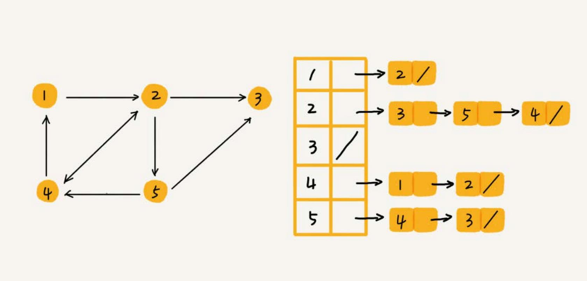
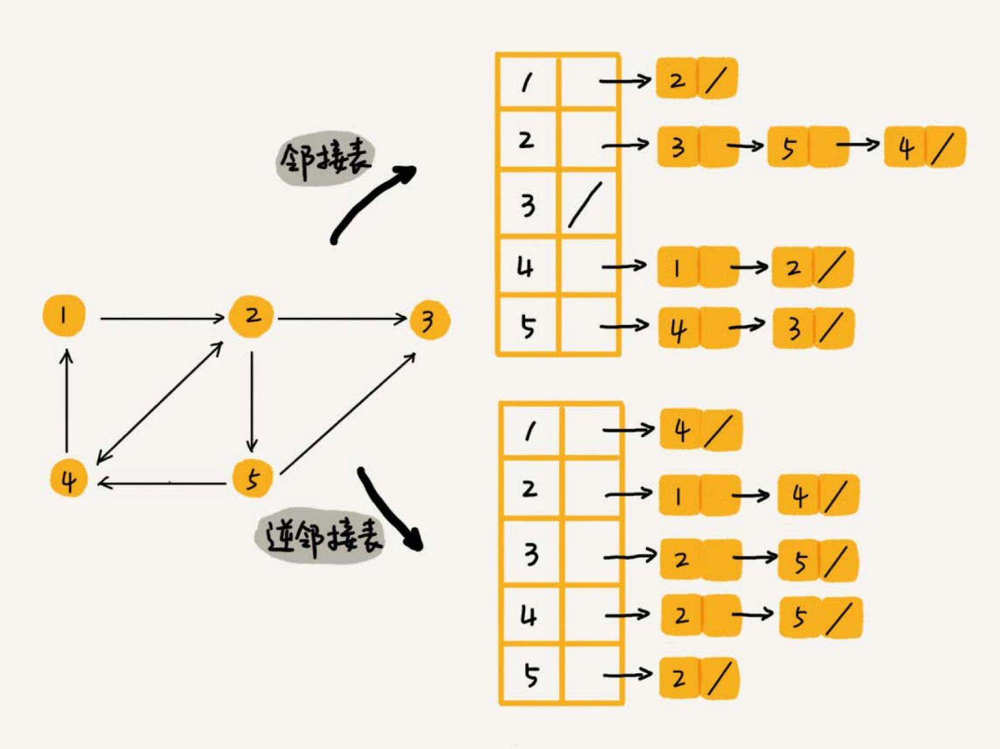
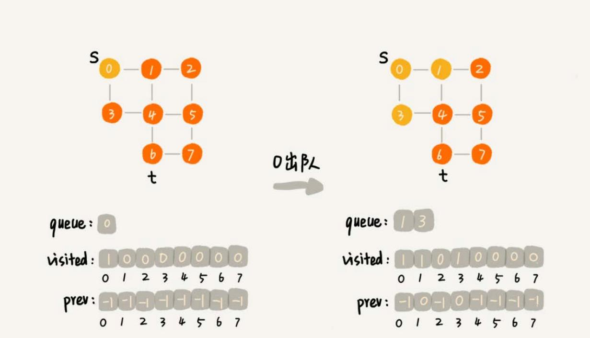

# 图
图也是一种非线性表数据结构，比树更复杂。涉及图的算法有很多，也非常复杂，比如图的搜索、最短路径、最小生成树、二
分图等等。

树中的元素称为节点，图中的元素叫作**顶点**（vertex）。


图中的一个顶点可以与任意其他顶点建立连接关系。这种建立的关系叫作**边**（edge）。

生活中就有很多符合图这种结构的例子。比如，社交网络，就是一个非常典型的图结构。拿微信举例子。可以把每个用户看作一个顶点。如果两个用户之间互加
好友，那就在两者之间建立一条边。所以，整个微信的好友关系就可以用一张图来表示。每个用户有多少个好友，对应到图中，就叫作顶点的**度**（degree），
就是跟顶点相连接的边的条数。

微博的社交关系比微信更复杂一点。微博允许单向关注，也就是说，用户 A 关注了用户 B，但用户 B 可以不关注用户 A。就要引入边的“方向”的概念。


这种边有方向的图叫作**有向图**。边没有方向的图就叫作**无向图**。

无向图中有“度”这个概念，表示一个顶点有多少条边。在有向图中，把度分为**入度**（In-degree）和**出度**（Out-degree）。

顶点的入度，表示有多少条边指向这个顶点；顶点的出度，表示有多少条边是以这个顶点为起点指向其他顶点。

QQ 中的社交关系要还更复杂。QQ 不仅记录了用户之间的好友关系，还记录了两个用户之间的亲密度，如果两个用户经常往来，那亲密度就比较高；如果不经
常往来，亲密度就比较低。

这里就要用到另一种图，**带权图**（weighted graph）。在带权图中，每条边都有一个**权重**（weight），可以通过这个权重来表示 QQ 好友
间的亲密度。


## 图的存储
### 邻接矩阵
邻接矩阵的底层依赖一个二维数组。对于无向图来说，如果顶点 i 与顶点 j 之间有边，就将 `A[i][j]` 和 `A[j][i]` 标记为 1；
对于有向图来说，如果顶点 i 到顶点 j 之间，有一条箭头从顶点 i 指向顶点 j 的边，那就将 `A[i][j]` 标记为 1。同理，如果有一条箭
头从顶点 j 指向顶点 i 的边，就将 `A[j][i]` 标记为 1。对于带权图，数组中就存储相应的权重。


邻接矩阵来表示一个图，虽然简单、直观，但是比较浪费存储空间。

如果存储的是稀疏图（Sparse Matrix），也就是说，顶点很多，但每个顶点的边并不多，那邻接矩阵的存储方法就更加浪费空间了。比如微信有好几亿的
用户，对应到图上就是好几亿的顶点。但是每个用户的好友并不会很多，一般也就三五百个而已。如果用邻接矩阵来存储，那绝大部分的存储空间都被浪费了。

### 邻接表



邻接表有点像散列表，每个顶点对应一条链表，链表中存储的是与这个顶点相连接的其他顶点。图中画的是一个有向图的邻接表存储方式，每个顶点对应的
链表里面，存储的是指向的顶点。对于无向图来说，也是类似的，不过，每个顶点的链表中存储的，是跟这个顶点有边相连的顶点。

邻接表存储起来比较节省空间，但是使用起来就比较耗时间。

比如上图中，如果要确定，是否存在一条从顶点 2 到顶点 4 的边，就要遍历顶点 2 对应的那条链表，看链表中是否存在顶点 4。而且，链表的存储方式
对缓存不友好。所以，比起邻接矩阵的存储方式，在邻接表中查询两个顶点之间的关系就没那么高效了。

在基于链表法解决冲突的散列表中，如果链过长，为了提高查找效率，可以将链表换成其他更加高效的数据结构，比如平衡二叉查找树等。邻接表长得很像散列。
所以，也可以将邻接表同散列表一样进行“改进升级”。

可以将邻接表中的链表改成平衡二叉查找树。实际开发中，可以选择用红黑树。这样，就可以更加快速地查找两个顶点之间是否存在边了。当然，这里的二叉
查找树可以换成其他动态数据结构，比如跳表、散列表等。除此之外，还可以将链表改成有序动态数组，可以通过二分查找的方法来快速定位两
个顶点之间否是存在边。

#### 逆邻接表
用一个邻接表来存储这种有向图有时候是不够的。比如微博中去查找某个用户关注了哪些用户非常容易，但是如果要想知道某个用户都被哪些用户关注了，也就
是用户的粉丝列表，是非常困难的。

需要一个逆邻接表。邻接表中存储了用户的关注关系，逆邻接表中存储的是用户的被关注关系。



## 深度和广度优先搜索
在社交网络中，有一个六度分割理论，具体是说，你与世界上的另一个人间隔的关系不会超过六度，也就是说平均只需要六步就可以联系到任何两个互不相识的人。
一个用户的一度连接用户很好理解，就是他的好友，二度连接用户就是他好友的好友，三度连接用户就是他好友的好友的好友。在社交网络中，往往通过用户之
间的连接关系，来实现推荐“可能认识的人”这么一个功能。

如何找出一个用户的所有三度（其中包含一度、二度和三度）好友关系？

### 广度优先搜索
广度优先搜索（Breadth-First-Search），简称为 BFS。其实就是一种“地毯式”层层推进的搜索策略，即先查找离起始顶点最近的，然后是次近的，
依次往外搜索。


```go
// s 起始顶点，t 终止顶点
func (g *Graph) BFS(s, t int) {
	if s == t {
		return
	}

	// init prev 记录搜索路径
	prev := make([]int, g.v)
	for index := range prev {
		prev[index] = -1
	}

	// search by queue
	var queue []int // 一个队列，存储已经被访问、但相连的顶点还没有被访问的顶点
	visited := make([]bool, g.v) // 记录已经被访问的顶点，避免顶点被重复访问
	queue = append(queue, s)
	visited[s] = true  // 顶点设置为 true 表示已经被访问
	isFound := false
	for len(queue) > 0 && !isFound {
		top := queue[0]
		queue = queue[1:]
		linkedList := g.adj[top]
		for e := linkedList.Front(); e != nil; e = e.Next() {
			k := e.Value.(int)
			if !visited[k] {
				prev[k] = top
				if k == t {
					isFound = true
					break
				}
				queue = append(queue, k)
				visited[k] = true
			}
		}
	}

	if isFound {
		printPrev(prev, s, t)
	} else {
		fmt.Printf("no path found from %d to %d\n", s, t)
	}
}
```

`prev` 用来记录搜索路径。当从顶点 s 开始，广度优先搜索到顶点 t 后，`prev` 数组中存储的就是搜索的路径。不过，这个路径是反向存储的。
`prev[w]` 存储的是，顶点 w 是从哪个前驱顶点遍历过来的。比如，我们通过顶点 2 的邻接表访问到顶点 3，那 `prev[3]` 就等于 2。为了正
向打印出路径，需要递归地来打印 `printPrev`。




#### 广度优先搜索的时间、空间复杂度
最坏情况下，终止顶点 t 离起始顶点 s 很远，需要遍历完整个图才能找到。这个时候，每个顶点都要进出一遍队列，每个边也都会被访问一次，所以，
广度优先搜索的时间复杂度是 `O(V+E)`，其中，V 表示顶点的个数，E 表示边的个数。当然，对于一个连通图来说，也就是说一个图中的所有顶点都
是连通的，E 肯定要大于等于 `V-1`，所以，广度优先搜索的时间复杂度也可以简写为 `O(E)`。

广度优先搜索的空间消耗主要在几个辅助变量 `visited` 数组、`queue` 队列、`prev` 数组上。这三个存储空间的大小都不会超过顶点的个数，
所以空间复杂度是 `O(V`)。

### 深度优先搜索
深度优先搜索（Depth-First-Search），简称 DFS。
假设你站在迷宫的某个岔路口，然后想找到出口。你随意选择一个岔路口来走，走着走着发现走不通的时候，你就回退到上一个岔路口，重新选择一条路继续走，
直到最终找到出口。这种走法就是一种**深度优先搜索策略**。


图中寻找一条从顶点 s 到顶点 t 的路径，s 就可以理解为迷宫中起始的位置，t 代表出口。

深度优先搜索找到的并不是顶点 s 到顶点 t 的最短路径。

```go
func (g *Graph) DSF(s, t int) {
	if s == t {
		return
	}
	// init prev 记录搜索路径
	prev := make([]int, g.v)
	for index := range prev {
		prev[index] = -1
	}

	visited := make([]bool, g.v) // 记录已经被访问的顶点，避免顶点被重复访问
	visited[s] = true  // 顶点设置为 true 表示已经被访问

	g.recurse(s, t, prev, visited, false)

	printPrev(prev, s, t)
}

func (g *Graph) recurse(s int, t int, prev []int, visited []bool, isFound bool) {

	if isFound {
		return
	}

	visited[s] = true

	if s == t {
		isFound = true
		return
	}

	linkedList := g.adj[s]
	for e := linkedList.Front(); e != nil; e = e.Next() {
		k := e.Value.(int)
		if !visited[k] {
			prev[k] = s
			g.recurse(k, t, prev, visited, false)
		}
	}

}
```

#### 深度度优先搜索的时、空间间复杂度
从图可以看出，每条边最多会被访问两次，一次是遍历，一次是回退。所以，图上的深度优先搜索算法的时间复杂度是 `O(E)`，E 表示边的个数。

深度优先搜索算法的消耗内存主要是 visited、prev 数组和递归调用栈。visited、prev 数组的大小跟顶点的个数 V 成正比，递归调用栈的最
大深度不会超过顶点的个数，所以总的空间复杂度就是 `O(V)`。
