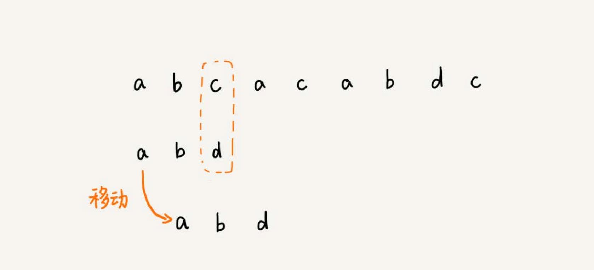
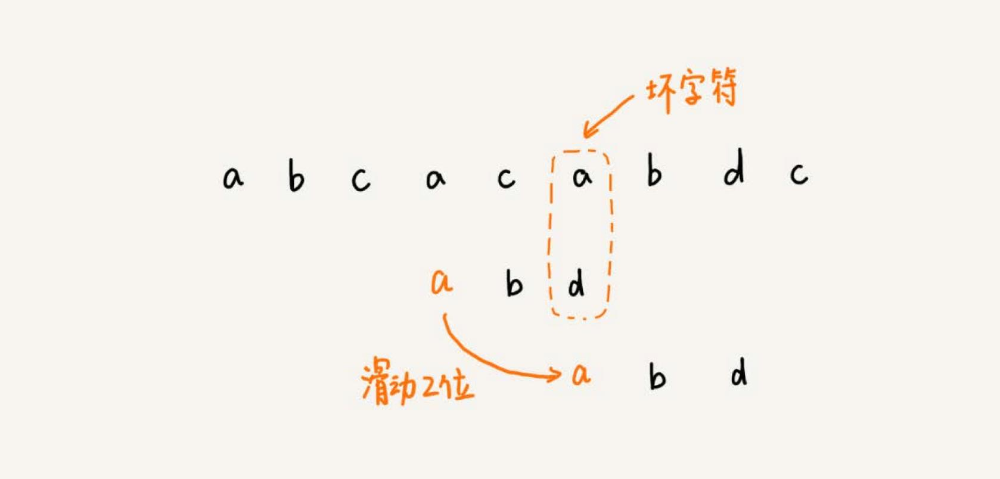
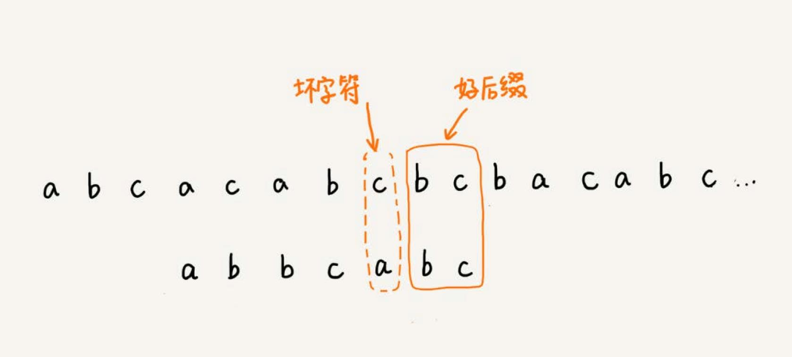
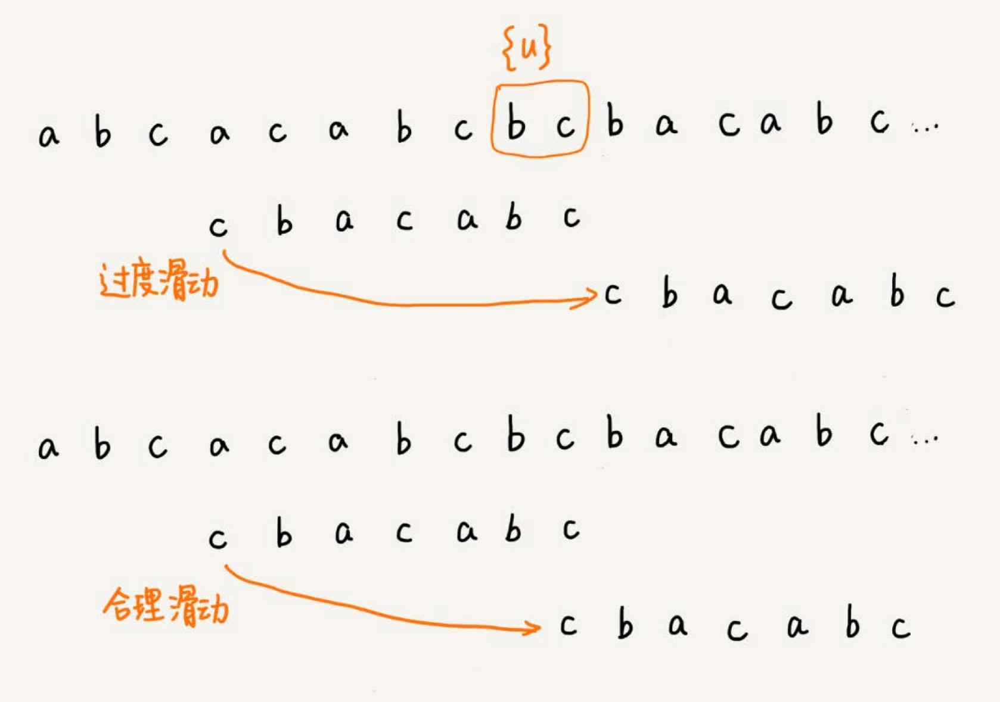
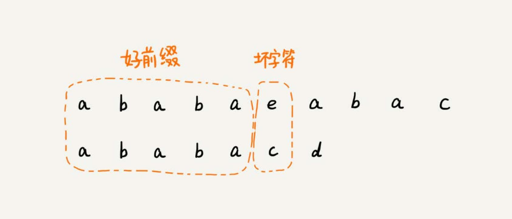

# 字符串匹配算法

字符串匹配算法很常用，比如 js 中的 `indexOf` 函数，就依赖字符串匹配算法。

## BF 算法
BF （Brute Force）算法叫作暴力匹配算法，也叫朴素匹配算法。简单，但是性能差。

字符串匹配算法有两个概念：**主串**和**模式串**。比如两个字符串 A 和 B，要在 A 中查找 B，A 就是主串，B 就是模式串。
主串的长度记作 n，模式串的长度记作 m。

BF 算法的思想就是在主串中，检查起始位置分别是 0、1、2…n-m 且长度为 m 的 n-m+1 个子串，看有没有跟模式串匹配的。

比如主串是 "aaaaa…aaaaaa"（省略号表示有很多重复的字符 a），模式串是 "aaaaab"。每次都比对 m 个字符，要比对 n-m+1 次，所以，这种算法的
最坏情况时间复杂度是 `O(n*m)`。

实际的软件开发中，大部分情况下，模式串和主串的长度都不会太长。朴素的字符串匹配算法就够用了。


## RK 算法
RK 算法（Rabin-Karp）其实就是 BF 算法的升级版。BF 算法需要暴力地对比这 n-m+1 个子串与模式串，但是，每次检查主串与子串是否匹配，需要依
次比对每个字符，所以 BF 算法的时间复杂度就比较高，是 `O(n*m)`。

RK 算法的思想是通过哈希算法对主串中的 n-m+1 个子串分别求哈希值，然后逐个与模式串的哈希值比较大小。如果某个子串的哈希值与模式串相等（如果不
考虑哈希冲突的问题），那就说明对应的子串和模式串匹配了。但这只是**提高了模式串与子串比较的效率**。

### 提高哈希算法计算子串哈希值的效率
怎样设计哈希算法，假设要匹配的字符串的字符集中只包含 K 个字符，可以用一个 K 进制数来表示一个子串，这个 K 进制数转化成十进制数，作为子
串的哈希值。

比如要处理的字符串只包含 `a～z` 这 26 个小写字母，那就用二十六进制来表示一个字符串。把 `a～z` 这 26 个字符映射到 `0～25` 这 26 个数
字，a 就表示 0，b 就表示 1，以此类推，z 表示 25。

RK 算法包含两部分，计算子串哈希值和模式串哈希值与子串哈希值之间的比较。第一部分，可以通过设计特殊的哈希算法，只需要扫描一遍主串就能计算出所有
子串的哈希值了，所以这部分的时间复杂度是 `O(n)`。

模式串哈希值与每个子串哈希值之间的比较的时间复杂度是 `O(1)`，总共需要比较 n-m+1 个子串的哈希值，所以，这部分的时间复杂度也是 `O(n)`。
所以，RK 算法整体的时间复杂度就是 `O(n)`。

当存在哈希冲突的时候，有可能存在这样的情况，子串和模式串的哈希值虽然是相同的，但是两者本身并不匹配。

解决方法很简单。当发现一个子串的哈希值跟模式串的哈希值相等的时候，只需要再对比一下子串和模式串本身就好了。

哈希算法的冲突概率要相对控制得低一些，如果存在大量冲突，就会导致 RK 算法的时间复杂度退化，效率下降。

## BM 算法



上面的例子，模式串中不包含 c，所以，模式串向后滑动时，只要 c 与模式串有重合，肯定不匹配。所以，把模式串往后多滑动几位，把模式串移动
到 c 的后面。


当遇到不匹配的字符时，有什么固定的规律，往后多滑动几位？BM 算法，就是在寻找这种规律。

BM 算法包含两部分：
- 坏字符规则（bad character rule）
- 好后缀规则（good suffix shift）。

### 坏字符规则
BM 算法的匹配顺序比较特别，它是按照模式串下标从大到小的顺序，倒着匹配的。


从模式串的末尾往前倒着匹配，当发现某个字符没法匹配的时候。把这个没有匹配的字符叫作**坏字符**（主串中的字符），上面的 c 就是是坏字符。
并且 c 并不在模式串中，那么可以直接将模式串移动到 c 的后面，再继续比较。这个时候模式串 "abd" 和 "aca" 比较， a 就是坏字符，但是
模式串中下标是 0 的位置是字符 a，只需要往后滑动两位，两个 a 对齐，再继续比较。



如何寻找滑动的规律？

发生不匹配的时，把坏字符对应的模式串中的字符下标记作 si。如果坏字符在模式串中存在，把这个坏字符在模式串中的下标记作 xi。如果不存在，把 xi 
记作 -1。那模式串往后移动的位数就等于 si-xi。（注意，这里的下标，都是字符在模式串的下标）。**如果坏字符在模式串里多处出现，在计
算 xi 的时候，选择最靠后的那个位置的下标。** 避免可能匹配的情况被滑动略过。

BM 算法在最好情况下的时间复杂度非常低，是 `O(n/m)`。比如，主串是 "aaabaaabaaabaaab"，模式串是 "aaaa"。每次比对，模式串都可以直
接后移四位。

单纯使用坏字符规则还是不够的。因为根据 si-xi 计算出来的移动位数，有可能是负数，比如主串是 "aaaaaaaaaaaaaaaa"，模式串是 "baaa"。不但
不会向后滑动模式串，还有可能倒退。

### 好后缀规则
好后缀规则跟坏字符规则的思路类似。



已经匹配的 bc 叫作**好后缀**，记作 `{u}`。拿它在模式串中查找，如果找到了另一个跟 `{u}` 相匹配的子串 `{u*}`，那就将模式串滑动
到子串 `{u*}` 与主串中 `{u}` 对齐的位置。

如果在模式串中找不到另一个等于 `{u}` 的子串，就直接将模式串，滑动到主串中 `{u}` 的后面。但是有时候不能直接滑动到 `{u}` 的后面，比如：



针对这种情况，不仅要看好后缀在模式串中，是否有另一个匹配的子串，还要检查好后缀的后缀子串，是否存在跟模式串的前缀子串匹配的。

### BM 算法实现

当模式串和主串中的某个字符不匹配的时候，选择坏字符规则还是好后缀规则？

分别计算好后缀和坏字符往后滑动的位数，然后取两个数中最大的，作为模式串往后滑动的位数。这种处理方法还可以避免前面提到的，根据坏字符规则，
计算得到的往后滑动的位数，有可能是负数的情况。

遇到坏字符时，要计算往后移动的位数 si-xi，如何求得 xi？如果在模式串中顺序遍历查找，就会比较低效。更加高效的方式是使用散列表。

将模式串中的每个字符及其下标都存到散列表中。这样就可以快速找到坏字符在模式串的位置下标了。

实现一种最简单的情况，假设字符串的字符集不是很大，每个字符长度是 1 字节，用大小为 256 的数组，来记录每个字符在模式串中出现的位置。数组的
下标对应字符的 ASCII 码值，数组中存储这个字符在模式串中出现的位置。


```go
func generateBC(pattern string) []int {

	bc := make([]int, 256)

	for index := range bc {
		bc[index] = -1
	}

	for index, char := range pattern {
		bc[int(char)] = index // int(char) 计算 char 的 ASCII 值
	}

	return bc
}

func bm(main string, pattern string) int {
	bc := generateBC(pattern)
}
```

## KMP 算法
KMP （Knuth Morris Pratt）算法核心思想和 BM 算法类似。区别是 KMP 算法的两部分是：
- 坏字符
- 好前缀

坏字符仍然是不能匹配的那个字符。已经匹配的那段字符串叫作**好前缀**。

