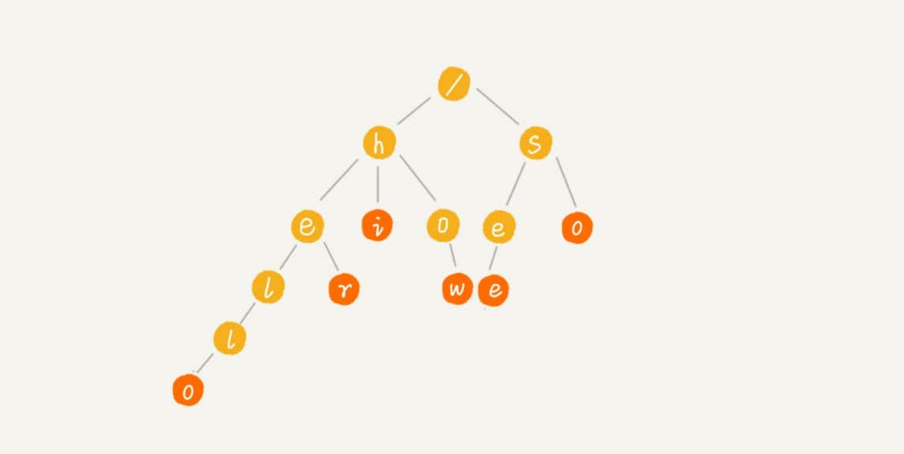
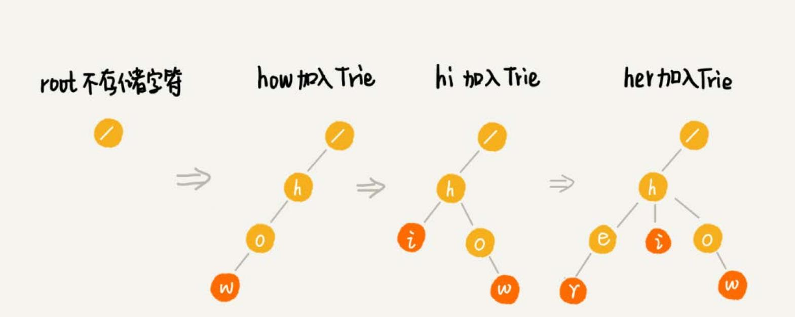

# Trie 树
Trie 树（字典树）。树形结构。是一种专门处理字符串匹配的数据结构，用来解决在一组字符串集合中快速查找某个字符串的问题。

例如，一个字符串集合中 6 个字符串： how，hi，her，hello，so，see。如果要在里面多次查找某个字符串是否存在。
如果每次查找，都是拿要查找的字符串跟这 6 个字符串依次进行字符串匹配，效率肯定是比较低的。如何高效查询？

利用 Trie 树结构，利用字符串之间的公共前缀，将重复的前缀合并在一起。如：



**根节点不包含任何信息**。每个节点表示一个字符串中的字符，从根节点到红色节点的一条路径表示一个字符串
（**红色节点并不都是叶子节点**）。

构造 Trie 树结构的过程：



当在 Trie 树中查找一个字符串的时候，比如 “her”，将要查找的字符串分割成单个的字符 h，e，r，然后从 Trie 树的根节点开始
匹配。依次找到  h，e，r 三个节点。

如果要查找 “he”，从根节点开始，找到 h，e 节点。但是，路径的最后一个节点 “e” 并不是红色的。也就是说，“he” 是某个字
符串的前缀子串，但并不能完全匹配任何字符串。

## 实现一棵 Trie 树
二叉树中，一个节点的左右子节点是通过两个指针来存储的，但是 Trie 树是一个**多叉树**，如何存储子节点？**使用数组**。
借助散列表的思想，通过一个下标与字符一一映射的数组，来存储子节点的指针。


假设字符串中只有从 a 到 z 这 26 个小写字母，在数组中下标为 0 的位置，存储指向子节点 a 的指针，下标为 1 的位置存储指向子节点 b 的指针，
以此类推，下标为 25 的位置，存储的是指向的子节点 z 的指针。如果某个字符的子节点不存在，就在对应的下标的位置存储 null。

在 Trie 树中查找字符串的时候，就可以通过字符的 ASCII 码减去 a 的 ASCII 码，迅速找到匹配的子节点的指针。比如，d 的 ASCII 码减去
 a 的 ASCII 码就是 3，那子节点 d 的指针就存储在数组中下标为 3 的位置中。
 
 ```go
type TrieNode struct {
	data            string
	isEndingChar    bool
	children        []*TrieNode
}

func NewTrieNode(data string) *TrieNode {
	return &TrieNode{data, false, make([]*TrieNode, 26)}
}

type TrieTree struct {
	root    *TrieNode
}

func NewTrieTree() *TrieTree {
	return &TrieTree{NewTrieNode("/")}
}

func (t *TrieTree) Insert(data string) {
	var basicChar rune = 'a'
	node := t.root
    for _, s := range data {
    	index := int(s) - int(basicChar)
    	if node.children[index] == nil {
			node.children[index] = NewTrieNode(string(s))
		}
		node = node.children[index]
	}
    node.isEndingChar = true
}

func (t *TrieTree) Find(pattern string) bool {
	var basicChar rune = 'a'
	node := t.root
	for _, s := range pattern {
		index := int(s) - int(basicChar)
		if node.children[index] == nil {
			return false
		}
		node = node.children[index]
	}
	if !node.isEndingChar { // 只匹配到部分前缀
		return false
	}
	return true
}
```

## Trie 的时间复杂度
构建 Trie 树的过程，需要扫描所有的字符串，时间复杂度是 `O(n)`，n 表示所有字符串的长度和。

如果要查询的字符串长度是 k，只需要比对大约 k 个节点，就能完成查询操作。所以，构建好 Trie 树后，查找字符串的时间复杂度是 `O(k)`，k 
表示要查找的字符串的长度。

## Trie 占用的内存
Trie 树用的是一种空间换时间的思路，实现 Trie 的时候，用数组来存储一个节点的子节点的指针。如果字符串中包含从 a 到 z 这 26 个字符，那每个节
点都要存储一个长度为 26 的数组，并且每个数组存储一个 8 字节指针（或者是 4 字节，这个大小跟 CPU、操作系统、编译器等有关）。而且，即便一个
节点只有很少的子节点，远小于 26 个，比如 3、4 个，也要维护一个长度为 26 的数组。

Trie 树的本质是避免重复存储一组字符串的相同前缀子串，但是现在每个字符的存储远远大于 1 个字节。按照上面例子，数组长度为 26，每个元素
是 8 字节，那每个节点就会额外需要 `26*8=208` 个字节。而且这还是只包含 26 个字符的情况。如果字符串中不仅包含小写字母，还包含大写字母、数字、
甚至是中文，那需要的存储空间就更多了。

也就是说，在某些情况下，Trie 树不一定会节省存储空间。在重复的前缀并不多的情况下，Trie 树不但不能节省内存，还有可能会浪费更多的内存。

可以稍微牺牲一点查询的效率，将每个节点中的数组换成其他数据结构，来存储一个节点的子节点指针。比如有序数组、跳表、散列表、红黑树等。

## Trie 与散列表、红黑树
散列表、红黑树、跳表等这些数据结构也可以实现在一组字符串中查找字符串的功能。跟 Trie 树比较一下，看看它们各自的优缺点和应用场景。

Trie 树它对要处理的字符串要求：
1. 字符串中包含的字符集不能太大。如果字符集太大，那存储空间可能就会浪费很多。
2. 要求字符串的前缀重合比较多，不然空间消耗会变大很多。
3. 通过指针串起来的数据块是不连续的，而 Trie 树中用到了指针，所以，对缓存并不友好。

Trie 树不适合精确匹配查找，这种问题更适合用散列表或者红黑树来解决。Trie 树比较适合的是查找前缀匹配的字符串。比如索引擎的搜索关键词提示
功能。当你在搜索引擎的搜索框中，输入要搜索的文字的某一部分的时候，搜索引擎就会自动弹出下拉框，里面是各种关键词提示。