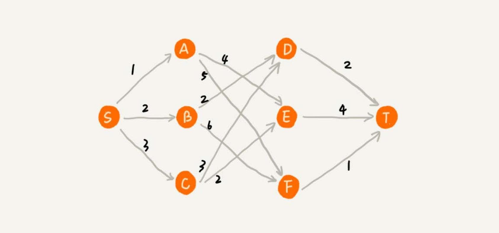
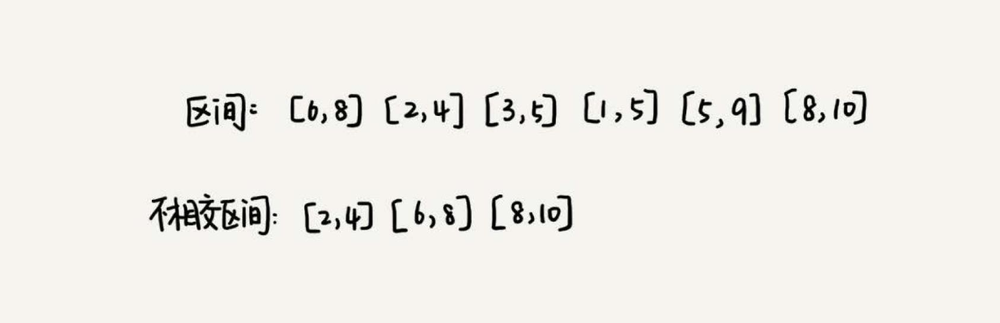
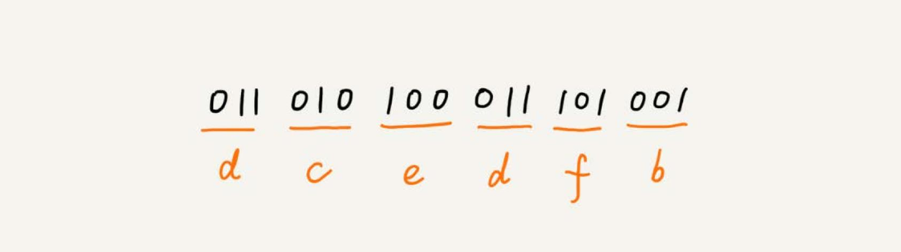
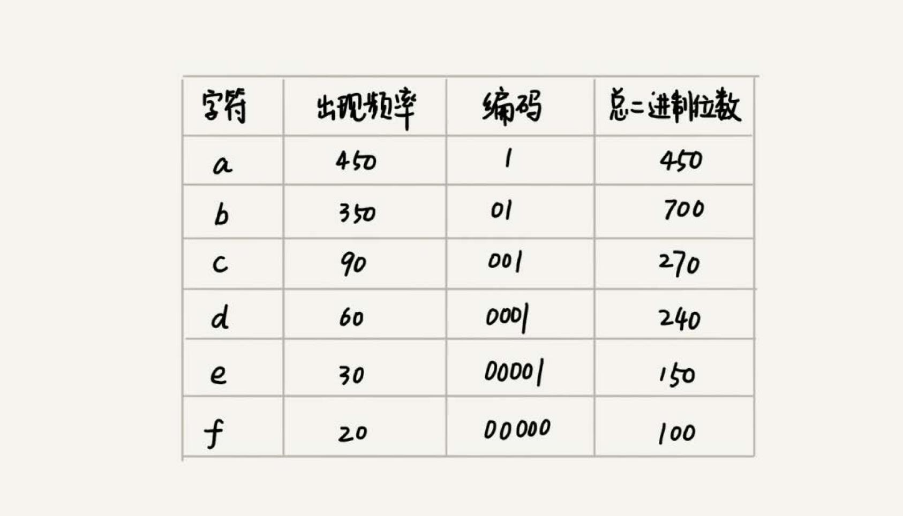
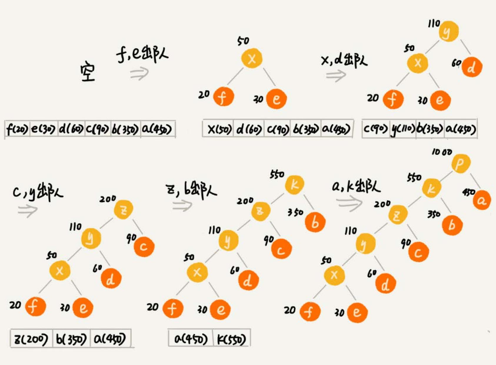
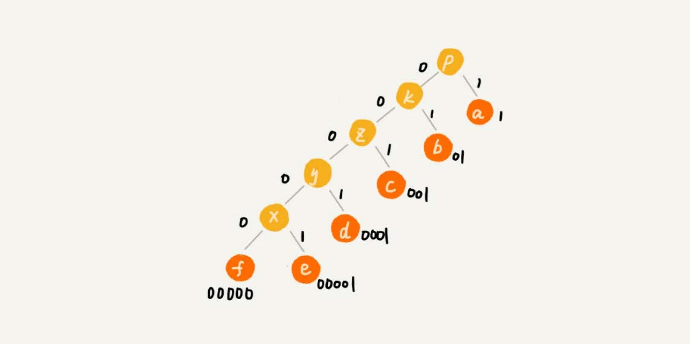

贪心、分治、回溯、动态规划是 4 种基本的算法思想。

## 理解贪心算法

假设有一个可以容纳 100kg 物品的背包，有 5 种豆子，每种豆子的总量和总价值都各不相同。为了让背包中所装物品的总价值最大，
如何选择在背包中装哪些豆子？每种豆子又该装多少？

| 种类 | 总量（kg） | 总价值（元） |
| --- | --- | --- |
| 黄豆 | 100 | 100 |
| 绿豆 | 30 | 90 |
| 红豆 | 60 | 120 |
| 黑豆 | 20 | 80 |
| 青豆 | 50 | 70 |

这个问题很简单，只要先算一算每个物品的单价，按照单价由高到低依次来装就好了。这个问题的解决思路借助的就是贪心算法。

碰到这类问题，首先要联想到贪心算法：针对一组数据，定义了**限制值**和**期望值**，希望从中选出几个数据，**在满足限制值的情况下，
期望值最大**。上面的例子，限制值就是重量不能超过 100kg，期望值就是物品的总价值。

贪心算法解决问题的思路，并不总能给出最优解，例如：
在一个有权图中，从顶点 S 开始，找一条到顶点 T 的最短路径（路径中边的权值和最小）。贪心算法的解决思路是，每次都选择一条跟
当前顶点相连的权最小的边，直到找到顶点 T。按照这种思路，求出的最短路径是 S->A->E->T，路径长度是 1+4+4=9。

但是实际上最短的路径是 S->B->D->T，长度是 2+2+2=6。

在这个问题上，贪心算法不工作的主要原因是，前面的选择，会影响后面的选择。如果第一步从顶点 S 走到顶点 A，那接下来面对的顶
点和边，跟第一步从顶点 S 走到顶点 B，是完全不同的。所以，即便第一步选择最优的走法（边最短），但有可能因为这一步选择，导
致后面每一步的选择都很糟糕。

## 实战分析

### 分糖果

有 m 个糖果和 n 个孩子。但是糖果少，孩子多（m<n），所以糖果只能分配给一部分孩子。

每个糖果的大小不等，这 m 个糖果的大小分别是 s1，s2，s3，……，sm。除此之外，每个孩子对糖果大小的需求也是不一样的，只有
糖果的大小大于等于孩子的对糖果大小的需求的时候，孩子才得到满足。假设这 n 个孩子对糖果大小的需求分
别是 g1，g2，g3，……，gn。如何分配糖果，能尽可能满足最多数量的孩子？

如何用贪心算法来解决。对于一个孩子来说，如果小的糖果可以满足，就没必要用更大的糖果，这样更大的就可以留给其他对糖果大小需求
更大的孩子。另一方面，对糖果大小需求小的孩子更容易被满足，所以，可以从需求小的孩子开始分配糖果。因为满足一个需求大的孩子
跟满足一个需求小的孩子，对期望值的贡献是一样的。

### 钱币找零

假设我们有 1 元、2 元、5 元、10 元、20 元、50 元、100 元这些面额的纸币，它们的张数分别是 c1、c2、c5、c10、c20、c50、c100。
现在要用这些钱来支付 K 元，最少要用多少张纸币？

在贡献相同期望值（纸币数目）的情况下，我们希望多贡献点金额，这样就可以让纸币数更少，这就是一种贪心算法的解决思路。

### 区间覆盖

假设有 n 个区间，区间的起始端点和结束端点分别是 `[l1, r1]，[l2, r2]，[l3, r3]，……，[ln, rn]`。从这 n 个区间中选出一部分
区间，这部分区间满足两两不相交（端点相交的情况不算相交），最多能选出多少个区间？

解决思路：假设这 n 个区间中最左端点是 lmin，最右端点是 rmax。这个问题就相当于，选择几个不相交的区间，
从左到右将 `[lmin,rmax]` 覆盖上。按照起始端点从小到大的顺序对这 n 个区间排序。

每次选择的时候，左端点跟前面的已经覆盖的区间不重合的，右端点又尽量小的，这样可以让剩下的未覆盖区间尽可能的大，就可以放置
更多的区间。这实际上就是一种贪心的选择方法。

### 霍夫曼编码

假设我有一个包含 1000 个字符的文件，每个字符占 1 个 byte，那么一共需要 8000bits，有没有更加节省空间的存储方式？

假设通过统计分析发现，这 1000 个字符中只包含 6 种不同字符，假设它们分别是 a、b、c、d、e、f。而 3 个二进制位（bit）就可
以表示 8 个不同的字符，所以，为了尽量减少存储空间，每个字符用 3 个二进制位来表示。那存储这 1000 个字符只需要 3000bits 就可
以了，比原来的存储方式节省了很多空间。不过，还有没有更加节省空间的存储方式？

霍夫曼编码就要登场了。霍夫曼编码是一种十分有效的编码方法，广泛用于数据压缩中，其压缩率通常在 20%～90% 之间。

霍夫曼编码不仅会考察文本中有多少个不同字符，还会考察每个字符出现的频率，根据频率的不同，选择不同长度的编码。霍夫曼编码
试图用这种不等长的编码方法，来进一步增加压缩的效率。如何给不同频率的字符选择不同长度的编码？根据贪心的思想，把出现频率比
较多的字符，用稍微短一些的编码；出现频率比较少的字符，用稍微长一些的编码。

对于等长的编码来说，解压缩起来很简单。比如刚才那个例子中，用 3 个 bit 表示一个字符。在解压缩的时候，每次从文本中读取 3 位二
进制码，然后翻译成对应的字符。但是，霍夫曼编码是不等长的，每次应该读取 1 位还是 2 位、3 位等等来解压缩？
**为了避免解压缩过程中的歧义，霍夫曼编码要求各个字符的编码之间，不会出现某个编码是另一个编码前缀的情况**。

假设这 6 个字符出现的频率从高到低依次是 a、b、c、d、e、f。把它们编码下面这个样子，**任何一个字符的编码都不是另一个的前缀**，
在解压缩的时候，每次会读取尽可能长的可解压的二进制串，所以在解压缩的时候也不会歧义。经过这种编码压缩之后，这 1000 个字符只需
要 2100bits 就可以了。

如何根据字符出现频率的不同，给不同的字符进行不同长度的编码？

把每个字符看作一个节点，并且辅带着把频率放到优先级队列中。从队列中取出频率最小的两个节点 A、B，然后新建一个节点 C，把频率设
置为两个节点的频率之和，并把这个新节点 C 作为节点 A、B 的父节点。最后再把 C 节点放入到优先级队列中。重复这个过程，直到队
列中没有数据。

给每一条边加上画一个权值，指向左子节点的边我们统统标记为 0，指向右子节点的边，统统标记为 1，那从根节点到叶节点的路径就
是叶节点对应字符的霍夫曼编码。

