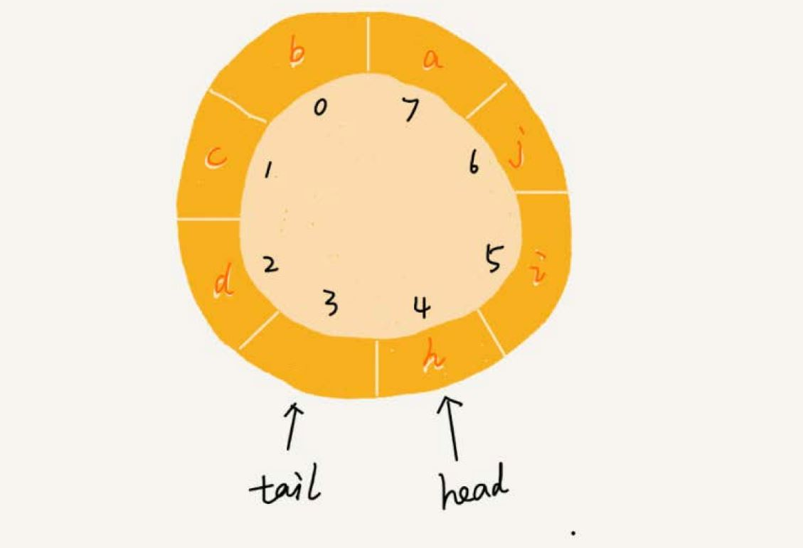

# 队列
队列，先进先出，像排队买票一样。队列和栈很像，也是一种操作受限的线性表数据结构，有两个基本操作：
- 入队（enqueue），放一个数据到队列尾部。
- 出队（dequeue），从队列头部取一个元素。

## 顺序队列和链式队列

### 顺序队列
跟栈一样，队列可以用数组来实现，也可以用链表来实现。用数组实现的队列叫作**顺序队列**，用链表实现的队列叫作**链式队列**。
```go
type ArrayQueue struct {
	items      []string
	n          int       // 数组 size
	head       int       // 队列头下标
	tail       int       // 队列尾下标
}

func (a *ArrayQueue) NewArrayQueue(capacity int) {
	a.items = []string{}
	a.n = capacity
	a.head = 0
	a.tail = 0
}

// 入队
func (a *ArrayQueue) Enqueue(item string) bool {
	if a.tail == a.n { // 队列已满
		return false
	}
	a.items[a.tail] = item
	a.tail ++
    return true
}

// 出队
func (a *ArrayQueue) Dequeue() string {
	if a.head == a.tail { // 队列为空
		return ""
	}
	item := a.items[a.head]
	a.head ++
	return item
}
```
上面的实现比栈的数组实现稍微复杂，栈只需要一个**栈顶指针**，但是队列需要一个 **head 指针**和一个 **tail 指针**，分别指向队列的头和尾。

随着不停地进行入队、出队操作，`head` 和 `tail` 都会持续往后移动。当 `tail` 移动到最右边，即使数组中还有空闲空间，也无法继续往队列中
添加数据了。这个问题如何解决？

在栈的数组实现中，通过数据搬移，但是，对于队列来说每次进行出队操作都相当于删除数组下标为 0 的数据，要搬移整个队列中的数据，这样出
队操作的时间复杂度就会从原来的 `O(1)` 变为 `O(n)`。

在出队时可以不用搬移数据。如果没有空闲空间了，只需要在入队时，再集中触发一次数据的搬移操作。修改 `Enqueue` 函数：
```go
func (a *ArrayQueue) Enqueue(item string) bool {
	if a.tail == a.n { // 队列已满
		if a.head == 0 { // 没有空闲空间
			return false
		}
		// 队列已满 但是有空闲空间 进行数据搬移
		for i := a.head; i < a.tail; i ++ { // 从 head 指向的头部数据开始搬移
			a.items[i - a.head] = a.items[i]
		}
		// 数据搬移后 更新 head tail
		a.tail -= a.head
		a.head = 0
	}
	a.items[a.tail] = item
	a.tail ++
	return true
}
```

### 链式队列
基于链表实现，同样需要两个指针：`head` 指针和 `tail` 指针。它们分别指向链表的第一个结点和最后一个结点。如图所示，
入队时，`tail->next= new_node`, `tail =tail->next`；出队时，`head = head->next`。

```go
type LinkedListQueue struct {
	head       *ListNode
	tail       *ListNode
	Length     int
}

type ListNode struct {
	data        interface{}
	next        *ListNode
}

func NewLinkedListQueue() *LinkedListQueue {
	return &LinkedListQueue{nil, nil, 0}
}

// 入队
func (l *LinkedListQueue) Enqueue(item interface{}) {
	node := &ListNode{item, nil}
	if nil == l.tail { // 空队列
		l.tail = node
		l.head = node
	} else {
		l.tail.next = node
		l.tail = node
	}
    l.Length ++
}

// 出队
func (l *LinkedListQueue) Dequeue() interface{} {
	if l.head == nil { // 队列为空
	    l.tail = nil // clean
		return nil
	}
    item := l.head.data
    l.head = l.head.next
    l.Length --
    return  item
}
```

## 循环队列
用数组实现的队列，会有数据搬移，影响性能。如何避免？使用循环队列。

循环队列，顾名思义，它长得像一个环。原本数组是有头有尾的，是一条直线。把首尾相连，变成了一个环。


图中这个队列的大小为 8，当前 `head=4`，`tail=7`。当有一个新的元素 a 入队时，我们放入下标为 7 的位置。但这个时候，我们并不把 `tail` 
更新为 8，而是将其在环中后移一位，到下标为 0 的位置。当再有一个元素 b 入队时，我们将 b 放入下标为 0 的位置，然后 `tail` 加 1 更新为 1。
这样就避免了数据搬移操作。

在用数组实现的非循环队列中，队满的判断条件是 `tail == n`，队空的判断条件是 `head == tail`。那针对循环队列，如何判断队空和队满？
队列为空的判断条件仍然是 `head == tail`。但队列满的判断条件就稍微有点复杂了。



图中队满的情况，`tail=3`，`head=4`，`n=8`，总结一下规律就是：`(3+1)%8=4`。尝试多种队满的情况，得出结论，当队满时，`(tail+1)%n=head`。

当队列满时，图中的 `tail` 指向的位置实际上是没有存储数据的。所以，**循环队列会浪费一个数组的存储空间**。