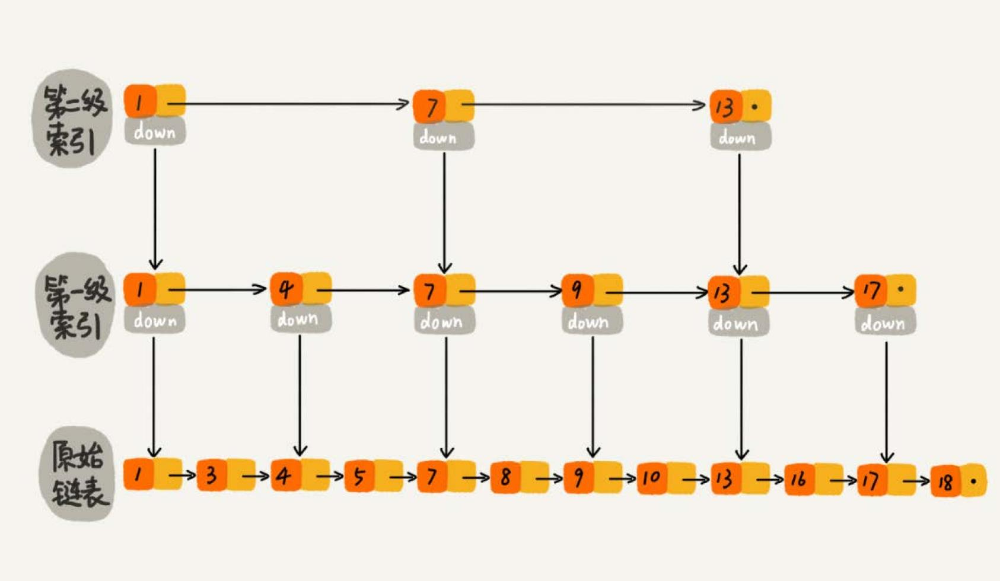
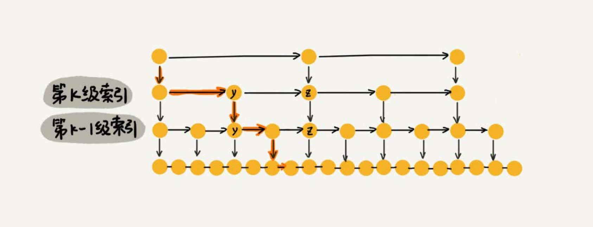
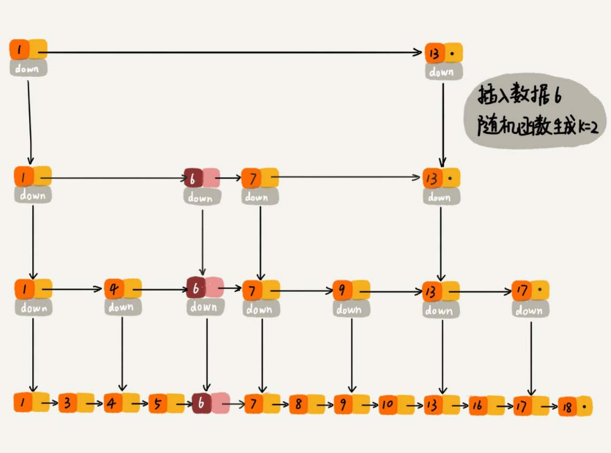

# 跳表
二分查找底层依赖的是数组随机访问的特性，如何用链表实现类似二分查找的算法，就需要对链表稍加改造，这种改造之后的数据结构叫作
**跳表**（Skip list）。

对于一个单链表，即使链表中存储的数据是有序的，如果要想在其中查找某个数据，也只能从头到尾遍历链表。时间复杂度会是 `O(n)`。

如果对链表建立一级“索引”，每两个结点提取一个结点到上一级，抽出来的那一级叫作**索引**或**索引层**。图中的 down 表示 **down 
指针**，指向下一级结点。

如果现在要查找值为 16 节点。可以先在索引层遍历，当遍历到索引层中值为 13 的结点时，发现下一个结点的值是 17，那要查找
的结点 16 肯定就在这两个结点之间。然后通过索引层结点的 down 指针，下降到原始链表这一层，继续遍历。这个时候，只需要
再遍历 2 个结点，就可以找到值等于 16 的这个结点了。这样，原来如果要查找 16，需要遍历 10 个结点，现在只需要遍历 7 个结点。

加来一层索引之后，查找效率提高了。那如果再加一级索引效率会不会提升更多？

上图中，再来查找 16，只需要遍历 6 个结点，需要遍历的结点数量又减少了。

上图中，一个包含 64 个结点的链表，按照前面思路，建立了五级索引。原来没有索引的时候，查找 62 需要遍历 62 个结点，现在
只需要遍历 11 个结点，速度提高了很多。所以，当链表的长度 n 比较大时，比如 1000、10000 的时候，在构建索引之后，查找效
率的提升就会非常明显。

**链表加多级索引的结构，就是跳表**。

## 跳表的时间复杂度
如果链表里有 n 个结点，按照前面的思路，每两个结点会抽出一个结点作为上一级索引的结点，那第一级索引的结点个数大约就是 n/2，第二
级索引的结点个数大约就是 n/4，第三级索引的结点个数大约就是 n/8，依次类推，也就是说，第k级索引的结点个数是第 k-1 级索引的结
点个数的 1/2，那第 k 级索引结点的个数就是 `n/(2^k)`。

假设索引有 h 级，最高级的索引有 2 个结点。通过上面的公式，我们可以得到 `n/(2^h)=2`，从而求得 `h=log2(n-1)`。如果包含原始链
表这一层，整个跳表的高度就是 `log2(n)`。我们在跳表中查询某个数据的时候，如果每一层都要遍历 m 个结点，那在跳表中查询一个数
据的时间复杂度就是 `O(m*logn)`。

这个 m 的值是多少？按照前面这种索引结构，每一级索引都最多只需要遍历 3 个结点，也就是说 `m=3`，为什么是 3？

假设我们要查找的数据是 x，在第 k 级索引中，我们遍历到 y 结点之后，发现 x 大于 y，小于后面的结点 z，所以我们通过 y 的 down 
指针，从第 k 级索引下降到第 k-1 级索引。在第 k-1 级索引中，y 和 z 之间只有 3 个结点（包含 y 和 z），所以，我们在 K-1 级索
引中最多只需要遍历 3 个结点，依次类推，每一级索引都最多只需要遍历 3 个结点。

所以在跳表中查询任意数据的时间复杂度就是 `O(logn)`。这个查找的时间复杂度跟二分查找是一样的。换句话说，
其实是基于单链表实现了二分查找。这种查询效率的提升，前提是建立了很多级索引，也就需要更多的内存，也就是空间换时间的设计思路。

## 跳表的空间复杂度
跳表需要存储多级索引，肯定要消耗更多的存储空间。那到底需要消耗多少额外的存储空间？

假设原始链表大小为 n，那第一级索引大约有 n/2 个结点，第二级索引大约有 n/4 个结点，以此类推，每上升一级就减少一半，直到剩下 2 
个结点。把每层索引的结点数写出来，就是一个等比数列。

这几级索引的结点总和就是 `n/2+n/4+n/8…+8+4+2=n-2`。所以，**跳表的空间复杂度是 `O(n)`**。也就是说，如果将包含 n 个结点的
单链表构造成跳表，需要额外再用接近 n 个结点的存储空间。有没有办法降低索引占用的内存空间？

可以每三个结点或五个结点，抽一个结点到上级索引，比如个每三个结点抽一个，第一级索引需要大约 n/3 个结点，第二级索引需要
大约 n/9 个结点。每往上一级，索引结点个数都除以 3。为了方便计算，假设最高一级的索引结点个数是 1。每级索引的结点个数都写下来，
也是一个等比数列。

通过等比数列求和公式，总的索引结点大约就是 `n/3+n/9+n/27+…+9+3+1=n/2`。尽管空间复杂度还是 `O(n)`，但比上面的每两个结点
抽一个结点的索引构建方法，要减少了一半的索引结点存储空间。

## 高效的动态插入和删除
跳表这个动态数据结构，不仅支持查找操作，还支持动态的插入、删除操作，而且插入、删除操作的时间复杂度也是 `O(logn)`。

### 插入
在单链表中，插入结点的时间复杂度是 `O(1)`。耗时的是查找，跳表查找操作时间复杂度是 `O(logn)`。所有插入的时间复杂度
也是 `O(logn)`。

### 删除
如果这个结点在索引中也有出现，除了要删除原始链表中的结点，还要删除索引中的。因为单链表中的删除操作需要拿到要删除结
点的前驱结点，然后通过指针操作完成删除。所以在查找要删除的结点的时候，一定要获取前驱结点。当然，如果用的是双向链表，就
不需要考虑这个问题了。

## 跳表索引动态更新
不停地往跳表中插入数据时，如果不更新索引，就有可能出现某 2 个索引结点之间数据非常多的情况。极端情况下，跳表还会退化成单链表。

作为一种动态数据结构，需要某种手段来维护索引与原始链表大小之间的平衡，也就是说，如果链表中结点多了，索引结点就相应地增
加一些，避免复杂度退化，以及查找、插入、删除操作性能下降。

跳表是通过**随机函数**来维护“平衡性”。当往跳表中插入数据的时候，可以选择同时将这个数据插入到部分索引层中。通过一个随机函数
来决定将这个结点插入到哪几级索引中，比如随机函数生成了值 K，那就将这个结点添加到第一级到第 K 级这 K 级索引中。

