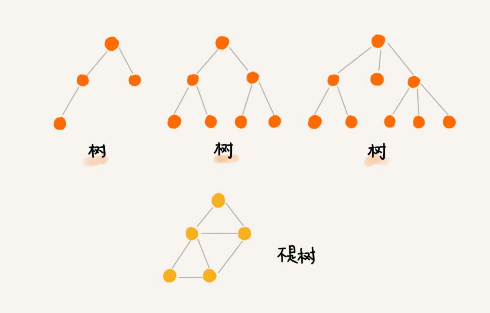
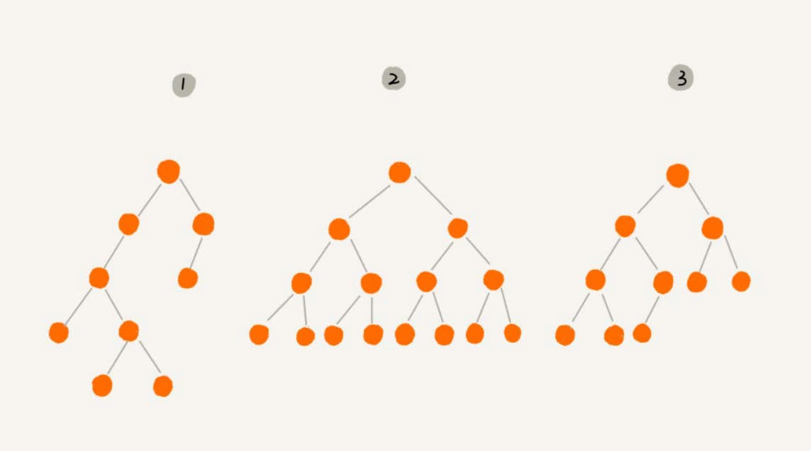

# 树
栈、队列等都是线性表结构，**树**，一种非线性表结构，这种数据结构比线性表的数据结构要复杂得多。



树的每个元素叫作**节点**，用来连线相邻节点之间的关系，叫作**父子关系**。


A 节点就是 B 节点的**父节点**，B 节点是 A 节点的**子节点**。B、C、D 这三个节点的父节点是同一个节点，所以它们之间互
称为**兄弟节点**。没有父节点的节点叫作**根节点**，也就是节点 E。**没有子节点的节点**叫作**叶子节点**或者**叶节点**，
G、H、I、J、K、L 都是叶子节点。

“树” 的三个比较相似的概念：高度（Height）、深度（Depth）、层（Level）。


## 二叉树
二叉树是最常用的树结构。

二叉树，就是每个节点**最多有两个“叉”，也就是两个子节点**，分别是左子节点和右子节点。不过，二叉树并不要求每个节点都有两个子节点，
有的节点只有左子节点，有的节点只有右子节点。



- 编号 2，叶子节点全都在最底层，除了叶子节点之外，每个节点都有左右两个子节点，这种二叉树就叫作**满二叉树**。
- 编号 3 ，叶子节点都在最底下两层，最后一层的叶子节点都靠左排列，并且除了最后一层，其他层的节点个数都要达到最大，
这种二叉树叫作**完全二叉树**。

### 二叉树的存储
为什么把最后一层的叶子节点靠左排列的叫完全二叉树？

二叉树的存储方法：
- 基于指针或者引用的二叉链式存储法。
- 基于数组的顺序存储法。


上图是链式存储法，每个节点有三个字段，其中一个存储数据，另外两个是指向左右子节点的指针。只要拎住根节点，就可以通过左右子节点
的指针，把整棵树都串起来。这种存储方式比较常用。大部分二叉树代码都是通过这种结构来实现的。


上图是顺序存储法，节点 X 存储在数组中下标为 i 的位置，下标为 `2 * i` 的位置存储的就是左子节点，下标为 `2 * i + 1` 的位置存储
的就是右子节点。反过来，下标为 `i/2` 的位置存储就是它的父节点。只要知道根节点存储的位置，就可以把整棵树都串起来。

但是基于数组的顺序存储法，如果是非完全二叉树，其实会浪费比较多的数组存储空间。


如果某棵二叉树是一棵完全二叉树，那用数组存储无疑是最节省内存的一种方式。因为数组的存储方式并不需要存储额外的左右子节点的指针。
这就是为什么完全二叉树要求最后一层的子节点都靠左的原因。

堆其实就是一种完全二叉树，最常用的存储方式就是数组。

### 二叉树的遍历
遍历方法有三种：
- 前序遍历是指，对于树中的任意节点来说，先打印这个节点，然后再打印它的左子树，最后打印它的右子树。
- 中序遍历是指，对于树中的任意节点来说，先打印它的左子树，然后再打印它本身，最后打印它的右子树。
- 后序遍历是指，对于树中的任意节点来说，先打印它的左子树，然后再打印它的右子树，最后打印这个节点本身。


每个节点最多会被访问两次，所以遍历操作的时间复杂度，跟节点的个数 n 成正比，也就是说二叉树遍历的时间复杂度是 `O(n)`。

## 二叉查找树
二叉查找树是二叉树中最常用的一种类型，也叫**二叉搜索树**。支持快速查找、插入、删除一个数据。

二叉查找树要求，在树中的任意一个节点，其左子树中的每个节点的值，都要小于这个节点的值，而右子树节点的值都大于这个节点的值。

### 查找
先取根节点，如果它等于要查找的数据，就返回。如果要查找的数据比根节点的值小，那就在左子树中递归查找；如果要查找的数据比根节点的值大，
那就在右子树中递归查找。

```go

```

### 插入
新插入的数据一般都是在叶子节点上，所以只需要从根节点开始，依次比较要插入的数据和节点的大小关系。如果要插入的数据比节点的数据大，并且节点的
右子树为空，就将新数据直接插到右子节点的位置；如果不为空，就再递归遍历右子树，查找插入位置。同理，如果要插入的数据比节点数值小，并且节点
的左子树为空，就将新数据插入到左子节点的位置；如果不为空，就再递归遍历左子树，查找插入位置。

```go

```

### 删除
删除操作比较复杂，针对要删除节点的子节点个数的不同，要分三种情况：

1. 如果要删除的节点没有子节点，只需要直接将父节点中，指向要删除节点的指针置为 `null`。
2. 如果要删除的节点只有一个子节点（只有左子节点或者右子节点），只需要更新父节点指向要删除节点的指针，让它指向要删除节点的子
节点就可以了。
3. 如果要删除的节点有两个子节点，这就比较复杂了。需要找到这个节点的右子树中的最小节点，把它替换到要删除的节点上。然后再删除掉这个
最小节点，因为最小节点肯定没有左子节点（如果有左子结点，那就不是最小节点了），所以，我们可以应用上面两条规则来删除这个最小节点。

```go

```

### 其他操作
查找最大节点和最小节点、前驱节点和后继节点。