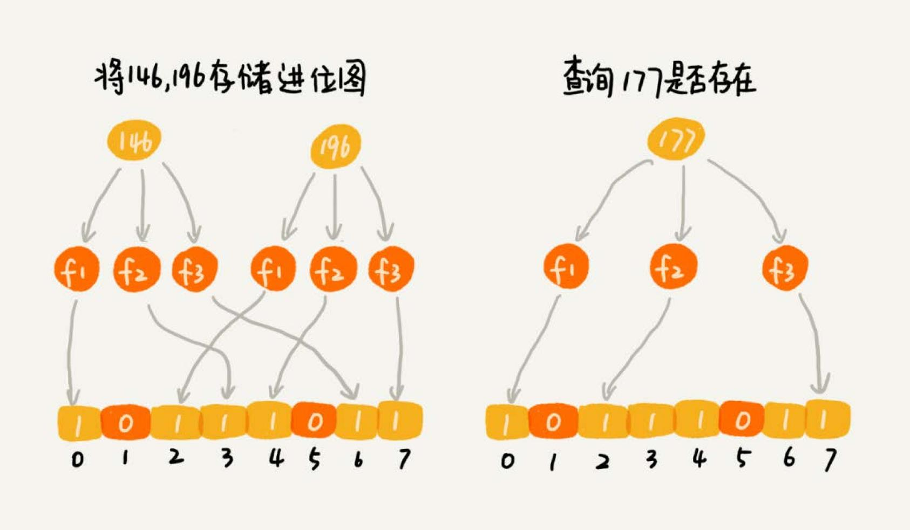

# 位图
## 爬虫 URL 去重
爬虫的工作原理是，通过解析已经爬取页面中的网页链接，然后再爬取这些链接对应的网页。搜索引擎的爬虫系统会爬取几十亿、上百亿的
网页。如何实现 url 去重，避免重复爬取网页。

思路很简单：记录已经爬取的 url。

## 解析
要记录已经爬取的 url，那么使用什么数据结构来存储。这里涉及到两个操作，添加和查询 url。

散列表，红黑树，跳表都可以实现快速的插入和查找。

### 散列表
1. 内存空间占用大
使用散列表存储，如果爬取 10 亿个 url，假设一个 url 长度为 64 bytes，那么存储 10 亿个 url 至少需要大约 60 GB 的内存。
而且散列表要维持较小的装载因子，以免过多出现散列冲突，导致性能下降。而且如果用链表法解决冲突，还要存储链表指针。
所以散列表存储 10 亿 url 需要内存远大于 60 GB，甚至超过 100 GB。

2. 查询耗时
如果基于链表法解决冲突，散列表中存储的是 URL，那当查询的时候，通过哈希函数定位到某个链表之后，还需要依次比对每个链表中
的 URL。链表中的结点在内存中不是连续存储的，所以不能一下子加载到 CPU 缓存中，没法很好地利用到 CPU 高速缓存，所以数据访
问性能方面会打折扣。

3. 字符串匹配耗时
链表中的每个数据都是 URL，而 URL 平均长度为 64 字节的字符串，要让待判重的 URL，跟链表中的每个 URL，做字符串匹配。比较耗时。

### 位图
如果有 1 千万个整数，整数的范围在 1 到 1 亿之间。如何快速查找某个整数是否在这 1 千万个整数中？
申请一个大小为 1 亿、数据类型为布尔类型（true 或者 false）的数组。将这 1 千万个整数作为数组下标，将对应的数组值设置成 true。
比如，整数 5 对应下标为 5 的数组值设置为 true，也就是 `array[5] = true`。

当查询某个整数 K 是否在这 1 千万个整数中的时候，只需要将对应的数组值 `array[K]` 取出来，看是否等于 true。如果等于 true，
那说明 1 千万整数中包含这个整数 K；相反，就表示不包含这个整数 K。

大部分语言的布尔类型，大小是 1 个字节的，并不能节省太多内存空间。实际上，表示 true 和 false 两个值，只需要用一个二进
制位（bit）就可以了。

可以借助编程语言中提供的数据类型，比如 int、long、char 等类型，通过**位运算**，用其中的某个位表示某个数字。

```go
// BitMap implement bitmap
type BitMap []byte

// New create BitMap
func New(length uint) BitMap {
	return make([]byte, length/8+1)
}

// Set set value in bitmap
func (b BitMap) Set(value uint) {
	byteIndex := value / 8
	if byteIndex >= uint(len(b)) {
		return
	}
	bitIndex := value % 8
	[]byte(b)[byteIndex] |= 1 << bitIndex
}

// Get check whether value exist or not
func (b BitMap) Get(value uint) bool {
	byteIndex := value / 8
	if byteIndex >= uint(len(b)) {
		return false
	}
	bitIndex := value % 8
	return []byte(b)[byteIndex]&(1<<bitIndex) != 0
}
```

如果用散列表存储这 1 千万的数据，数据是 32 位的整型数，也就是需要 4 个字节的存储空间，那总共至少需要 40MB 的存储空间。如果通过位图
的话，数字范围在 1 到 1 亿之间，只需要 1 亿个二进制位，也就是 12MB 左右的存储空间就够了。

#### 使用位图的问题
如果数字的范围很大，比如刚刚那个问题，数字范围是 1 到 10 亿，那位图的大小就是 10 亿个二进制位，也就是 120MB 的大小，消耗的内存空间，
不降反增。

### 布隆过滤器
布隆过滤器是基于位图改进的，就是为了解决位图内存消耗的问题。

还是数据个数是 1 千万，数据的范围是 1 到 10 亿。布隆过滤器的做法是，仍然使用一个 1 亿个二进制大小的位图，然后通过哈希函数，对数
字进行处理，让它落在这 1 到 1 亿范围内。

#### 哈希冲突问题
哈希函数会存在冲突的问题，布隆过滤器的处理方法。既然**一个哈希函数可能会存在冲突，那用多个哈希函数一块儿定位一个数据**。
使用 K 个哈希函数，对同一个数字进行求哈希值，那会得到 K 个不同的哈希值，我们分别记作 X1，X2，X3，…，XK。把这 K 个数字作为位图中的下
标，将对应的 `BitMap[X1]`，`BitMap[X2]`，`BitMap[X3]`，…，`BitMap[XK]`都设置成 true，也就是说，**用 K 个二进制位，来表示一个
数字的存在**。


查询某个数字是否存在的时候，用同样的 K 个哈希函数，对这个数字求哈希值，看这 K 个哈希值，对应位图中的数值是否都为 true，如果都是 true，
则说明，这个数字存在，如果有其中任意一个不为 true，那就说明这个数字不存在。

#### 误判问题
使用多个哈希函数的处理方式，容易发生误判的问题。



如果某个数字经过**布隆过滤器判断不存在，那说明这个数字真的不存在**；如果某个数字经过**布隆过滤器判断存在，这个时候才会有可能误判，有可
能并不存在**。

## 总结
虽然布隆过滤器会存在误判，但是，这并不影响它发挥大作用。很多场景对误判有一定的容忍度。比如爬虫判重这个问题，即便一个没有被爬取过的网页，
被误判为已经被爬取，对于搜索引擎来说，也并不是什么大事情，是可以容忍的，毕竟网页太多了，搜索引擎也不可能 100% 都爬取到。

假设需要判重的网页有 10 亿，可以用一个 10 倍大小的位图来存储，也就是 100 亿个二进制位，换算成字节，那就是大约 1.2GB。如果用散列表判
重，需要至少 100GB 的空间。布隆过滤器在存储空间的消耗上，降低了非常多。

布隆过滤器用多个哈希函数对同一个网页链接进行处理，只需要将网页链接从内存中读取一次，进行多次哈希计算，理论上讲这组操作是 CPU 密集
型的。而在散列表的处理方式中，需要读取散列冲突拉链的多个网页链接，分别跟待判重的网页链接，进行字符串匹配。这个操作涉及很多内存数据
的读取，所以是内存密集型的。CPU 计算可能是要比内存访问更快速的，所以，理论上讲，布隆过滤器的判重方式，更加快速。