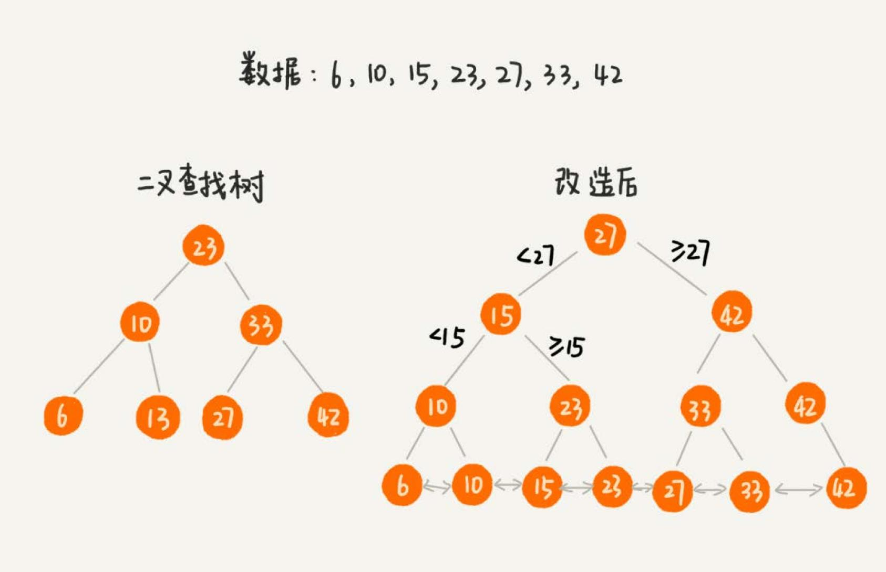
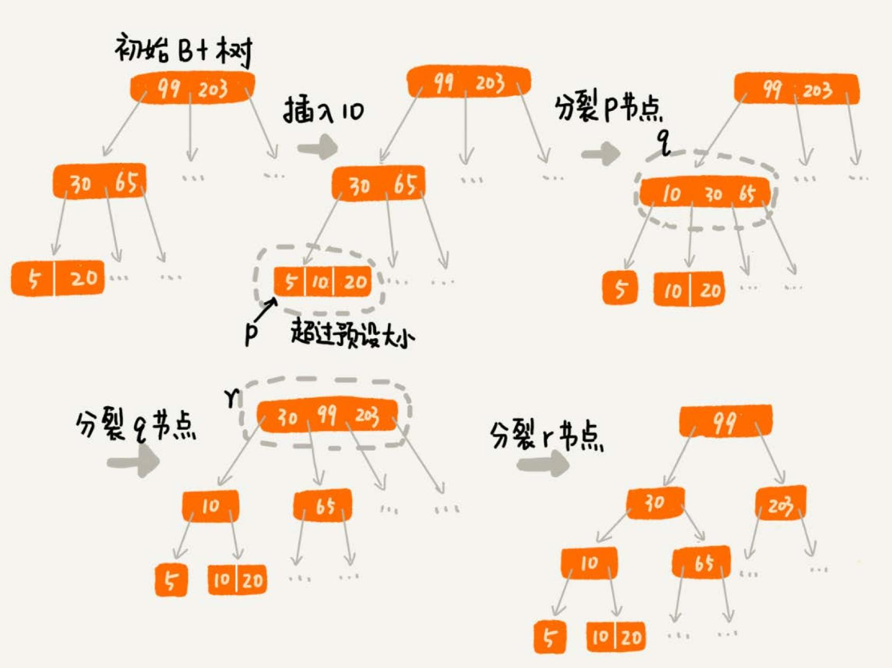

# 索引

对于存储的需求，无非就是增删改查，并不复杂。但是，一旦存储的数据很多，那性能就成了要关注的重点。
特别是一些跟存储相关的基础系统，比如 MySQL 数据库、消息中间件 RocketMQ 等。这些系统的实现，都离不开**索引**。

索引可以类比书籍的目录来理解，通过目录，我们就可以快速定位相关知识点的页数，查找的速度也会有质的提高。

## 设计索引的需求
### 功能性需求
功能性需求需要考虑的点：
1. 数据可以分为两类：
  - 结构化数据，比如，MySQL 中的数据；
  - 非结构化数据，比如搜索引擎中网页。非结构化数据一般需要做预处理，提取出查询关键词，**对关键词构建索引**。
2. 数据是静态还是动态：
  - 静态数据，也就是说，不会有数据的增加、删除、更新操作，在构建索引的时，只需要考虑查询效率就可以了。
  - 动态数据，大部分场景下，都是对动态数据构建索引，不仅要考虑到索引的查询效率，在**原始数据更新的同时，
  还需要动态地更新索引**。设计起来更加复杂。
3. 索引的存储：
  - 索引存储在内存中，查询的速度肯定要比在磁盘中高。但是，如果原始数据量很大的情况下，对应的索引可能也会
  很大。内存是有限的，这时就需要考虑存储在磁盘。
  - 一部分存储在内存，一部分存储在磁盘，可以兼顾内存消耗和查询效率。
4. 单值查找还是区间查找：
  - 单值查找，也就是根据查询关键词等于某个值的数据。
  - 区间查找，就是查找关键词处于某个区间值的所有数据。
5. 单关键词查找还是多关键词组合查找：
  - 搜索引擎中构建的索引，既要支持一个关键词的查找，比如“数据结构”，也要支持组合关键词查找，比如
  “数据结构 AND 算法”。
  - 对于多关键词查询，像 MySQL 这种结构化数据的查询需求，可以实现针对多个关键词的组合，建立索引；
  对于像搜索引擎这样的非结构数据的查询需求，可以针对单个关键词构建索引，然后通过集合操作，比如求并集、
  求交集等，计算出多个关键词组合的查询结果。

### 非功能性需求   

#### 存储空间
不管是存储在内存中还是磁盘中，索引对存储空间的消耗不能过大。如果存储在内存中，索引对占用存储空间的限制就会非常苛刻。毕竟内存空间非
常有限，一个中间件启动后就占用几个 GB 的内存，开发者显然是无法接受的。如果存储在硬盘中，那索引对占用存储空间的限制，稍微会放宽一些。
但是，我们也不能掉以轻心。因为，有时候，索引对存储空间的消耗会超过原始数据。

#### 索引的维护成本
索引的目的是提高查询效率，但是，基于动态数据集合构建的索引，还要考虑到，索引的维护成本。因为在原始数据动态增删改的同时，也需要
动态的更新索引。而索引的更新势必会影响到增删改操作的性能。

### 构建索引的数据结构
常用来构建索引的数据结构，比如，散列表、红黑树、跳表、B+ 树。除此之外，位图、布隆过滤器可以作为辅助索引，有序数组可以用来
对静态数据构建索引。

散列表增删改查操作的性能非常好，时间复杂度是 O(1)。一些键值数据库，比如 Redis、Memcache，就是使用散列表来构建索引的。

位图和布隆过滤器这两个数据结构，也可以用于索引中，辅助存储在磁盘中的索引，加速数据查找的效率。布隆过滤器有一定的判错率。但是对于判定
不存在的数据，那肯定就不存在。而且，内存占用非常少。可以针对数据，构建一个布隆过滤器，并且存储在内存中。当要查询数据的时候，可以先通
过布隆过滤器，判定是否存在。如果通过布隆过滤器判定数据不存在，就没有必要读取磁盘中的索引了。对于数据不存在的情况，数据查询就更加快速了。

## B+ 树索引

假设有两个需求：
- 根据某个值查找数据，比如 `select * from user where id=1234`；
- 根据区间值来查找某些数据，比如 `select * from user where id > 1234 and id < 2345`。

上面的语句实现了功能需求，除了功能，对于数据库的性能要考察两个方面：
- 执行效率，希望通过索引，查询数据的效率尽可能的高；
- 存储空间，希望索引不要消耗太多的内存空间。

### 用数据结构解决问题
- 散列表的查询性能很好，时间复杂度是 `O(1)`。但是，散列表不能支持按照区间快速查找数据。所以，散列表不能满足需求。
- 平衡二叉查找树查询的性能也很高，时间复杂度是 `O(logn)`。而且，对树进行中序遍历，可以得到一个从小到大有序的数据序列，
但这仍然不足以支持按照区间快速查找数据。
- 跳表是在链表之上加上多层索引构成的。它支持快速地插入、查找、删除数据，对应的时间复杂度是 `O(logn)`。并且，跳表也支
持按照区间快速地查找数据。只需要定位到区间起点值对应在链表中的结点，然后从这个结点开始，顺序遍历链表，直到区间终点对
应的结点为止，这期间遍历得到的数据就是满足区间值的数据。

跳表是可以解决这个问题。实际上，数据库索引所用到的数据结构跟跳表非常相似，叫作 B+ 树。不过，它是通过二叉查找树演化过来的，
而非跳表。

### 改造二叉查找树来解决问题
为了让二叉查找树支持按照区间来查找数据，可以对它进行这样的改造：**树中的节点并不存储数据本身，而是只是作为索引**。除此之外，**把每个叶
子节点串在一条链表上，链表中的数据是从小到大有序的**。就像下图，看起来很像跳表：

如果要求某个区间的数据。只需要拿区间的起始值，在树中进行查找，当查找到某个叶子节点之后，再顺着链表往后遍历，直到链表中的结点数据值大于
区间的终止值为止。所有遍历到的数据，就是符合区间值的所有数据。

但是，如果要为几千万、上亿的数据构建索引，存储在内存中，占用的内存会非常多。比如，给一亿个数据构建二叉查找树索引，那索引中会包含
大约 1 亿个节点，每个节点假设占用 16 个字节，那就需要大约 1GB 的内存空间。

### 如何占用太多内存的问题
借助时间换空间的思路，把索引存储在硬盘中，而非内存中。但是硬盘是一个非常慢速的存储设备。如果把改造之后的二叉树存储在硬盘中，那么每
个节点的读取（或者访问），都对应一次磁盘 IO 操作。树的高度就等于每次查询数据时磁盘 IO 操作的次数。

#### 如何降低树的高度
把索引构建成 m 叉树.

如下图，给 16 个数据构建二叉树索引，树的高度是 4，查找一个数据，就需要 4 个磁盘 IO 操作（如果根节点存储在内存中，其他结点存储在磁盘中），
如果对 16 个数据构建五叉树索引，那高度只有 2，查找一个数据，对应只需要2次磁盘操作。如果 m 叉树中的 m 是 100，那对一亿个数据构建索引，树
的高度也只是 3，最多只要 3 次磁盘 IO 就能获取到数据。磁盘 IO 变少了，查找数据的效率也就提高了。

#### m 叉树 m 的大小
操作系统都是按页（一页大小通常是 4KB，这个值可以通过 getconfig PAGE_SIZE 命令查看）来读取的，一次会读一页的数据。如果要读取的数
据量超过一页的大小，就会触发多次 IO 操作。所以，在选择 m 大小的时候，要尽量让每个节点的大小等于一个页的大小。

#### 索引的弊端
索引也会让写入数据的效率下降。数据的写入过程，会涉及索引的更新，这是索引导致写入变慢的主要原因。

对于一个 B+ 树来说，m 值是根据页的大小事先计算好的，也就是说，每个节点最多只能有 m 个子节点。在往数据库中写入数据的过程中，这样就
有可能使索引中某些节点的子节点个数超过 m，这个节点的大小超过了一个页的大小，读取这样一个节点，就会导致多次磁盘 IO 操作。

需要将这个节点分裂成两个节点。但是，节点分裂之后，其上层父节点的子节点个数就有可能超过m个。不过这也没关系，我们可以用同样的方法，将
父节点也分裂成两个节点。这种级联反应会从下往上，一直影响到根节点。

正是因为要时刻保证 B+ 树索引是一个 m 叉树，所以，索引的存在会导致数据库写入的速度降低。