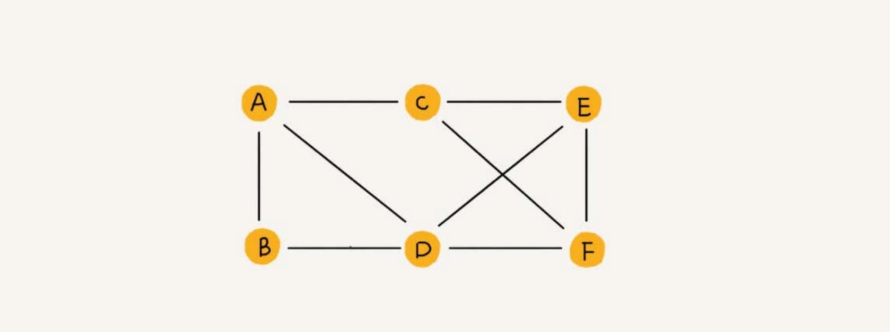
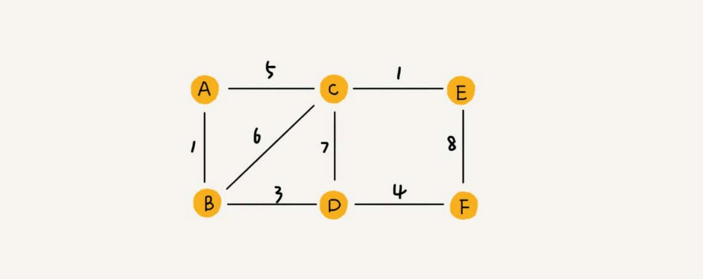

# 图
图也是一种非线性表数据结构，比树更复杂。涉及图的算法有很多，也非常复杂，比如图的搜索、最短路径、最小生成树、二
分图等等。

树中的元素称为节点，图中的元素叫作**顶点**（vertex）。


图中的一个顶点可以与任意其他顶点建立连接关系。这种建立的关系叫作**边**（edge）。

生活中就有很多符合图这种结构的例子。比如，社交网络，就是一个非常典型的图结构。拿微信举例子。可以把每个用户看作一个顶点。如果两个用户之间互加
好友，那就在两者之间建立一条边。所以，整个微信的好友关系就可以用一张图来表示。每个用户有多少个好友，对应到图中，就叫作顶点的**度**（degree），
就是跟顶点相连接的边的条数。

微博的社交关系比微信更复杂一点。微博允许单向关注，也就是说，用户 A 关注了用户 B，但用户 B 可以不关注用户 A。就要引入边的“方向”的概念。


这种边有方向的图叫作**有向图**。边没有方向的图就叫作**无向图**。

无向图中有“度”这个概念，表示一个顶点有多少条边。在有向图中，把度分为**入度**（In-degree）和**出度**（Out-degree）。

顶点的入度，表示有多少条边指向这个顶点；顶点的出度，表示有多少条边是以这个顶点为起点指向其他顶点。

QQ 中的社交关系要还更复杂。QQ 不仅记录了用户之间的好友关系，还记录了两个用户之间的亲密度，如果两个用户经常往来，那亲密度就比较高；如果不经
常往来，亲密度就比较低。

这里就要用到另一种图，**带权图**（weighted graph）。在带权图中，每条边都有一个**权重**（weight），可以通过这个权重来表示 QQ 好友
间的亲密度。



## 图的存储
### 邻接矩阵
邻接矩阵的底层依赖一个二维数组。对于无向图来说，如果顶点 i 与顶点 j 之间有边，就将 `A[i][j]` 和 `A[j][i]` 标记为 1；
对于有向图来说，如果顶点 i 到顶点 j 之间，有一条箭头从顶点 i 指向顶点 j 的边，那就将 `A[i][j]` 标记为 1。同理，如果有一条箭
头从顶点 j 指向顶点 i 的边，就将 `A[j][i]` 标记为 1。对于带权图，数组中就存储相应的权重。


邻接矩阵来表示一个图，虽然简单、直观，但是比较浪费存储空间。

如果存储的是稀疏图（Sparse Matrix），也就是说，顶点很多，但每个顶点的边并不多，那邻接矩阵的存储方法就更加浪费空间了。比如微信有好几亿的
用户，对应到图上就是好几亿的顶点。但是每个用户的好友并不会很多，一般也就三五百个而已。如果我们用邻接矩阵来存储，那绝大部分的存储空间都被浪费了。

### 邻接表


邻接表有点像散列表，每个顶点对应一条链表，链表中存储的是与这个顶点相连接的其他顶点。图中画的是一个有向图的邻接表存储方式，每个顶点对应的
链表里面，存储的是指向的顶点。对于无向图来说，也是类似的，不过，每个顶点的链表中存储的，是跟这个顶点有边相连的顶点。

邻接表存储起来比较节省空间，但是使用起来就比较耗时间。

比如上图中，如果要确定，是否存在一条从顶点 2 到顶点 4 的边，就要遍历顶点 2 对应的那条链表，看链表中是否存在顶点 4。而且，链表的存储方式
对缓存不友好。所以，比起邻接矩阵的存储方式，在邻接表中查询两个顶点之间的关系就没那么高效了。

在基于链表法解决冲突的散列表中，如果链过长，为了提高查找效率，可以将链表换成其他更加高效的数据结构，比如平衡二叉查找树等。邻接表长得很像散列。
所以，也可以将邻接表同散列表一样进行“改进升级”。

可以将邻接表中的链表改成平衡二叉查找树。实际开发中，可以选择用红黑树。这样，就可以更加快速地查找两个顶点之间是否存在边了。当然，这里的二叉
查找树可以换成其他动态数据结构，比如跳表、散列表等。除此之外，还可以将链表改成有序动态数组，可以通过二分查找的方法来快速定位两
个顶点之间否是存在边。

#### 逆邻接表
用一个邻接表来存储这种有向图有时候是不够的。比如微博中去查找某个用户关注了哪些用户非常容易，但是如果要想知道某个用户都被哪些用户关注了，也就
是用户的粉丝列表，是非常困难的。

需要一个逆邻接表。邻接表中存储了用户的关注关系，逆邻接表中存储的是用户的被关注关系。


## 深度和广度优先搜索
在社交网络中，有一个六度分割理论，具体是说，你与世界上的另一个人间隔的关系不会超过六度，也就是说平均只需要六步就可以联系到任何两个互不相识的人。
一个用户的一度连接用户很好理解，就是他的好友，二度连接用户就是他好友的好友，三度连接用户就是他好友的好友的好友。在社交网络中，往往通过用户之
间的连接关系，来实现推荐“可能认识的人”这么一个功能。

如何找出一个用户的所有三度（其中包含一度、二度和三度）好友关系？

### 广度优先搜索
广度优先搜索（Breadth-First-Search），简称为 BFS。其实就是一种“地毯式”层层推进的搜索策略，即先查找离起始顶点最近的，然后是次近的，
依次往外搜索。


```go

```