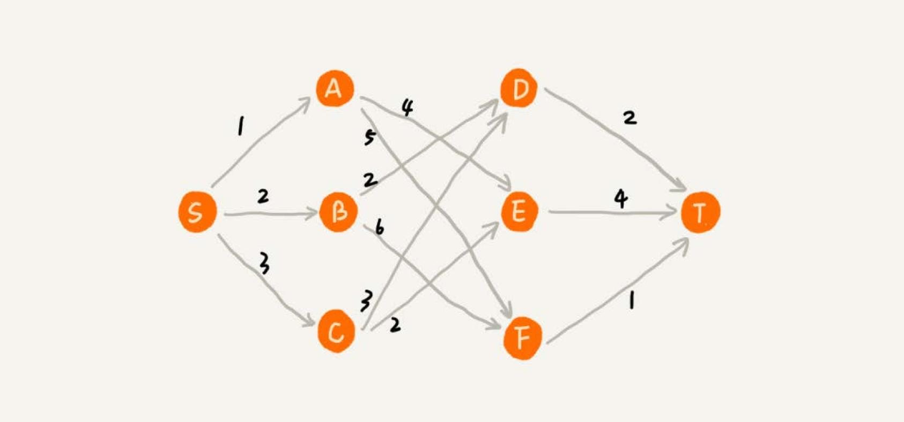

# 贪心算法
贪心、分治、回溯、动态规划是 4 种基本的算法思想。

## 理解贪心算法
假设有一个可以容纳 100kg 物品的背包，有 5 种豆子，每种豆子的总量和总价值都各不相同。为了让背包中所装物品的总价值最大，
如何选择在背包中装哪些豆子？每种豆子又该装多少？

| 种类 | 总量（kg） | 总价值（元） |
| --- | --- | --- |
| 黄豆 | 100 | 100 |
| 绿豆 | 30 | 90 |
| 红豆 | 60 | 120 |
| 黑豆 | 20 | 80 |
| 青豆 | 50 | 70 |

这个问题很简单，只要先算一算每个物品的单价，按照单价由高到低依次来装就好了。这个问题的解决思路借助的就是贪心算法。

贪心算法解决问题的思路，并不总能给出最优解，例如：
在一个有权图中，从顶点 S 开始，找一条到顶点 T 的最短路径（路径中边的权值和最小）。贪心算法的解决思路是，每次都选择一条跟
当前顶点相连的权最小的边，直到找到顶点 T。按照这种思路，求出的最短路径是 S->A->E->T，路径长度是 1+4+4=9。

但是实际上最短的路径是 S->B->D->T，长度是 2+2+2=6。

在这个问题上，贪心算法不工作的主要原因是，前面的选择，会影响后面的选择。如果第一步从顶点 S 走到顶点 A，那接下来面对的顶
点和边，跟第一步从顶点 S 走到顶点 B，是完全不同的。所以，即便第一步选择最优的走法（边最短），但有可能因为这一步选择，导
致后面每一步的选择都很糟糕。

## 实战分析
### 分糖果
有 m 个糖果和 n 个孩子。但是糖果少，孩子多（m<n），所以糖果只能分配给一部分孩子。

每个糖果的大小不等，这 m 个糖果的大小分别是 s1，s2，s3，……，sm。除此之外，每个孩子对糖果大小的需求也是不一样的，只有
糖果的大小大于等于孩子的对糖果大小的需求的时候，孩子才得到满足。假设这 n 个孩子对糖果大小的需求分
别是 g1，g2，g3，……，gn。如何分配糖果，能尽可能满足最多数量的孩子？