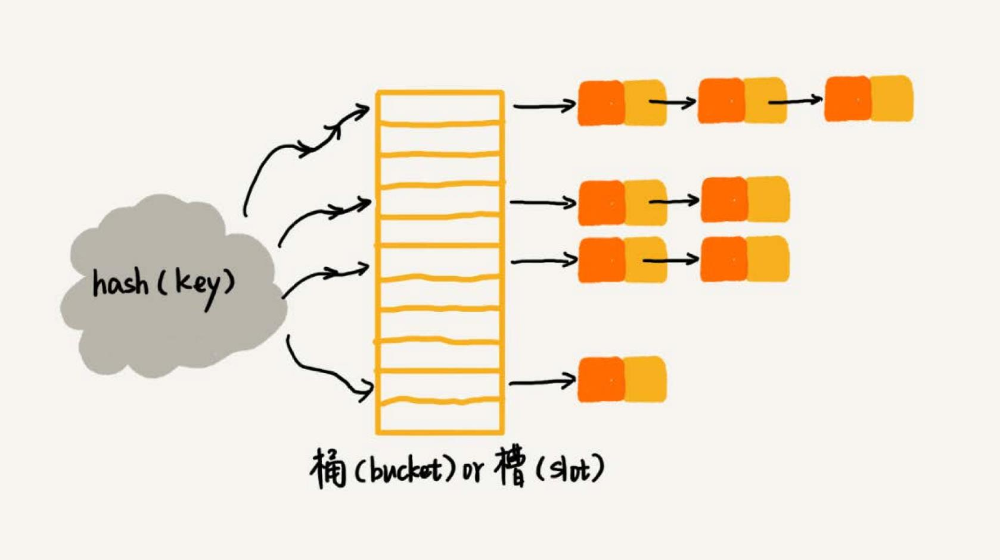

# 散列表
散列表（Hash Table），也叫它**哈希表**或者 **Hash 表**。

散列表用的是数组支持按照下标随机访问数据的特性，所以散列表其实就是数组的一种扩展，由数组演化而来。

通过散列函数把元素的键值映射为下标，然后将数据存储在数组中对应下标的位置。当按照键值查询元素时，用同样的散列函数，将键值转化数组下标，
从对应的数组下标的位置取数据。

## 散列函數
散列函数在散列表中起着非常关键的作用。把它定义成 `hash(key)`，`key` 表示元素的键值，`hash(key)` 计算得到一个散列值。

散列函数设计的基本要求：
- 散列函数计算得到的散列值是一个非负整
- 如果 `key1 = key2`，那 `hash(key1) == hash(key2)`
- 如果 `key1 != key2`，那 `hash(key1) != hash(key2)`

第三点要注意，在真实的情况下，要想找到一个不同的 key 对应的散列值都不一样的散列函数，几乎是不可能的。即便像的 MD5、SHA、CRC 等哈希算法，
也无法完全避免这种散列冲突。而且，因为数组的存储空间有限，也会加大散列冲突的概率。

## 散列冲突
再好的散列函数也无法避免散列冲突。那该如何解决散列冲突问题？

常用的散列冲突解决方法有两类：
- 开放寻址法（open addressing）
- 链表法（chaining）

### 开放寻址法
### 链表法
链表法对内存的利用率比开放寻址法要高。因为链表结点可以在需要的时候再创建，并不需要像开放寻址法那样事先申请好。实际上，这一点也是链表优于
数组的地方。

## 如何设计散列函数