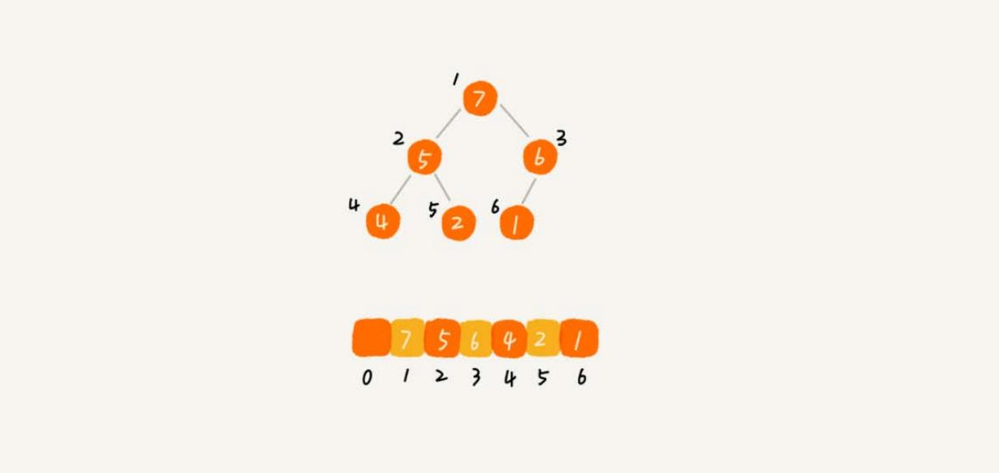

# 堆
堆是一种特殊的树。

- 堆必须是一个完全二叉树；
- 堆中每一个节点的值都必须大于等于（或小于等于）其子树中每个节点的值。换一种说法，堆中每个节点的值都大于等于（或者小于等于）其左右
子节点的值。

对于每个节点的值都大于等于子树中每个节点值的堆，叫作“大顶堆”。对于每个节点的值都小于等于子树中每个节点值的堆，叫作“小顶堆”。

将根节点最大的堆叫做最大堆或大根堆，根节点最小的堆叫做最小堆或小根堆。

堆最经典的应用就是堆排序了。堆排序是一种原地的、时间复杂度为 `O(nlogn)` 的排序算法。

## 实现一个堆
完全二叉树比较适合用数组来存储，非常节省存储空间。

用数组存储堆的例子：

数组中下标为 i 的位置，下标为 `2 * i` 的位置存储的就是左子节点，下标为 `2 * i + 1` 的位置存储
的就是右子节点。反过来，下标为 `i/2` 的位置存储就是它的父节点。

### 插入
往堆中插入一个元素后，需要继续满足堆的两个特性。这个过程叫作**堆化**（heapify）。

堆化实际上有两种，从下往上和从上往下。先看从下往上的堆化方法。

堆化非常简单，就是顺着节点所在的路径，向上或者向下，对比，然后交换。

让新插入的节点与父节点对比大小。如果不满足子节点小于等于父节点的大小关系，就互换两个节点。一直重复这个过程，直到父子节点之间满足刚说的那
种大小关系。

### 删除对顶元素
堆顶元素存储的就是堆中数据的最大值或者最小值。

假设构造的是大顶堆，堆顶元素就是最大的元素。当删除堆顶元素之后，就需要把第二大的元素放到堆顶，那第二大元素肯定会出现在左右子节点中。
然后再迭代地删除第二大节点，以此类推，直到叶子节点被删除。

上面的方法有点问题，就是最后堆化出来的堆并不满足完全二叉树的特性。

把最后一个节点放到堆顶，然后利用同样的父子节点对比方法。对于不满足父子节点大小关系的，互换两个节点，并且重复进行这个过程，直到父子节点
之间满足大小关系为止。这就是从上往下的堆化方法。

## 堆排序
### 建堆
### 排序

