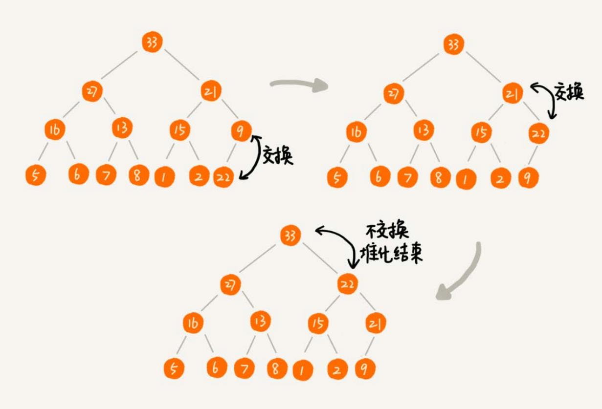
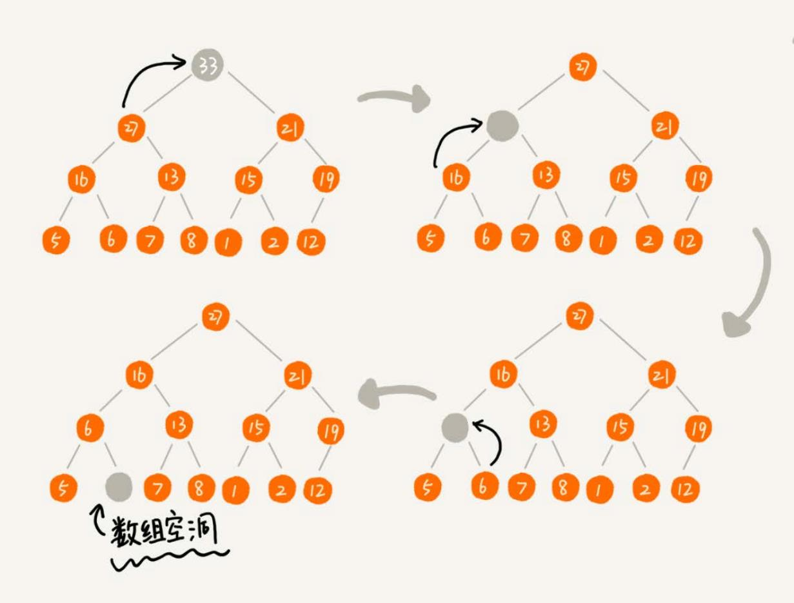
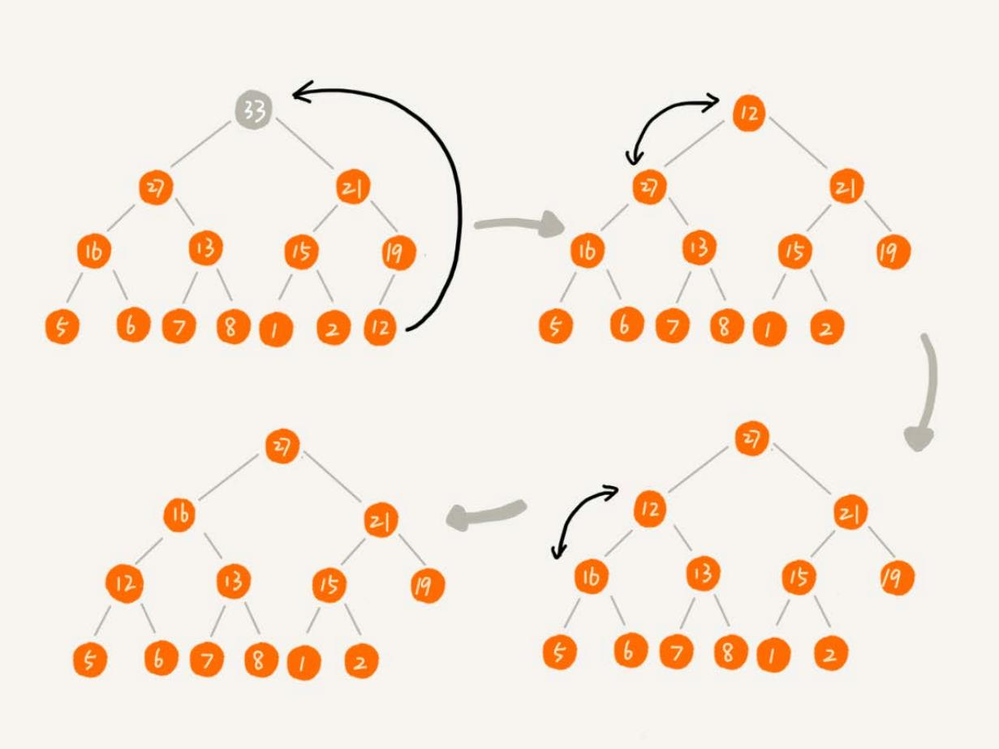

# 堆
堆是一种特殊的树。

- 堆必须是一个完全二叉树；
- 堆中每一个节点的值都必须大于等于（或小于等于）其子树中每个节点的值。换一种说法，堆中每个节点的值都大于等于（或者小于等于）其左右
子节点的值。

对于每个节点的值都大于等于子树中每个节点值的堆，叫作“大顶堆”。对于每个节点的值都小于等于子树中每个节点值的堆，叫作“小顶堆”。

将根节点最大的堆叫做最大堆或大根堆，根节点最小的堆叫做最小堆或小根堆。

堆最经典的应用就是堆排序了。

## 实现一个堆
完全二叉树比较适合用数组来存储，非常节省存储空间。

用数组存储堆的例子：

数组中下标为 i 的位置，下标为 `2 * i` 的位置存储的就是左子节点，下标为 `2 * i + 1` 的位置存储
的就是右子节点。反过来，下标为 `i/2` 的位置存储就是它的父节点。

### 插入
往堆中插入一个元素后，需要继续满足堆的两个特性。这个过程叫作**堆化**（heapify）。

堆化实际上有两种，从下往上和从上往下。先看从下往上的堆化方法。

堆化非常简单，就是顺着节点所在的路径，向上或者向下，对比，然后交换。

让新插入的节点与父节点对比大小。如果不满足子节点小于等于父节点的大小关系，就互换两个节点。一直重复这个过程，直到父子节点之间满足刚说的那
种大小关系。

### 删除对顶元素
堆顶元素存储的就是堆中数据的最大值或者最小值。

假设构造的是大顶堆，堆顶元素就是最大的元素。当删除堆顶元素之后，就需要把第二大的元素放到堆顶，那第二大元素肯定会出现在左右子节点中。
然后再迭代地删除第二大节点，以此类推，直到叶子节点被删除。

上面的方法有点问题，就是最后堆化出来的堆并不满足完全二叉树的特性。

把最后一个节点放到堆顶，然后利用同样的父子节点对比方法。对于不满足父子节点大小关系的，互换两个节点，并且重复进行这个过程，直到父子节点
之间满足大小关系为止。这就是从上往下的堆化方法。

一个包含 n 个节点的完全二叉树，树的高度不会超过 `log2n`。堆化的过程是顺着节点所在路径比较交换的，所以堆化的时间复杂度跟树的高度成正比，
也就是 `O(logn)`。插入数据和删除堆顶元素的主要逻辑就是堆化，所以，往堆中插入一个元素和删除堆顶元素的时间复杂度都是 `O(logn)`。

## 堆排序
堆排序是一种原地的、时间复杂度为 `O(nlogn)` 的排序算法。

堆排序的过程大致分解成两个大的步骤，建堆和排序。

### 建堆

所谓“原地”就是，不借助另一个数组，就在原数组上操作。建堆的过程，有两种思路：

1. 在堆中插入一个元素的思路。尽管数组中包含 n 个数据，但是可以假设，起初堆中只包含一个数据，就是下标为 1 的数据。然后，调用前面讲的插入
操作，将下标从 2 到 n 的数据依次插入到堆中。这样我们就将包含 n 个数据的数组，组织成了堆。
2. 第一种建堆思路的处理过程是从前往后处理数组数据，并且每个数据插入堆中时，都是从下往上堆化。而第二种实现思路，是从后往前处理数组，并且
每个数据都是从上往下堆化。

### 排序

建堆结束之后，数组中的数据已经是按照大顶堆的特性来组织的。数组中的第一个元素就是堆顶，也就是最大的元素。把它跟最后一个元素交换，那最大元素
就放到了下标为 n 的位置。

这个过程有点类似上面讲的“删除堆顶元素”的操作，当堆顶元素移除之后，把下标为 n 的元素放到堆顶，然后再通过堆化
的方法，将剩下的 n-1 个元素重新构建成堆。堆化完成之后，再取堆顶的元素，放到下标是 n-1 的位置，一直重复这个过程，直到最后堆中只剩下标
为 1 的一个元素，排序工作就完成了。

## 快速排序和堆排序
实际开发中，为什么快速排序要比堆排序性能好？
1. 堆排序数据访问的方式没有快速排序友好。
2. 对于同样的数据，在排序过程中，堆排序算法的数据交换次数要多于快速排序。

## 堆的应用
### 优先级队列
### 求 Top K
### 求中位数