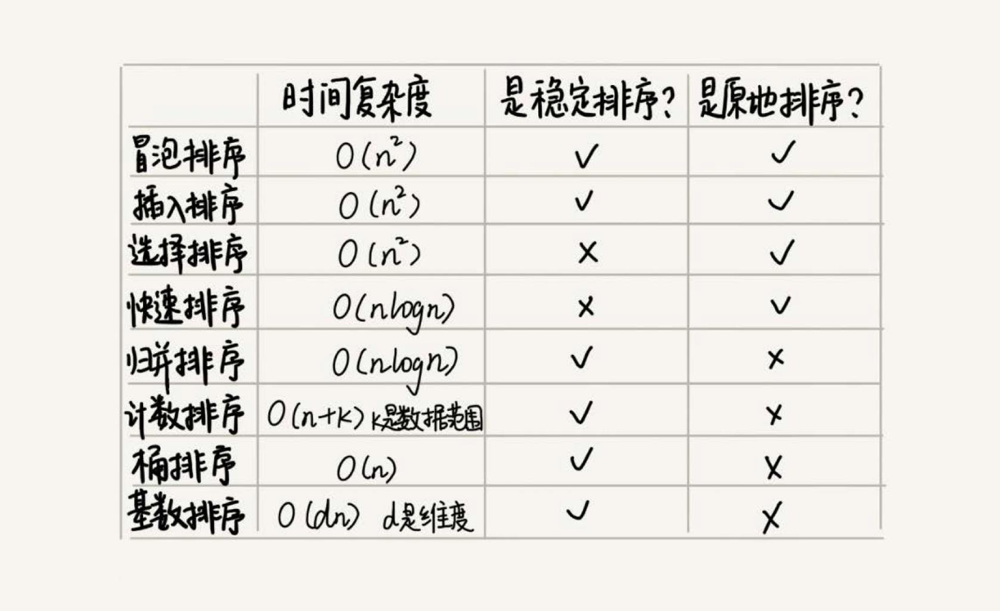

# 线性排序
## 桶排序
桶排序，会用到“桶”，核心思想是将要排序的数据分到几个有序的桶里，每个桶里的数据再单独进行排序。桶内排完序之后，再把每个桶里的数
据按照顺序依次取出，组成的序列就是有序的了。

### 桶排序的时间复杂度
如果要排序的数据有 n 个，我们把它们均匀地划分到 m 个桶内，每个桶里就有 `k=n/m` 个元素。每个桶内部使用快速排序，时间复杂度
为 `O(k * logk)`。m 个桶排序的时间复杂度就是 `O(m * k * logk)`，因为 `k=n/m`，所以整个桶排序的时间复杂度就是 `O(n*log(n/m))`。
当桶的个数 m 接近数据个数 n 时，`log(n/m)` 就是一个非常小的常量，这个时候桶排序的时间复杂度接近 `O(n)`。

### 桶排序对数据的要求
桶排序对要排序数据的要求非常苛刻：
- 要排序的数据需要很容易就能划分成 m 个桶，并且，桶与桶之间有着天然的大小顺序。这样每个桶内的数据都排序完之后，桶与桶之间的数据不需要
再进行排序。
- 数据在各个桶之间的分布是比较均匀的。如果数据经过桶的划分之后，有些桶里的数据非常多，有些非常少，很不平均，那桶内数据排序的时间复杂度
就不是常量级了。在极端情况下，如果数据都被划分到一个桶里，那就退化为 `O(nlogn)` 的排序算法了。

比如说有 10GB 的订单数据，如果希望按订单金额（假设金额都是正整数）进行排序，但是内存有限，只有几百 MB，没办法一次性把 10GB 的数据都加载
到内存中。怎么做？

借助桶排序的处理思想：
先扫描一遍文件，看订单金额所处的数据范围。假设经过扫描之后得到，订单金额最小是 1 元，最大是 10 万元。我们将所有订单根据金额划分到 100 个
桶里，第一个桶存储金额在 1 元到 1000 元之内的订单，第二桶存储金额在 1001 元到 2000 元之内的订单，以此类推。每一个桶对应一个文件，并且
按照金额范围的大小顺序编号命名（00，01，02…99）。

理想的情况下，如果订单金额在 1 到 10 万之间均匀分布，那订单会被均匀划分到 100 个文件中，每个小文件中存储大约 100MB 的订单数据，我们就可以将
这 100 个小文件依次放到内存中，用快排来排序。等所有文件都排好序之后，我们只需要按照文件编号，从小到大依次读取每个小文件中的订单数据，并将其写
入到一个文件中，那这个文件中存储的就是按照金额从小到大排序的订单数据了。

但是，订单按照金额在 1 元到 10 万元之间并不一定是均匀分布的，所以 10GB 订单数据是无法均匀地被划分到 100 个文件中的。有可能某个金额区间的
数据特别多，划分之后对应的文件就会很大，没法一次性读入内存。怎么处理？

针对这些划分之后还是比较大的文件，可以继续划分，比如，订单金额在 1 元到 1000 元之间的比较多，我们就将这个区间继续划分为 10 个小区间，
1 元到 100 元，101 元到 200 元 … 901 元到 1000 元。如果划分之后，101 元到 200 元之间的订单还是太多，无法一次性读入内存，那就继续
再划分，直到所有的文件都能读入内存为止。

## 计数排序
计数排序其实是桶排序的一种特殊情况。当要排序的 n 个数据，所处的范围并不大的时候，比如最大值是 k，就可以把数据划分成 k 个桶。每个桶内的数
据值都是相同的，省掉了桶内排序的时间。

比如高考查分数系统，查分数的时候，系统会显示我们的成绩以及所在省的排名。如果你所在的省有 50 万考生，如何通过成绩快速排序得出名次？

考生的满分是 900 分，最小是 0 分，这个数据的范围很小，所以我们可以分成 901 个桶，对应分数从 0 分到 900 分。根据考生的成绩，我们将这 50 万
考生划分到这 901 个桶里。桶内的数据都是分数相同的考生，所以并不需要再进行排序。我们只需要依次扫描每个桶，将桶内的考生依次输出到一个数组中，
就实现了 50 万考生的排序。因为只涉及扫描遍历操作，所以时间复杂度是 `O(n)`。

计数排序的算法思想跟桶排序非常类似，只是桶的大小粒度不一样。不过，为什么这个排序算法叫**计数**排序？

假设只有 8 个考生，分数在 0 到 5 分之间。这 8 个考生的成绩我们放在一个数组 `A[8]` 中，它们分别是：2，5，3，0，2，3，0，3。

成绩从 0 到 5 分，使用大小为 6 的数组 `C[6]` 表示桶，其中下标对应分数。`C[6]` 内存储的是对应的考生个数。

`R[8]` 为排序之后的有序数组。如何快速计算出，每个分数的考生在有序数组中对应的存储位置？

思路：**对 `C[6]` 数组顺序求和，`C[6]` 存储的数据就变成了下面这样子。`C[k]` 里存储小于等于分数 k 的考生个数。

从后到前依次扫描数组 A。比如，当扫描到 3 时，我们可以从数组 C 中取出下标为 3 的值 7，也就是说，到目前为止，包括自己在内，分数小于等
于 3 的考生有 7 个，也就是说 3 是数组 R 中的第 7 个元素（也就是数组 R 中下标为 6 的位置）。当 3 放入到数组 R 中后，小于等于 3 的元
素就只剩下了 6 个了，所以相应的 `C[3]` 要减 1，变成 6。

以此类推，当扫描到第 2 个分数为 3 的考生的时候，就会把它放入数组 R 中的第 6 个元素的位置（也就是下标为 5 的位置）。当我们扫描完整个数
组 A 后，数组 R 内的数据就是按照分数从小到大有序排列的了。

计数排序就是利用另外一个数组来计数。计数排序只能用在数据范围不大的场景中，如果数据范围 k 比要排序的数据 n 大很多，就不适合用计数排序了。
计数排序只能给非负整数排序，如果要排序的数据是其他类型的，要将其在不改变相对大小的情况下，转化为非负整数。

## 基数排序
假设我们有10万个手机号码，希望将这10万个手机号码从小到大排序，有什么比较快速的排序方法？

手机号码有 11 位，范围太大，显然不适合用桶排序和计数排序。有没有比快排更高效的排序算法？基数排序。

手机号码有这样的规律：假设要比较两个手机号码 a，b 的大小，如果在前面几位中，a 手机号码已经比 b 手机号码大了，那后面的几位就不用看了。

先按照最后一位来排序手机号码，然后，再按照倒数第二位重新排序，以此类推，最后按照第一位重新排序。经过 11 次排序之后，手机号码就都有序了。

基数排序的过程分解图：

根据每一位来排序，可以用桶排序或者计数排序，它们的时间复杂度可以做到 `O(n)`。如果要排序的数据有 k 位，那我们就需要 k 次桶排序或者计数
排序，总的时间复杂度是 `O(k*n)`。当 k 不大的时候，比如手机号码排序的例子，k 最大就是 11，所以基数排序的时间复杂度就近似于 `O(n)`。

## 排序优化
### 选择合适的排序算法

- 线性排序算法的时间复杂度比较低，适用场景比较特殊。所以如果要写一个**通用的排序函数，不能选择线性排序算法**。
- 小规模数据进行排序，可以选择时间复杂度是 `O(n^2)`的算法
- 大规模数据进行排序，时间复杂度是 `O(nlogn)` 的算法更加高效
- 为了兼顾任意规模数据的排序，一般都会首选时间复杂度是 `O(nlogn)` 的排序算法来实现排序函数

### 优化快速排序
快速排序在最坏情况下的时间复杂度是 `O(n^2)`，如何来解决这个“复杂度恶化”的问题？

为什么最坏情况下快速排序的时间复杂度是 `O(n^2)`？我们前面讲过，如果数据原来就是有序的或者接近有序的，每次分区点都选择最后一个数据，那快速排
序算法就会变得非常糟糕，时间复杂度就会退化为 `O(n^2)`。实际上，这种 `O(n^2)` 时间复杂度出现的主要原因还是因为**分区点选的不够合理**。

**最理想的分区点是：被分区点分开的两个分区中，数据的数量差不多**。

#### 三数取中法
从区间的首、尾、中间，分别取出一个数，然后对比大小，取这 3 个数的中间值作为分区点。如果要排序的数组比较大，那“三数取中”可能就不够了，
可能要“五数取中”或者“十数取中”。

#### 随机法
随机法就是每次从要排序的区间中，随机选择一个元素作为分区点。这种方法并不能保证每次分区点都选的比较好，但是从概率的角度来看，也不大可能
会出现每次分区点都选的很差的情况，所以平均情况下，这样选的分区点是比较好的。

### 分析排序函数
以 Glibc 中的 `qsort()` 函数举例，从名字上看，好像是基于快排实现的，实际上它并不仅仅用了快排这一种算法。

`qsort()` 会优先使用归并排序来排序输入数据，因为归并排序的空间复杂度是 `O(n)`，所以对于小数据量的排序，比如 1KB、2KB 等，归并排序额外
需要 1KB、2KB 的内存空间，这个问题不大。这就是空间换时间。

如果数据量太大，比如 100MB 的数据，这个时候 `qsort()` 会改为用快速排序算法来排序。`qsort()` 选择分区点的方法就是“三数取中法”。

`qsort()` 并不仅仅用到了归并排序和快速排序，它还用到了插入排序。在快速排序的过程中，当要排序的区间中，元素的个数小于等于 4 时，
`qsort()` 就退化为插入排序，不再继续用递归来做快速排序，
