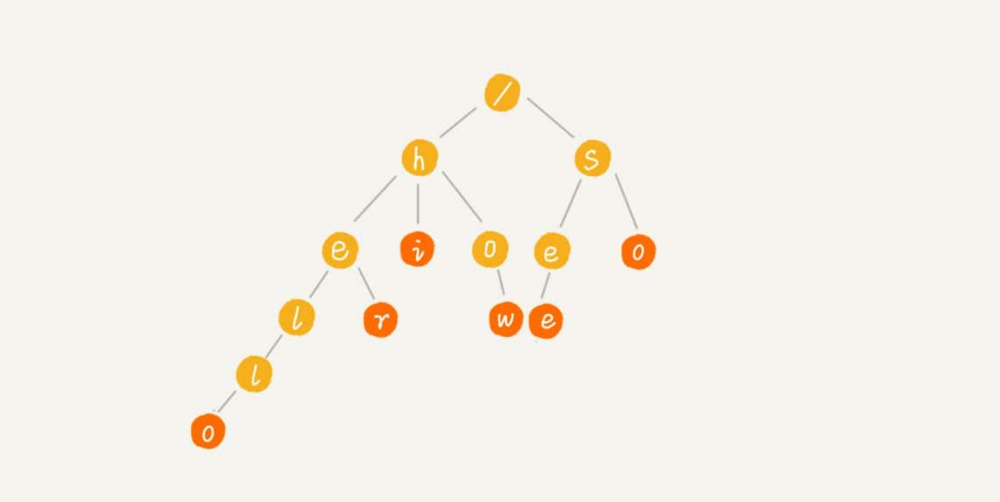
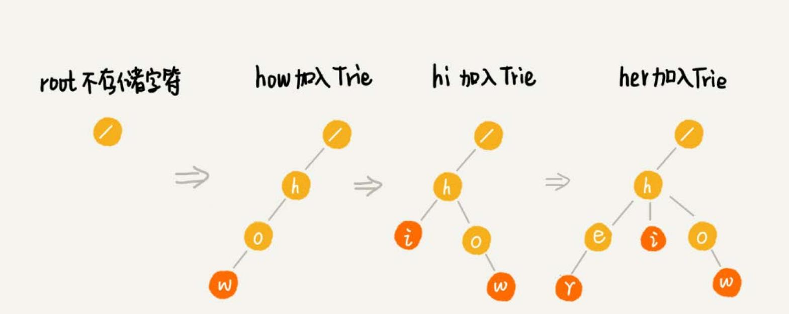

# Trie 树
Trie 树（字典树）。树形结构。是一种专门处理字符串匹配的数据结构，用来解决在一组字符串集合中快速查找某个字符串的问题。

例如，一个字符串集合中 6 个字符串： how，hi，her，hello，so，see。如果要在里面多次查找某个字符串是否存在。
如果每次查找，都是拿要查找的字符串跟这 6 个字符串依次进行字符串匹配，效率肯定是比较低的。如何高效查询？

利用 Trie 树结构，利用字符串之间的公共前缀，将重复的前缀合并在一起。如：

根节点不包含任何信息。每个节点表示一个字符串中的字符，从根节点到红色节点的一条路径表示一个字符串
（**红色节点并不都是叶子节点**）。

构造 Trie 树结构的过程：

当在 Trie 树中查找一个字符串的时候，比如“her”，将要查找的字符串分割成单个的字符 h，e，r，然后从 Trie 树的根节点开始
匹配。依次找到  h，e，r 三个节点。

如果要查找“he”，从根节点开始，找到 h，e 节点。但是，路径的最后一个节点“e”并不是红色的。也就是说，“he”是某个字
符串的前缀子串，但并不能完全匹配任何字符串。

## 实现一棵 Trie 树
二叉树中，一个节点的左右子节点是通过两个指针来存储的，但是 Trie 树是一个多叉树，如何存储子节点？**使用数组**。

