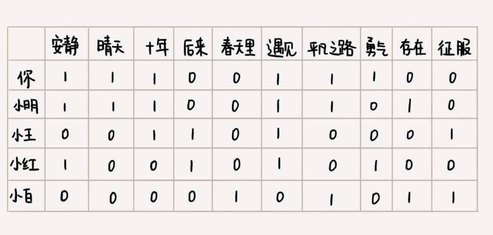
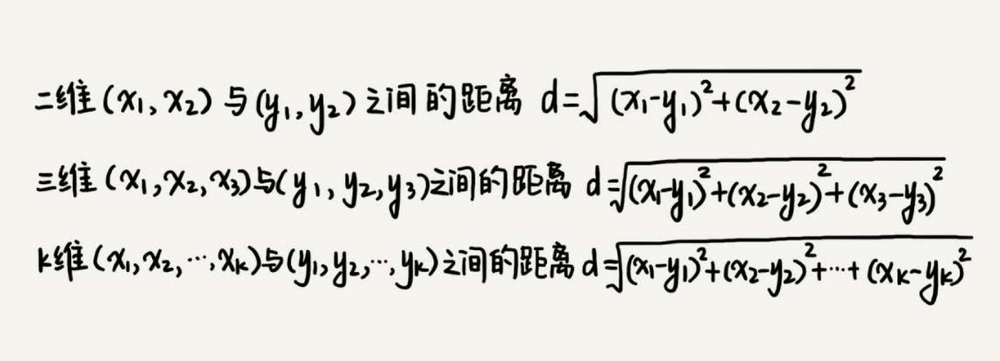
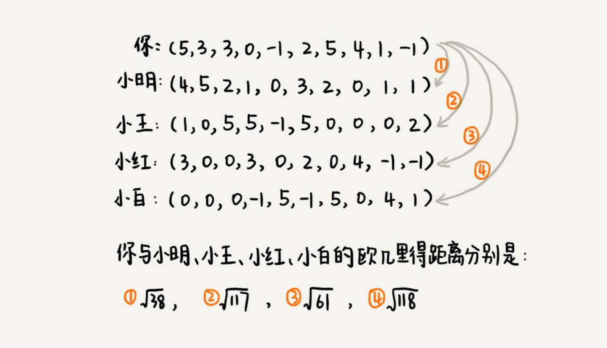

# 向量空间

如何实现一个简单的音乐推荐系统？

核心思想：
- 找到口味偏好相似的用户，推荐他们爱听的歌曲；
- 找出跟你喜爱的歌曲特征相似的歌曲，推荐这些歌曲

## 基于相似用户做推荐
如下图，把听类似歌曲的人，看做口味相似的用户。用 “1” 表示“喜爱”，用 “0” 表示“不发表意见”。从图中可以看出，你跟小明共同喜爱的歌曲最多，
有 5 首。可以得出，小明跟你的口味非常相似。

可以通过用户的行为，来定义对歌曲的喜爱程度。给每个行为定义一个得分，得分越高表示喜爱程度越高。

这里统计两个用户之间的相似度，就需要使用另外一个距离，那就是**欧几里得距离**（Euclidean distance）。欧几里得距离是用来计算两个向量
之间的距离的。

一维空间是一条线，用 1，2，3 … 这样单个的数，来表示一维空间中的某个位置；二维空间是一个面，用（1，3）（4，2）（2，2）… 这样的两个数，
来表示二维空间中的某个位置；三维空间是一个立体空间，用（1，3，5）（3，1，7）（2，4，3）… 这样的三个数，来表示三维空间中的某个位置。
K 维空间中的某个位置，可以写作 `（$X_{1}$，$X_{2}$，$X_{3}$，…，$X_{K}$）`。这种表示方法就是**向量**（vector）。

### 如何计算两个向量之间的距离
类比到二维、三维空间中距离的计算方法，得到两个向量之间距离的计算公式：

把每个用户对所有歌曲的喜爱程度，都用一个向量表示。计算出两个向量之间的欧几里得距离，作为两个用户的口味相似程度的度量：

结论是，小明跟你的口味最相似。

## 基于相似歌曲做推荐
如何判断两首歌曲是否相似？

对歌曲定义一些特征项，比如是伤感的还是愉快的，是摇滚还是民谣，是柔和的还是高亢的等等。类似基于相似用户的推荐方法，给每个歌曲的
每个特征项打一个分数，这样每个歌曲就都对应一个特征项向量。